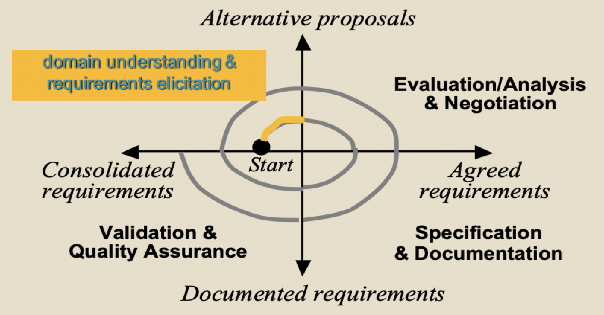
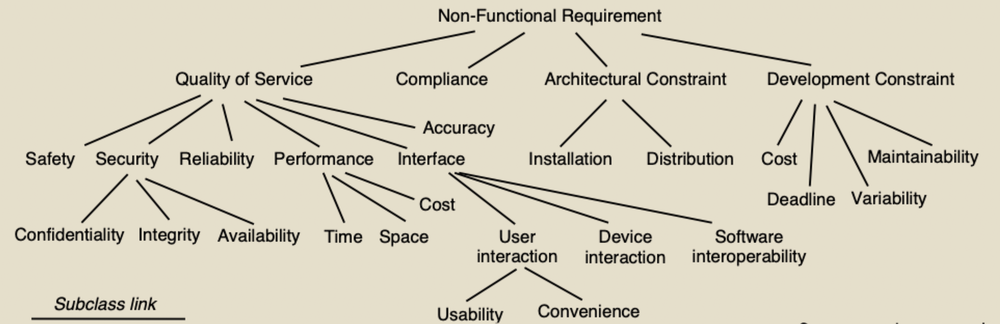

# Requirements elicitation

## What is requirements elicitation?

### Context in RE process

### Elicitation

- The activities involved in discovering the requirements of the system
- Exploring the problem world
- Identification of
	- Improvement objectives
	- Organizational/technical/environmental constraints/assumptions on system-to-be
	- Stakeholder needs
	- Alternative options for satisfying those needs
	- Scenarios of hypothetical software-environment interaction

#### Domain understanding

- Studying the system-as-is
	- Business organization
	- Strengths and weaknesses
	- Application domain
- Identifying the system stakeholders

#### Requirements elicitation

- Further analysis of problem with system-as-is
- Analysis of new opportunities
- Identification of constraints on system-to-be, improvement objectives and usage scenarios

#### Elicitation goal

- Application domain understanding
- Problem understanding
- Business understanding
- Understanding the needs and constraints of system stakeholder

### Stakeholder analysis

- Stakeholder cooperation is essential for successful requirements engineering
	- Elicitation = cooperative learning
- Representative sample must be selected to ensure adequate coverage of the problem
- Stakeholder selection based on
	- Position or role
	- Level of expertise or experience
	- Goals
	- Influence

## Popular techniques

### Artifact driven

#### Background study

- Collect, read, synthesize documents, gather data about
	- The organization
	- The domain
	- The system-as-is
- Provides basics for getting prepared before meeting stakeholders
- Often a prerequisite to other techniques

#### Surveys and questionnaires

- Submit a list of questions and possible answers to selected stakeholders
	- Multiple choice questions
	- Weighting questions
- Effective method for collecting requirements when
	- Collecting a small amount of data from a large number of people
	- People are geographically distributed
	- Time is limited
	- 100% coverage is not necessary

#### Storyboards and scenarios

> Goal: acquire or validate info from concrete examples through narratives

- Illustrate typical sequences of interaction to meet an implicit objective
- Widely used for
	- **Explanation** of the system-as-is
	- **Exploration** of the system-to-be and elicitation of further information
- Evolutionary, incremental, and cooperative approach
- Storyboards: tell a story with a sequence of snapshots
	- Snapshot = sentence, sketch, slide, picture
	- Primarily pictures
- Scenarios: tell a story with a textual description

#### Prototyping

- A prototype is an initial version of a system used for experimentation/feedback
- Value: providing stakeholders with something concrete to evaluate
- Quick implementation

#### Knowledge reuse

> Goal: speed up elicitation by reuse of knowledge from experience with related system

### Stakeholder driven

#### Interviews

- Primary technique for knowledge elicitation
- Steps
	1) Select stakeholder specifically for info to be acquired (domain expert, manage, salesperson, end-user, consultant)
	2) Organize meeting with interviewee, ask questions, and record answers
	3) Write report for interview transcripts
	4) Submit report to interviewee for validation and refinement

##### Types of interviews

- Structured: predetermined set of questions
	- Specific to purpose of interview
	- Some open-ended, others with predetermined answer set
- Unstructured: no predetermined set of questions
	- Free discussion about system-as-is, perceived problems, and proposed solution

> Effective interviews should mix both modes

##### Pitfalls

- Subjectivity
- inconsistencies
- **Effectiveness depends critically on quality of questions and interviewer's attitude**

##### Guidelines for effective interviews

- Identify the right interviewee sample for full coverage of issues
- Prepare
- Keep control over the interview
- Make the interviewee feel comfortable
	- Start: break the ice, provide motivation, ask easy questions
	- Do always appear as a trustworthy partner
- Stay focused, leave open-ended questions for the end
- Be open minded and flexible in case of unexpected answers
- Ask why questions
- Avoid certain types of questions
	- Opinionated / biased / affirmative
	- "Obvious" answers for this interviewee
- Edit interview transcripts while still fresh in mind
- Co-review transcript with interviewee

##### Formulating interview questions

- Work through each feature one at a time
	- Write down what you know about each feature
	- Write down what you don't know about each feature -> interview question
- Use generic questions to spur your thinking
	- How?
	- Where?
	- When?
	- Who?
	- What?
	- Why?

#### Group sessions

- More perception, judgement, invention from interactions with groups of diverse people
- Elicitation takes place in a series of group workshops (a few days each)
- Generally focused on high-level requirements

#### Ethographic studies

- Sometimes, the best way to understand what people do is to observe them at work
- Ethnographer spends time observing people at work and building up a picture of what and how work is done
- Focus on system-as-is
