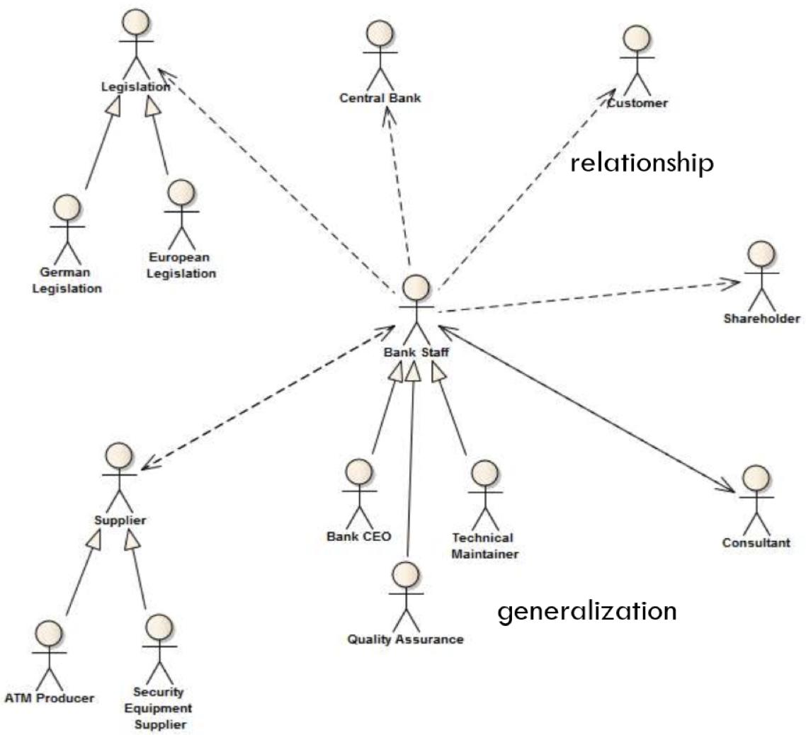
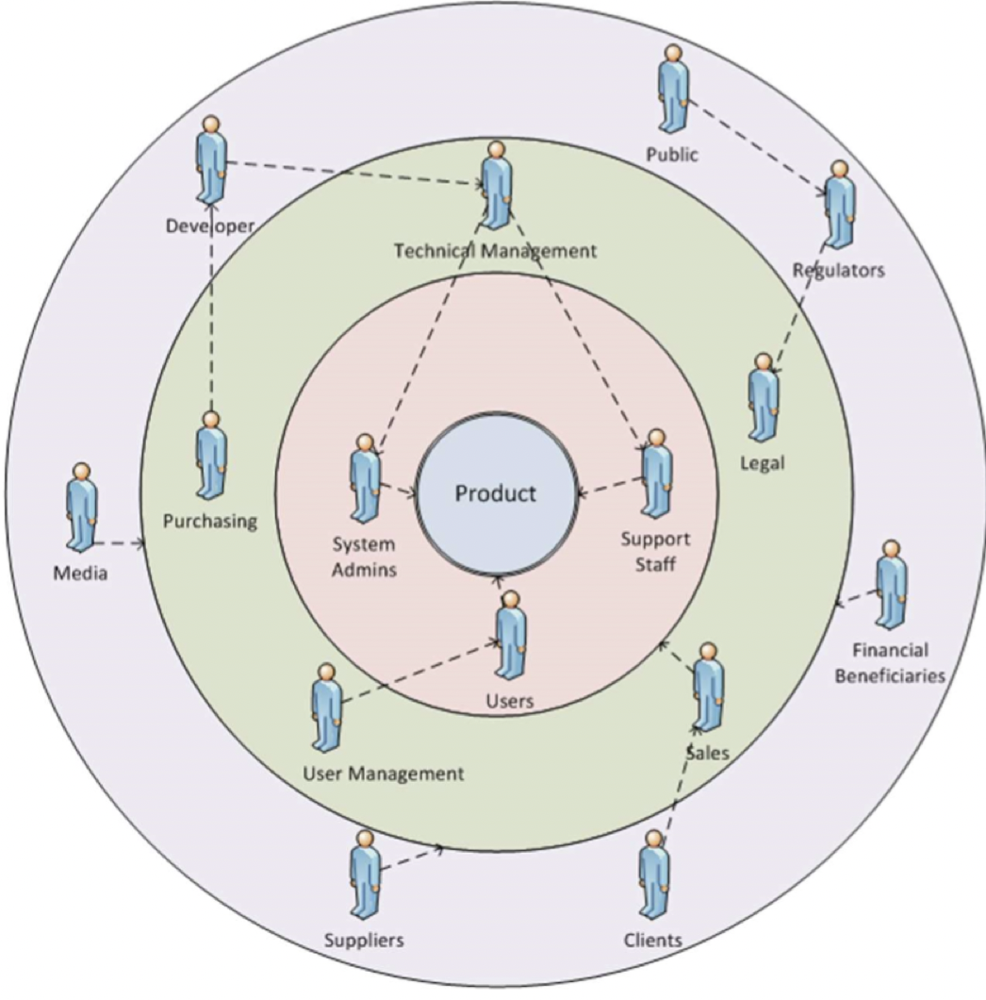
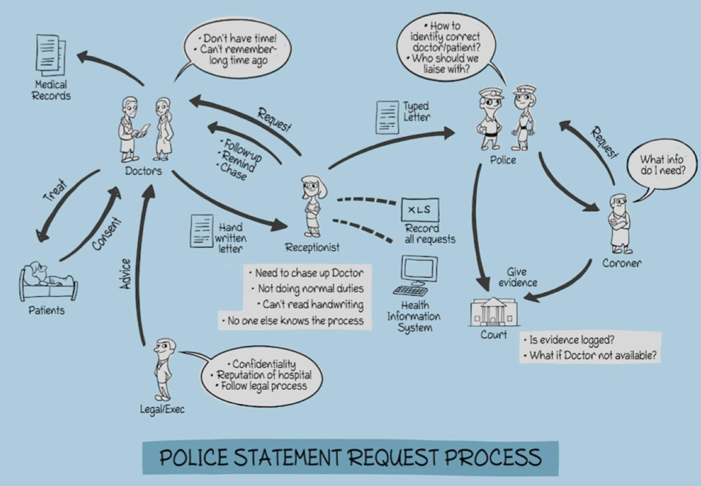

# Stakeholders

## What is a stakeholder?

- A stakeholder is a group or individual
	- Affected by the system-to-be
	- May influence the way this system is shaped
	- Has some responsibility in its acceptance
- Basic stakeholders
	- System engineers
	- System end-users
	- Managers of system end-users
	- External regulators
	- Domain experts
	- Developers

### Stakeholders make requirements messy

- Personality, status, personal goals, technical expertise, background, political influence
- Different viewpoints
- Tacit knowledge, hidden needs
- Hard to access
- Changes their minds

## Identifying stakeholders

- Reference list (framework for stakeholder model)
- Business/operational context
- Software development phases
- Goals

> It is important to identify *all* stakeholders as early as possible

## Classifying stakeholders

### Roles

- Software development staff
- Owners/partners
- Suppliers
- Department heads/managers
- Regulatory bodies, legislative representatives
- Customers (customers of your customer)
- Competitors
- Users
- Society (as a whole, or certain people groups)
- Environment

### Functions

- Decision makers
- Information providers
- Regulators
- Software developers
- End users
- Post implementation support

## Analyzing stakeholders

### Stakeholder analysis

- Developing stakeholder model and/or matrix
	- For each stakeholder, identify:
		1) Motivation
		2) Authority
		3) Relation to other stakeholders
		4) Level of expertise
		5) Their expectations
		6) Your expectations of them
		7) Location/availability
		8) Priority
- These models serve as the basis for
	- Requirements elicitation
	- Goal, domain, and usage models

### Type of stakeholder models

- Textual
- Informal diagram
- UML actor hierarchy
- Onion model
- Rich picture

#### UML actor hierarchy stakeholder model

#### Onion stakeholder model

Usually 4 or 5 layers -- from center out these layers represent

1) Product of solution
2) System (business)
3) Containing system (business)
4) Wider environment
5) Outer layer for stakeholders who do not map to other layers

#### Rich picture stakeholder model

- Create a "graph" in which
	- Nodes are stakeholders
	- Edges are relationships between stakeholders
	- Primary concern(s) of each stakeholder is shown as a thought/speech bubble near the stakeholder