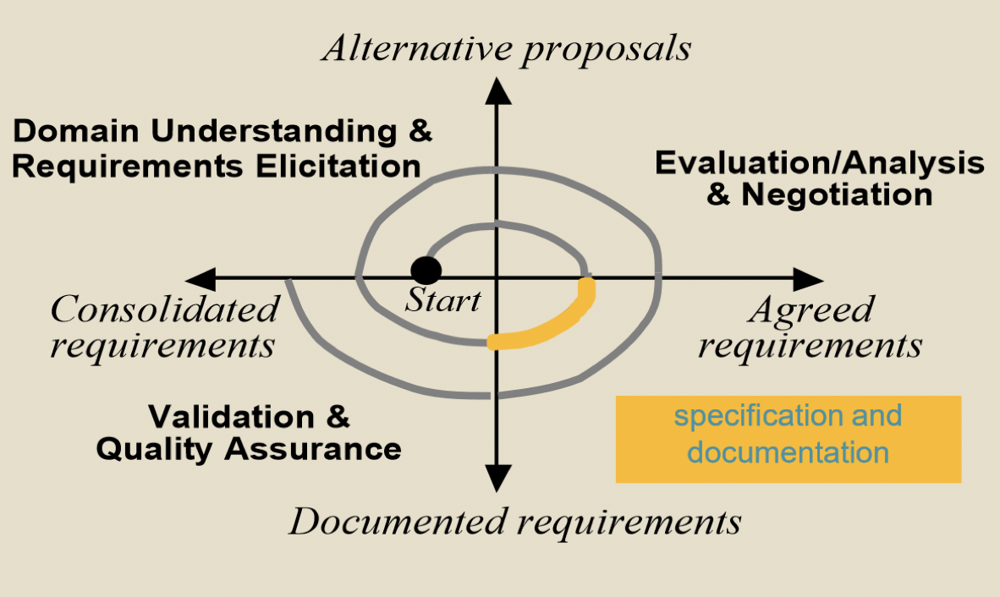

# Goal orientation (part 1)

## Aside: SRS preview

### Context of specification

- Precise definition and documentation of all features of the agreed upon system
	- Objectives, concepts, relevant domain properties, software/system requirements, assumptions and responsibilities
	- Rationale for options taken, satisfaction arguments
	- Likely system evolution and variant
	- Costs, workplan, delivery schedules (often in appendix)
- Organized in coherent structure and form understandable by all parties
- Resulting product = requirements document (RD) *aka* system requirements specification (SRS)
- Developed as joint effort between developer and customer
- Usually presented with system models developed during requirements analysis and further define part of the system to be developed
	- Adds details to requirements models, but should be remain consistent with them
- A standard template is typically used to organize contents

### Requirement specification contents

- Set out *what* the system should do and define constraints on its operation and development
- Specify external system behavior
- Characterize acceptable responses to undesired events
- Specify implementation constraints
- Address system lifecycle
- Be easy to change
- Serve as reference tool for maintenance

### Roles of requirements specification

1) Communication medium between groups of people working towards a common goal
2) Verification and validation device
3) Contractual device
4) Managerial device for project planning and management
5) Functional device for improving user's understanding of their real needs, may serve as early user manual

### Audience of requirements specification

- Users
- Purchasers
- System / requirement analysts
- Developers
- Testers
- Project managers
- Standards committees
- Safety boards
- Marketing department
- Government

### Attributes of requirements specification

- **Correct**: every requirement represents something required of the system to be built
- **Unambiguous**: every requirement has one and only one interpretation
- **Complete**: everything the software system is supposed to accomplish in included
- **Verifiable**: there is a means to determine whether or not each requirement is satisfied
- **Consistent**: no requirement conflicts
- **Modifiable**: its structure and style are such that any necessary changes can be made easily
- **Traceable**: the origin of each requirement is clear and it facilitates referencing each requirement in future development
- **Annotated**: to provide guidance for developers, particularly with respect to relative necessity / priority / stability

### Requirements measurability

| Property | Measure | 
| -------- | ------- |
| Speed | Processed transactions/second |
| Size | $K$ bytes |
| Ease of use | Training time
| Reliability | Rate of failure occurrence |
| Robustness | Time to restart after failure |
| Portability | Percentage of target dependent statements |

### Requirement specification evolution

- A formal change process
- A changeable requirements document
	- Modular
	- No redundancies

## What are goals?

### Definitions

- *Goal*: a system objective
	- **Prescriptive** statement of intent that the system should satisfy via cooperation of agents in manipulating entities
- *Agent*: an active component playing a specific role in goal satisfaction
- *Entity*: a passive component containing state

### Agent cooperation

- An agent is a role, rather than an individual
	- Must behave in a way to meet its assigned goal
	- Must be able to monitor / control phenomena involved in assigned goals
- Agent types
	- Software
	- Device
	- Human

### Type of statements

- Goal: prescriptive system objective
- Software requirement: a goal under responsibility of single agent of software-to-be
- Domain property: invariant descriptive property of environment
- Expectation: a goal under responsibility of single agent of environment that cannot be enforced by the application
- Domain hypothesis: descriptive statement about environment and subject to change

### Where to goals come from?

- System objectives during elicitation
	- Sometimes explicit, but often implicit
	- Mine them from background documents scenarios, operational details
- System-as-is
	- Business goals: achieve more
	- Domain analysis: reduce complaints

### Goal granularity

- Goals can be stated at different levels of abstraction
	- Higher level: strategic, coarse-grained, business
		- Meetings shall be scheduled so as to maximize the attendance of invited participants
		- The library shall provide effective access to state of the art
		- The system shall increase transportation capacity by 50%
	- Lower level: technical, fine-grained, application design
		- When no date can be found, the constraints shall be weakened by dropping constraints of low-priority participants
		- Reminder shall be issued by end of loan period if not returned
		- Acceleration command shall be sent every 3 seconds
- Finer grained goals -> fewer agents required