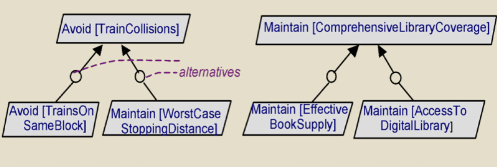

# Goal orientation (part 3)

## Central role of goals

- A rationale and framework for requirements
- A natural mechanism for structuring complex specifications at different levels of concern
- A basis for showing alignment of system-to-be with organization's strategic objectives
- Criteria for requirements completeness and relevance
- Support for evolution, negotiation, risk management

## Goal diagrams as graphs

- Goals: parallelograms
- AND goals: circles joining/splitting arrows
- OR goals: independent arrows
- Conflict goals: lightning bolt
- Agents: hexagons
	- Responsibility assignment: arrows to goal(s)
	- Stick figure inside indicates agent of environment
- Domain properties or hypotheses: trapezoids

## Goal refinement and abstraction

### Subgoals

- Goals can be related to each other by contribution, either partial or complete
	- Satisfaction of one goal may contribute to another's contribution
- Goals can be *refined* into finer-grained subgoals
- Subgoals can be *abstracted* toward coarser-grained goals
- The more refined, the fewer agents

### AND refinement

> An **AND** refinement of goal $G$ into subgoals $G_{1}\,\ \dots ,\, G_{N}$ states that $G$ can be satisfied by satisfying $G_{1}\,\ \dots ,\, G_{N}$

### OR refinement

> An **OR** refinement of goal $G$ into refinements $R_{1},\, \dots,\, R_{m}$ states that $G$ can be satisfied by satisfying all subgoals from any of the alternative refinements $R_{i}$

### OR assignment

> An **OR** assignment of goal $G$ to agents $A_{1},\, \dots,\, A_{m}$ states that $G$ can be satisfied by behavioral restrictions of any of the alternative agents $A_{i}$

### How far do you go?

> Leaf nodes: no further refinement necessary and assignable to an agent

- Requirements: goals assignable to a single software agent
- Expectations: goals assignable to a single environmental agent

## Annotating goal details and features

- Required
	- Name
	- Definition: must precisely define, in natural language, what the goal prescribes
	- Type
	- Source
	- Priority
- Optional
	- Category
	- Stability
	- FitCriterion
	- Issues
	- Formal specification

## Pitfalls

- Make sure subgoals are not an operational list of steps
- Make sure you highest-level goals are not just a list of features in the case study
- Beware of the "divide and conquer" approach to creating a goal model (often leads to overlapping)