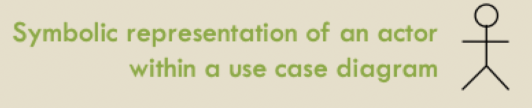
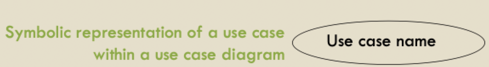
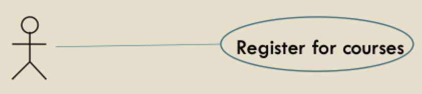

# Usage models (part 1)

## Model base RE

- Model-based approach addresses focus and structure in requirements engineering
- Model = an abstract representation of the target system
- A good system model
	- Provides structure
	- Allows abstraction
	- Provides basis for error detection
	- Facilitates understanding
	- Provides basis for decision making

### From goals to other models

- WHY? -> intentional view (goal model)
- WHAT? -> functional view (usage model)
- WHO? -> responsibility view (goal/usage/domain model)

### The operational model

- Functional view of the system being modeled
- Represented by UML use cases
- Multiple uses
	- Software specifications for development team
	- Description of environment tasks and procedures
	- Basis for deriving test data and executable specifications
	- Basis for size estimation, work units, user manual sections
	- Traceability to design and satisfaction arguments

## Object oriented analysis and use case models

### Object oriented analysis

- Analyzing object-modeling techniques to analyze the system's functional requirements
- Decomposing the problem space of the system into
	- **Major** operations
	- Actors
	- Objects
	- Inter-relationships
- OOA modeling notations
	- Use case models for operations and actors
	- Class models for objects

### Use case models

- Use case diagrams (one or more)
	- Actors (agents)
	- Use cases
	- Relationships
	- System boundary
- Descriptions of use cases
	- Something done with a template

### Developing use cases

- Iterative, discussion-based process involving the developers and the customers (and/or end users)
	- Defining the system
	- Finding the actors/use cases
	- Describing the use cases
	- Defining relationships between use cases
	- Validating the model
- Practically
	- Using goals and agents from goal model to create scenarios
	- Organizing scenarios into use cases

#### Actors and use cases

- Represents external entities that interact with the system
	- Human
	- Hardware
	- External systems (software or hardware)
- A use case is initiated by an actor to invoke a certain functionality in the system
- A use case is a dialogue between actors and the system

- Set of actions defining interactions between an actor and the system to achieve a goal
- A use case is within boundaries of the system and is connected to one or more actors
- A use case provides value to an actor (observable use case results)
- Use case name should describe functionality (in a few words)

#### Relationships

##### Association

- Use cases are connected to actors through *association* (shown as undirected solid lines)
- Associations show which actors the use case communicates with, including the actor that initiates the execution of the use case

##### Includes/uses

- One use case includes another entirely
- Too many use cases leads to duplicates
- Group duplicates into one and include that case into other cases that use it
- Represented as directed dashed lines and labeled with double angled brackets
- Use when you are repeating yourself in two or more separate use cases and you want to avoid repetition

##### Extends

- Optional behavior that is run only under certain conditions
- An "interruption" in the basic flow when the conditions comes true
- Typically occurs when an alternative flow has gotten too big for a particular use case
- Represented as directed dashed lines and labeled with double angled brackets
- Use when you are describing a variation on normal behavior or when an alternative flow has gotten too big

### Scenarios

- Story of use with the new product
	- User has certain motivation and specific goal in mind
- Shows the goal of the user, setting of usage, some of the steps
- Humans easily understand and relate to stories
- Story should introduce motivations and goals, the describe the steps taken to achieve the goal