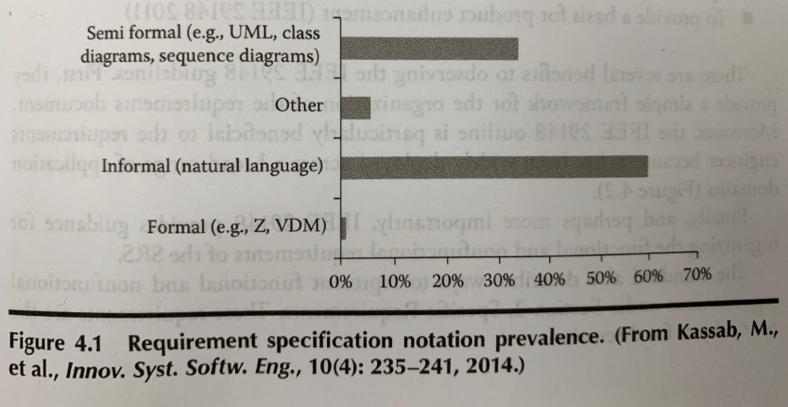
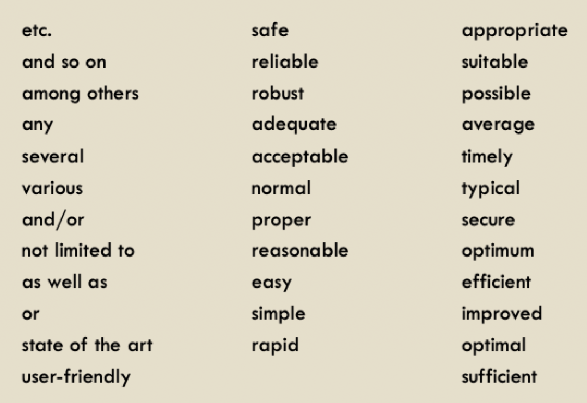

# Writing requirements

## Software requirements specification (SRS)

[See previous aside lecture](../week3/goal-orientation-part-1.md)

## Notations for SRS

- Informal notations (natural languages)
- Semi formal notations, including most diagrammatic notations
	- Goal diagrams
	- Use case diagrams
	- Class diagrams
- Formal specification languages
	- Logic as a basis for formalizing statements
	- State-based specification
	- Event-based specification
	- Algebraic specification

- Natural language is most often used
- Diagrams used fairly often
- Formal is not often used

### Natural language

| Benefits | Problems |
| -------- | -------- |
| Can express anything |  Can be ambiguous |
| Easy to write and understand | Subject to misinterpretation |
| Easy to change | Often does not completely describe the requirements |
| Easy to find errors | Can include contradictions |

#### Use shall/will/should carefully

- *Shall*
	- Something that must be there
	- Developers are responsible for ensuring the system provides this function
	- **REQUIREMENT**
- *Will*
	- This *will* be true or it *will* happen
	- Developers are not responsible
	- **ASSUMPTION
- *Should*
	- Specifies a desired or optional feature
	- Developers can choose to implement it or not
	- **CONSTRAINT** or **SUGGESTION**

#### Avoid imprecise terminology 

> Words with different interpretations leads to ambiguity

#### Make it measurable

- Define ambiguous terms with more precise terms
- Should be more measurable or verifiable

| Property | Measurement |
| -------- | ----------- |
| Speed | User/Event response time |
| Size | $K$ bytes |
| Ease of use | Training time |
| Reliability | Rate of failure occurrence |
| Robustness | Time to restart after failure |
| Portability | Percentage of target dependent statements |

#### Adapt/formalize NL for force the use of certain structures

- Construct glossaries
- Use stylistic rules
- Use templates

### Formal specification

- Requirements can be documented using mathematical notations -- referred to as *formal specifications*
- Desired correctness properties of the system can also be written in formal specs, and then correctness checking can be automated
- Software is becoming increasingly complex; critical systems have greater requirements for safety and reliability

#### Advantages

- Reduce the risk of failures by **removing ambiguities** early
- Provides a common understanding of the exact definition of the problem
- Can be analyzed mathematically
- Makes verification **provable**

#### Disadvantages

- Requires training; not understandable by most stakeholders
- Management/customer buy-in difficult
- Not appropriate for interactive (parts of) systems
- Other software engineering techniques may be more cost effective

#### Selective use

- Use to specify the most critical sections of the requirements document
- Use to specify stable requirements

## SRS templates

### IEEE std 830-1998

1) Introduction
	1) RD purpose
	2) Product scope
	3) Definitions, acronyms, abbreviations
	4) References
	5) Overview
2) General description
	1) Product perspective
	2) Product functions
	3) User characteristics
	4) General constraints
	5) Assumptions and dependencies
	6) Apportioning of requirements
3) Specific requirements
	1) Functional requirements
	2) External interface requirements
	3) Performance requirements
	4) Design constraints
	5) Software quality attributes
	6) Other requirements
4) Appendices
5) Index

#### Requirement statement patterns

| Pattern name | Pattern |
| ------------ | ------- |
| Ubiquitous | The `<system or actor>` shall `<action>` `<object>` |
| Event driven | WHEN `<trigger>` `<optional precondition>` the `<system or actor>` shall `<action>` `<object>` |
| State driven | WHILE `<system state or actor state>`, the `<system or actor>` shall `<action>` `<object>` |
| Unwanted behavior | IF `<unwanted state or unwanted event>`, THEN the `<system or actor>` shall `<action>` `<object>` |
| Optional feature | WHERE `<feature is included>`, the `system or actor>` shall `<action>` `<object>` |
| Compound | *Combination of the previous patterns* |