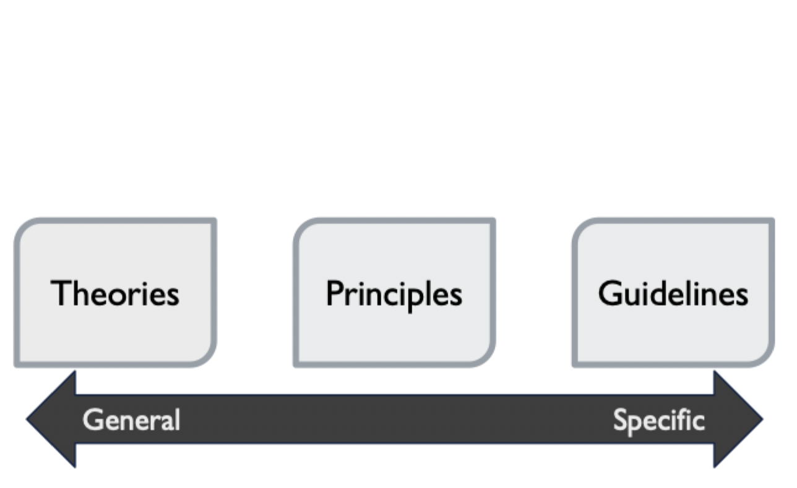
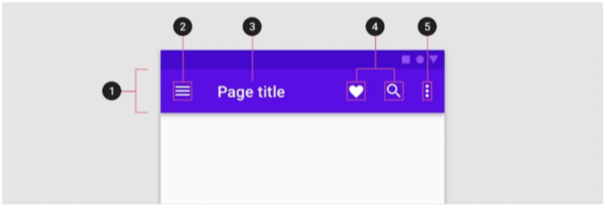

# Theories, principles, and guidelines

## Differences

- Terms seem interchangeable, but generally differ on how specific they apply
- Theories: communicate and teach a concept of design
- Principles
	- Rules and idioms
	- Analyze and compare alternative designs
- Guidelines
	- Apply to a specific context
	- Still a broad approach

## Examples of each

### Guidelines examples

#### In interface design

- Suggest how an interface should look and function
- Have a variety of sources including
	- Principles and theories
	- Generalization of earlier user studies
	- Practical experience of software/interface designers
	- Business considerations
	- Standards and norms

#### Apple interface guidelines: iOS

- Avoid crowding a navigation bar with too many controls
- In general, a navbar should have
	- Current view's title
	- A back button
	- One control to manage the view's contents

#### Android interface guidelines

- Navigation controls placed on the far left
- Any titles to the right of navigation
- Contextual actions to the right of the title
- An overflow menu (if used) on the far right
- Languages that read right-to-left should flip the order of the positions

### Principles examples

- Broader and more general than guidelines
- Not tied to a specific system, feature, or organization 
- Still apply to common contexts or issues
- Think of them as proverbs: principles are *what* to do, guidelines are *how* to do things

#### 8 golden rules

1) Strive for consistency
2) Seek universal usability
3) Offer informative feedback
4) Design dialogue to yield closure
5) Prevent errors
6) Permit easy reversal of actions
7) Keep users in control
8) Reduce short-term memory load

### Theories examples

- Capture generalized knowledge rather than practical application
- Generally don't tell the designer what to do, but provide the conceptual basis for action
- Explain how or why something *is*

#### Types

- **Descriptive**: clarify terms and key concepts
- **Explanatory**: reveal relationships and processes
- **Prescriptive**: convey guidance for designers to make decisions
- **Predictive**: enable comparison of design alternatives

