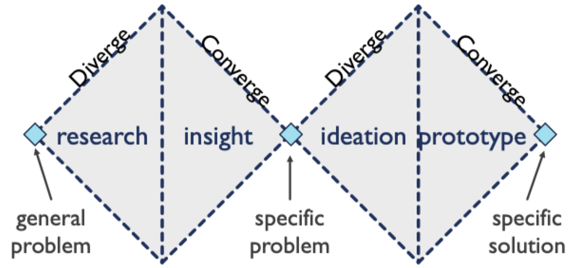

# Design process

## Roles that use design

- **Graphic designer**: take information and find ways to present it in a way that efficiently engages people in understanding that information
- **Interaction designer**: envisions new kinds of interactions with interactive technologies
- **User experience (UX) designer**: design and prototype user interfaces, defining the functionality, flow, layout, and overarching experience that are possible in a product. In many bigger companies, UX designers determine what software engineers build
- **User experience (UX) researcher**: understand problems deeply so that designers can envision solution to those problems or improve existing products
- **Product designers/managers**: investigate market opportunities and technical opportunities and design products that capitalize on those opportunities in a competitive landscape
- **Software engineers**: design data structures, algorithms, and architect systems

## Components of the design process

- Framing the goal
	- User research
	- Competitive analysis
	- Data analysis and summary
- Exploring the solution space
	- Brainstorming
	- Ideation through sketching
- Deciding on a good design
	- Scoping
	- Consideration of constraints
	- Scenarios, storyboards, personas
	- Design rationale
- Refining the design
	- Wireframes
	- Lo-fi and mid-fi prototyping
	- Evaluating

## Divergent and convergent thinking

- Divergent
	- Elaboration
	- Exploration
	- Expansion
	- Generation
	- Brainstorming
	- Sketching
- Convergent
	- Choice
	- Critique
	- Narrowing down
	- Winnowing
	- Deciding
	- Embracing

> Start with divergent thinking and then move towards convergent thinking

## Double diamond design model

- Two cycles of divergent and convergent thinking
- Divides the problem and solution into two design processes

