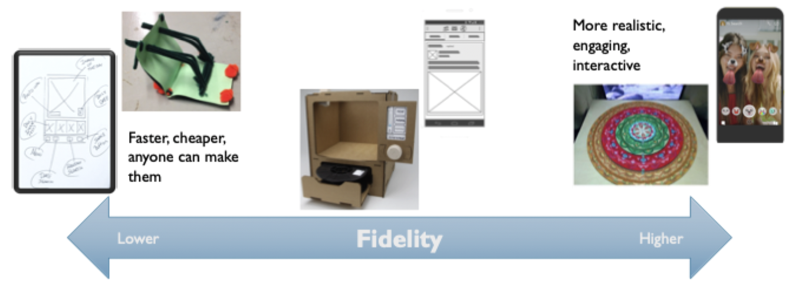

# Sketching

## Purpose of sketching

### Matching fidelity with level of certainty

- Lower fidelity suggests openness
	- Design team and users will feel more empowered to suggest changes
	- Critiques tend to be deeper, focused on structure and process
	- Better to identify *what* a design will be
- Higher fidelity representations feel closed
	- Suggests that design decisions have already been finalized
	- Critiques will focus on look-and-feel, easy-to-change details
	- Better at confirming *how* a design will be

## Qualities of sketches

### Quick, timely, inexpensive, disposable and plentiful

- Sketches promotes divergence - generating and exploring possibilities
- Sketches don't work if they become precious
	- Discover what works AND what doesn't
- Used *in the moment* to support exploration and deliberation

### Clear vocabulary and distinct gesture

- Sketch should signal that it is tentative in the way it is drawn
- Lack of precision suggests openness
	- Lines aren't perfect even and straight
	- Get a sense of fluid drawing strokes

### Minimal detail and appropriate degree of refinement

- Include only what is required to show the concept
- Make sketch as refined as the idea
- Going beyond good enough is a negative, not a positive

### Ambiguity is good

- Sketching (the process) is more important than the sketch (the byproduct)
- Focus on discovering relationships rather than refining ideas
- Ambiguity encourages innovation
	- Allows for multiple interpretations
	- Givers permission to critique, modify or even discard

## Rapid sketching workshop

### Big lessons

1) It's a good sketch when you can't take anything else away without making it harder to understand
2) Almost everything you sketch is made of a few basic shapes that you put together into a few common elements

### Pro tips

1) Use 2 thicknesses of pen (sharpies are ideal)
2) Scan + copy containers for later use
3) Drop shadows to indicate click-ability and show overlays
4) Use color sparingly
5) Differentiate people with simple resources