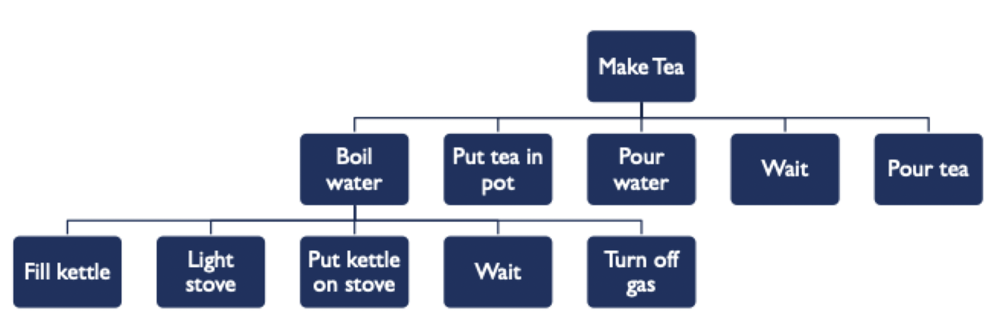

# Task analysis

## What is task analysis?

- The systematic study of how users complete tasks to achieve their goals
- Data comes from user research
- Helps designers create products that work how users expect

### Tasks are *not* goals

- Goals: what a person wants
- Tasks: activities the person must do to accomplish goals

### Task oriented questions

- Who is going to use the system?
- What tasks do they now perform?
- What tasks are desired?
- How are tasks learned?
- Where are the tasks performed?
- What is the relationship between people and data?
- What other tools do people have?
- How do people communicate with each other?
- How often are tasks performed?
- What are the time constraints on the tasks?
- What happens when things go wrong?

### Data about individual tasks

- **Trigger**: what prompts users to start their tasks?
- **Desired outcome**: how will users know when the task is complete?
- **Base knowledge**: what will the users be expected to know when starting the task?
- **Required knowledge**: what will users need to know to complete the tasks?
- **Artifacts**: what tools or information do the users utilize during the course of the task?

### Selecting tasks to model

- Real tasks people have faced or requested
	- Supported by your user research
	- Extracted from stories
- Provide reasonable coverage
- Mixture of simple and complex tasks

> Remember that you *cannot* model every single task, so be selective of those you do model

### Tasks should ...

- Be focused on *goals* (not a technology)
- Be specific - based on concrete knowledge/data
- Be linked to people (in line with personas)
- (Sometimes) describe a complete accomplishment

## Task modeling and task decomposition

- Break the goal down into tasks and subtasks
	- 4-8 tasks is usually a good scope for analysis
- Create a task diagram
	- Show relationship among tasks and how they are decomposed

- Annotate the diagram
	- Task order
	- Conditionals
	- Contextual factors
- Write a narrative to go along with the diagram
	- Motivation and nuances get lost in the graphical depiction
- Validate your analysis
	- Check with other team members for consistency
	- Ask users and stakeholders to confirm the accuracy

## Role of task analysis in design

### Tools for communicating

- Sharing user research and requirements with the team
- Especially useful for complex systems
- Creating diagrams together can generate consensus

### Further analysis and critique

- Overall number of tasks: too many?
- Frequency of tasks
	- How often are they performed?
	- Which are repeated?
- Cognitive complexity: what mental processes are needed?
- Physical requirements: is the design inclusive?
- Time: is it efficient?
- Underlying logic: are there written rules or norms?

### To interface design

- Enumerate features
	- Discard features that do not support tasks
	- Add features that are missing
- Produce scenarios for tasks
	- What will person do and see?
	- Step-by-step account of task in system
	- Illustrated using storyboards
