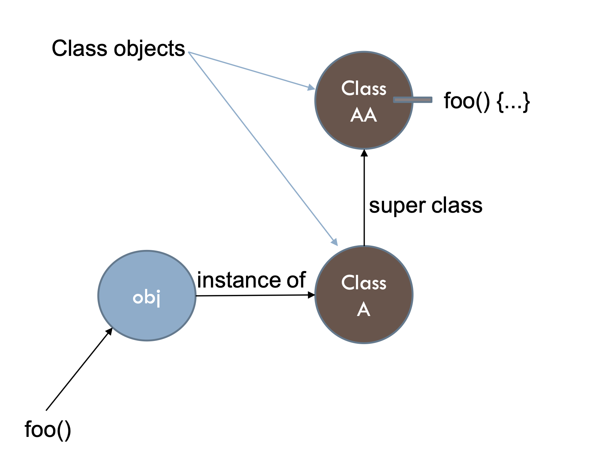
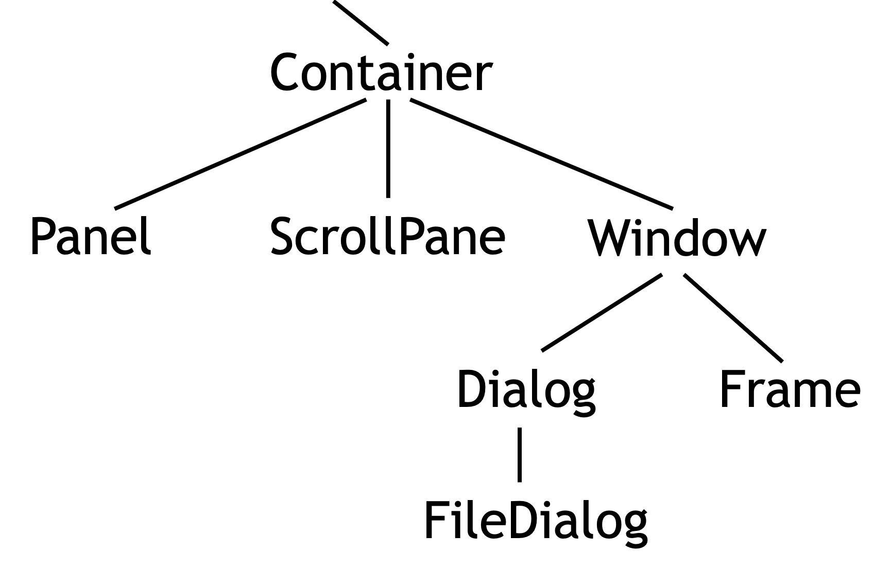
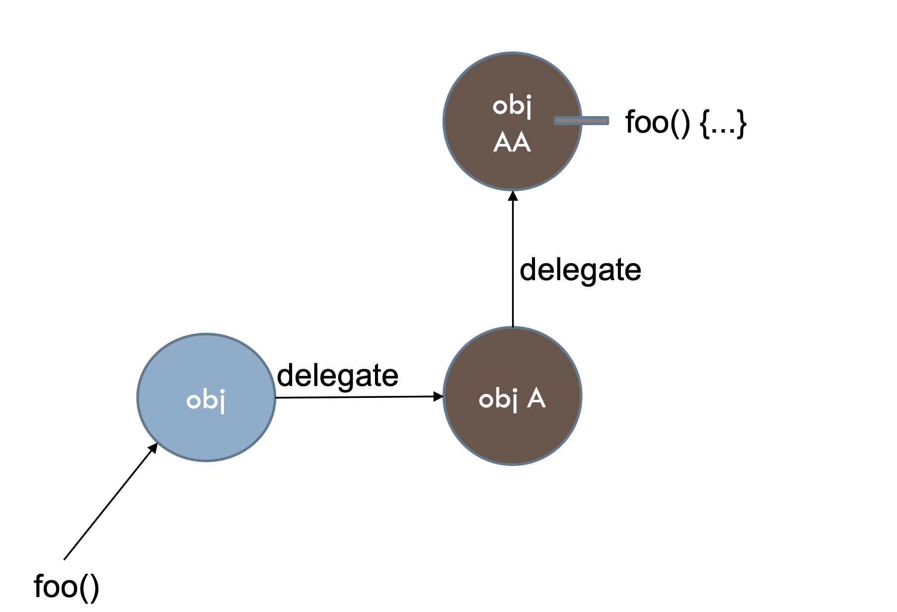

# Lecture 6

## Encapsulation

- Previously, in structure programming
	- data, which is passive
	- functions, which manipulate data
- An **object** contains both **data** and behavior (**methods**) that manipulate data
	- An object *does* things
	- An object is *responsible* for its own data
	- **But**: it can *expose* that data to other objects

### Example: a rabbit object

- You could (in a game, for example) create an object representing a rabbit
- It would have data
	- How hungry it is
	- How frightened it is
	- Where it is
- And methods
	- Eat
	- Hide
	- Run
	- Dig

### Advice: restrict access

- Always *always* strive for a narrow interface
- Follow the **principle of information hiding**
	- The caller should know as little as possible about how the method does its job
	- The method should know little or nothing about where or why it is being called
- Make as much as possible `private`

> Your class is responsible for it's own data; don't allow other classes to screw it up!

### Advice: use getters and setters

```Java
class Employee extends Person {  
	private double salary;  
	private boolean male;  
	public void setSalary (double newSalary) 
	{
		salary = newSalary;
	}

	public double getSalary () 
	{ 
		return salary;
	}

	public boolean isMale()
	{ 
		return male;
	}
}
```

- This way the object maintains control
- Setters and getter have conventional names
	- set*DataName*
	- get*DataName*
	- is*DataName* (boolean only)

### Kinds of access

- Java provides four levels of access
	- `public`: available everywhere
	- `protected`: available within the package (in the same subdirectory) and to all subclasses
	- default: available within the package
	- `private`: only available within the class itself
- The default is called **package** visibility
- In small programs this isn't important (or is it?)

### Smalltalk style

- Objects
	- Wrap around data
	- Receive messages
		- Messages are labels with optional data
	- Execute methods in reaction to those messages
		- They need to lookup methods given the message labels
		- Lookup is dynamic

### Stateful vs. stateless objects

- Typically, objects are stateful
	- The data represents the **state** of the object
	- State changes over time, with assignments
- Object can be stateless
	- When data never changes after the object is created

## Classes

- A class is like a template, or cookie cutter, or a factory
	- The class describes fields and methods
	- You use the class's **constructor** to make objects
- A class is also a type
	- Every object belongs to (is an d **instance** of) a class
- A class is also a runtime repository of methods
	- `obj.foo()` looks up method `foo` in the class of `obj`



### Prototypes: objects without classes

- JavaScript
- Prototypes are objects that contain their own methods

```JavaScript
var apple = {  
	type: "macintosh",
	color: "red",
	getInfo: function () {
		return this.color + ' ' + this.type + ' apple';
	}
}

apple.color = "reddish";
alert(apple.getInfo());
```

### Abstract data types (aka interfaces)

- Abstractions of behavior without committing to any implementation
- ADT -> multiple possible implementations
- **Specifying** ADTs in Java

```Java
public interface Queue<E> extends Collection<E> { 
	boolean add(E e);
	E element();
	boolean offer(E e); 
	E peek();  
	E poll();  
	E remove();
}
```

- **Implementing** ADTs in Java

```Java
public class LinkedList<E> implements Queue<E> {
	boolean add(E e) {...}
	E element() {...} 
	boolean offer(E e) {...} 
	E peek() {...}  
	E poll() {...}  
	E remove() {...}
}

public class PriorityQueue<E> implements Queue<E> { 
	boolean add(E e) {...}
	E element() {...}  
	boolean offer(E e) {...} 
	E peek() {...}  
	E poll() {...}  
	E remove() {...}
}
```

- Are classes ADTs?
	- No, unless they are marked abstract

### Singletons: single instances of a class

```Java
class Foo {  
	private static Foo Instance;
	 // no constructors  
	public static getTheFoo() {
		if (Instance == null)
		 Instance = new Foo();
		return Instance;
	 }
}
```

- Situation calls for 1 single object
- Object is more expressive than the class itself
	- can inherit, override methods, etc.

## Code reuse

### Inheritance: example of a hierarchy



- A `FileDialog` **is a** `Dialog` **is a** `Window` **is a** `Container`
- Conceptual modeling leads to *code reuse*

### Multiple inheritance (in C++)

- In C++, there may be more than one root
	- But not in Java, Python, C#
- In C++ an object may have more than one parent (immediate superclass)
	- But not in Java, Python, C#
- Java, Python, C# have a single, strict hierarchy

### Mixins: mix and match without inheritance

```Python
class RadioUserMixin(object):
	def __init__(self):
       self.radio = Radio()

	def play_song_on_station(self, station):
		self.radio.set_station(station)
		self.radio.play_song()

class Car(RadioUserMixin, Vehicle): ...

class Boat(RadioUserMixin, Vehicle): ...

class Plane(RadioUserMixin, Vehicle): ...
```

### Delegation: runtime inheritance



- Every object has a pointer to its class
- A class is represented by a "class object"
	- Every class object contains a hash table with method names and code
- Every class object has a pointer to its superclass
- Search for applicable methods starting in the object and moving up
	- If you hit the top without finding it, "message not understood"

## Dynamic dispatch

### Types of OO languages

- Java, C++, and others are *strongly typed*
- Purpose of the type system: prevent certain kinds of runtime errors by compile time checks (static analysis)

### OO type systems

- Usual guarantees
	- Program execution won't
		- Send a message that the receiver doesn't understand
		- Send a message with the wrong number of arguments
- Usual loophole
	- Type system doesn't try to guarantee that a reference is not null

### Typing and dynamic dispatch

- The type system allows us to know in advance what methods exists in each class, and the potential type(s) of each object
	- Declared (static) type
	- Supertypes
	- Possible dynamic type(s) because of downcasts
- Use this to engineer fast dynamic type lookup

### Object layout

- Whenever we execute `new Thing(...)`
	- We know the class of `Thing`
	- We know what fields it contains (everything declared in `Thing` plus everything inherited)
- We can guarantee that the initial part of subclass objects matches the layout of ones in the superclass
	- So when we up- or down-cast, offsets of inherited fields don't change

### Per-class data structures

- As in ruby, an object contains a pointer to a per-class data structure
	- But this need not be a first-class object in the language
- Per-class data structure contains a table of pointers to appropriate methods
	- Often called "virtual function table" or vtable
	- Method calls are indirect through the object's class's vtable

### Vtables and inheritance

- Key to making overriding work
	- Initial part of vtable for a subclass has the same layout as its superclass
		- So we can call a method indirectly through the vtable using a known offset fixed at compile time *regardless of the actual dynamic type of the object*
	- Key point: offset of a method pointer is the same, but it can refer to a different method in the subclass, not the inherited one

## Self reference

### Java

```Java
public class Point {
	public int x = 0;
	public int y = 0;

	//constructor
	public Point(int x, int y) {
		this.x = x;
		this.y = y;
	}

	public void print() {
		System.out.println(this.x + ":" + this.y);
	}
}
```

### Python

```Python
class Point():
	def __init__(self, x, y):
		self.x = x
		self.y = y

	def print(self):
		print(f'{self.x}:{self.y}')
```

- `self` is **not** a reserved word
- Python methods are class level functions that take an object as the first argument
- Object is passed implicitly, but received explicitly
- `p.print()` -> `Point.print(p)`

### JavaScript

```JavaScript
var apple = new Apple('macintosh');
apple.color = "reddish";
apple.getInfo();
```

- Uses a context variable `var context = {this: apple}`
- Passed implicitly to methods