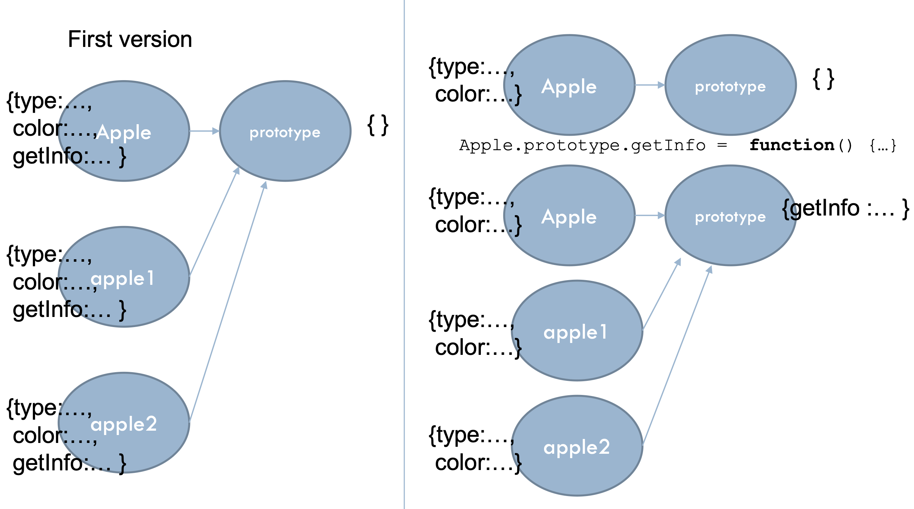
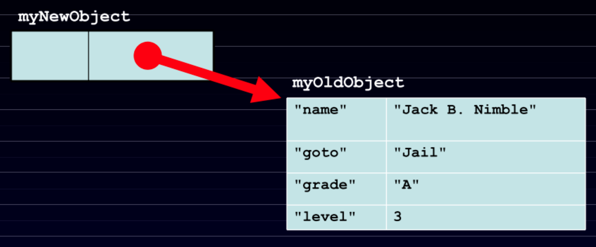
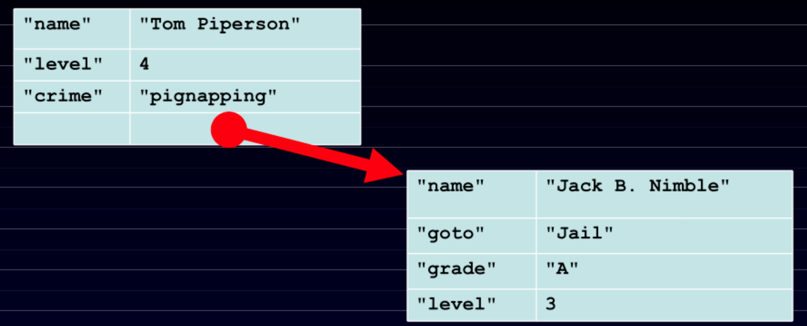

# Lecture 7

## Objects and functions

### JavaScript

- Classless objects
- Objects are dictionaries (hash maps)
- Functions are objects

### Instantiating objects

- Via literals

```JavaScript
var apple = {  
	type: "macintosh",
	color: "red", 
	getInfo: function () {
		return this.color + ' ' + this.type + ' apple'; 
	}
}
```

- Via functions

```JavaScript
function Apple (type) { 
	this.type = type;
	this.color = "red"; 
	this.getInfo = getAppleInfo;

}

// anti-pattern!
function getAppleInfo() {
	return this.color + ' ' + this.type + ' apple'; 
}
```

- Hybrid

```JavaScript
var apple = new function() {
	this.type = "macintosh";
	this.color = "red";
	this.getInfo = function() {
		return this.color + " " + this.type + " apple";
	}
}
```

### Function contexts

- Hidden magic of JS function calls
	- `Function.call(context: Object, arg1: Object, arg2: Object, ...)`
	- `Function.apply(context: Object, args: Array)`
- Given automatically to function calls
- Includes *at least* the object bound to the keyword `this`

## The mysterious prototype

### Prototypes

- Hidden "objects" associated with every **visible** object
- Hold additional information about the objects
- If a property is not found, JS looks for it in the objects prototype
- A mechanism for code reuse

### Objects via functions (better)

- In the snippet above, the `getAppleInfo` function is duplicated each time a new apple is made

```JavaScript
function Apple (type) { 
	this.type = type;
    this.color = "red";
}

Apple.prototype.getInfo = function() {
	return this.color + ' ' + this.type + ' apple'; 
}
```

- By putting the `getInfo` property in the prototype, only one implementation is used for all apples created



## Emulating inheritance

### Inheritance with prototypes

#### Mammal

```JavaScript
function Mammal(name) {
	this.name = name;
	this.offspring=[];
}

Mammal.prototype.haveABaby = function() {
	var newBaby = new Animal("Baby " + this.name);
	this.offspring.push(newBaby);
	return newBaby;
}

Mammal.prototype.toString() = function() {
	return "[Mammal '"+this.name+"']";
}
```

#### Cat

```JavaScript
Cat.prototype = new Mammal();
Cat.prototype.constructor=Cat;
function Cat(name) {
	this.name = name;
}
Cat.prototype.toString = function() {
	return '[Cat "'+this.name+'"]'
}
```

#### Pet

```JavaScript
var someAnimal = new Mammal('Mr. Biggles'); 
var myPet = new Cat('Felix'); 

alert('someAnimal is '+someAnimal); 
alert('myPet is '+myPet);
myPet.haveABaby(); 
alert(myPet.offspring.length); 
alert(myPet.offspring[0]);
```

### Linkage

- Objects can be created with a secret link to another object
- If an attempt to access a name fails, the secret linked object will be used
- The secret link is not used when storing. New members are only added to the primary object

#### Creating

```JavaScript
var myNewObject = new Object(myOldObject)
```



#### Using

```JavaScript
myNewObject.name = "Tom Piperson";
myNewObject.level += 1;  
myNewObject.crime = 'pignapping';
```



## Riddle me this

### Classless objects

- There are **three** ways to define a class
- Functions also have prototypes

### Hash hash

- Classes are functions
- Functions are objects
- They are all key-value maps anyway