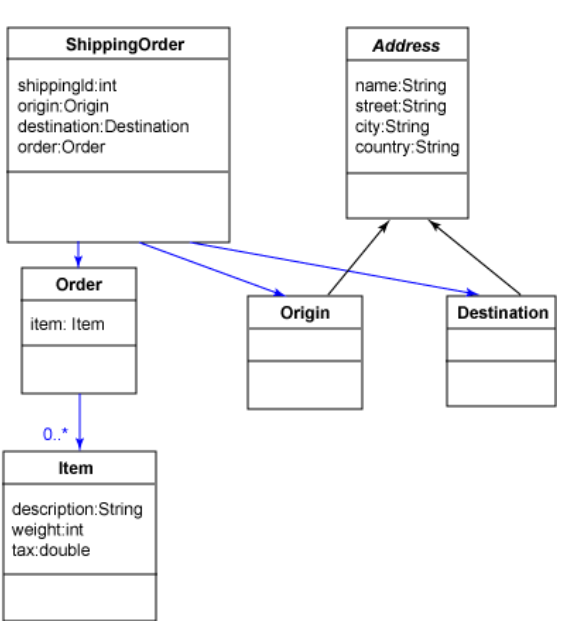
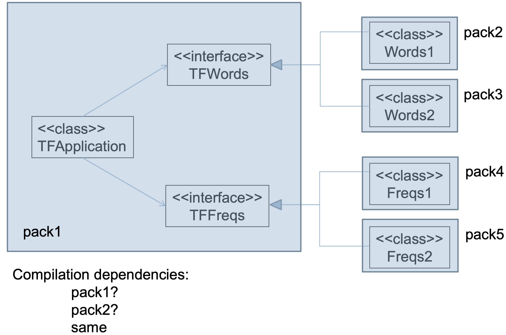
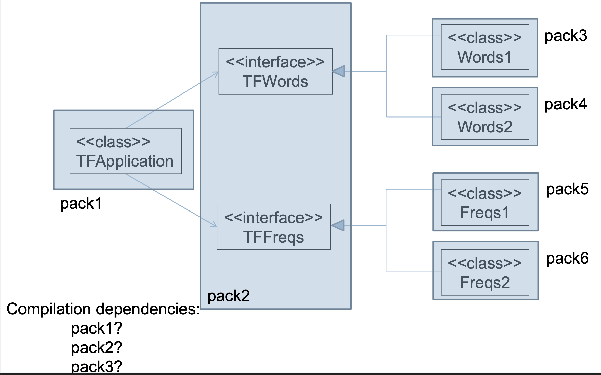
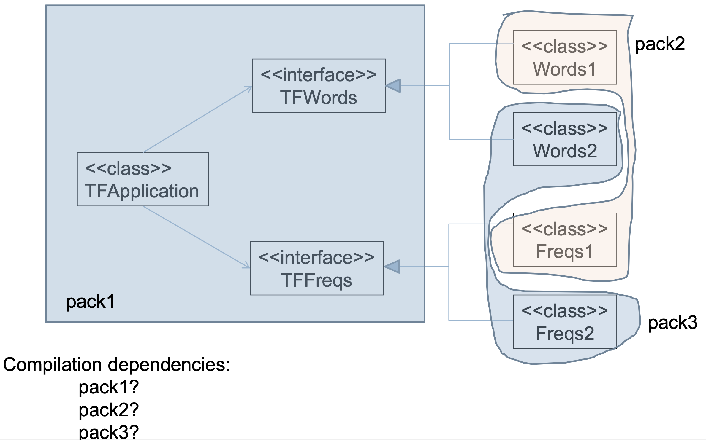
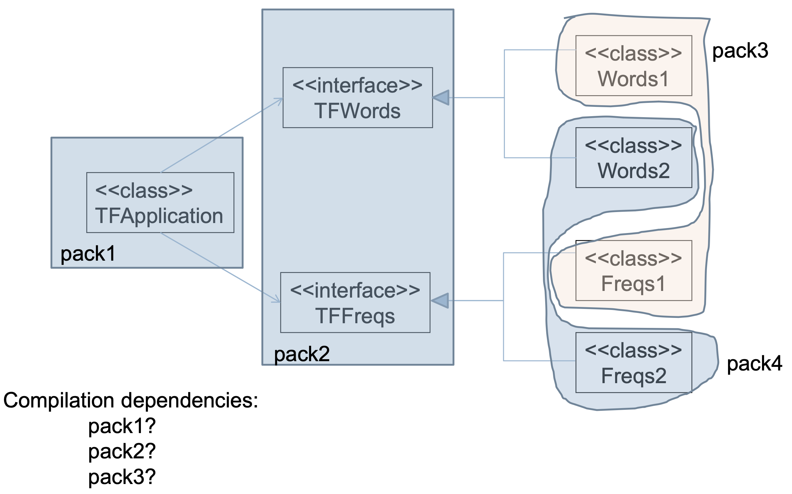
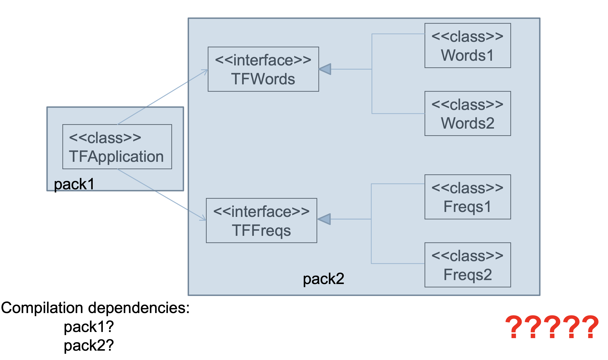

# Lecture 11

## Modules as...

### Conceptual units

- Business concepts
	- A shipping order has 
		- Id
		- Origin
		- Destination
		- Order
	- Origin and destination are of type Address
	- An address has
		- Name
		- Street
		- City
		- Country
	- An order consists of one or more items
	- An item has
		- Description
		- Weight
		- Tax
- Can be visualized with a UML diagram



### Physical components

- Source components
	- Get it, make it yours
- Binary components
	- Java: .jar files
	- .NET: DLL files
	- C/C++: .so files
	- ...

## Linking binary components

- Dynamically typed languages are simple
- Statically typed languages are not

### Python

- No need to worry about types during independent compilation

```Python
#! /usr/bin/env python
import sys, ConfigParser, imp

def load_plugins():
	config = ConfigParser.ConfigParser()
	config.read("config.ini")
	words_plugin = config.get("Plugins", "words")
	frequencies_plugin = config.get("Plugins", "frequencies")
	global tfwords, tffreqs
	tfwords = imp.load_compiled('tfwords', words_plugin)
	tffreq = imp.load_compiled('tffreqs', frequencies_plugin)

load_plugins()
words = tffreqs.top25(tfwords.extract_words(sys.argv[1]))

for (w, c) in word_freqs:
	print(w, ' - ', c)
```

### Typed

#### Independent compilation

```Java
class TFApp {
	static void main(String[] args) {
		HashMap<String, int> wordFreqs;
		wordFreqs = tffreqs.top25(tfwords.extract_words(args[0]))
	}
}
```

- Types of `tffreqs` and `tfwords` are unknown
- Could provide interfaces for them

```Java
interface TFWords {
	public List<String> extractWords(String path);
}

interface TFFreqs {
	public MashMap<String, int> top25(List<String> words);
}
```

- How to partition into jars?











#### Dynamic loading

```Java
class TFApp {
	static void main(String[] args) {
		HashMap<String, int> wordFreqs;
		TFWords tfwords = ???
		TFFreqs tffreqs = ???
		wordFreqs = tffreqs.top25(tfwords.extract_words(args[0]))
	}
}
```

- Coupling between physical components
- `TFApp` needs one of the other components in order to compile
- Perhaps create an instance dynamically with settings given in an `.ini` file?
- Loading of libraries
	- Java: `ClassLoader` class
	- .NET: Assembly class
	- Raw C++: 
		- Linux: `dlopen`, `dlsym`, `dlclose`
		- Windows: `LoadLibrary()`

#### Instantiation of classes

- Java: `Class.forName("...").newInstance();`
- .NET: `Activator.CreateInstance(type)`
- Raw C++: Factory pattern in linked lib?