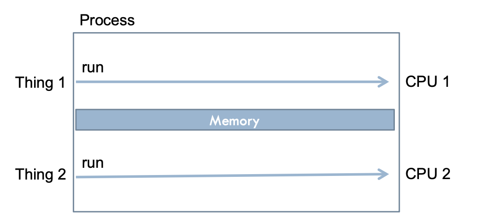
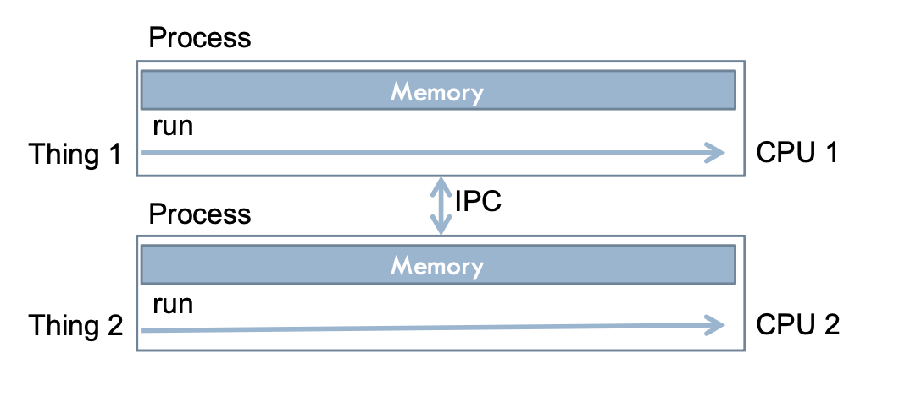
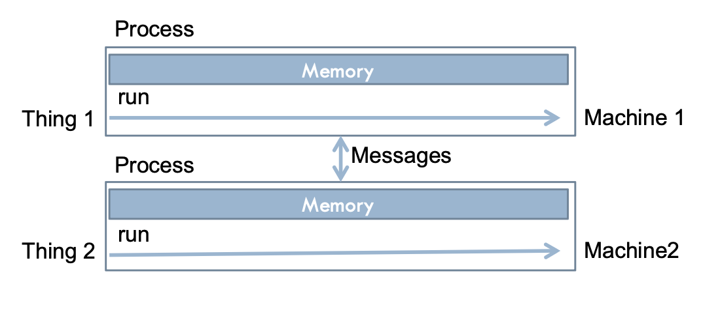
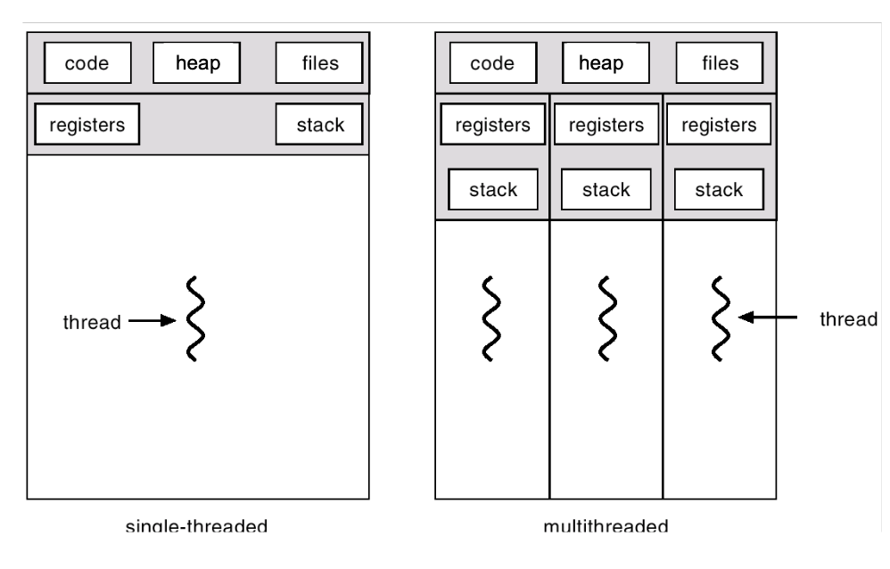
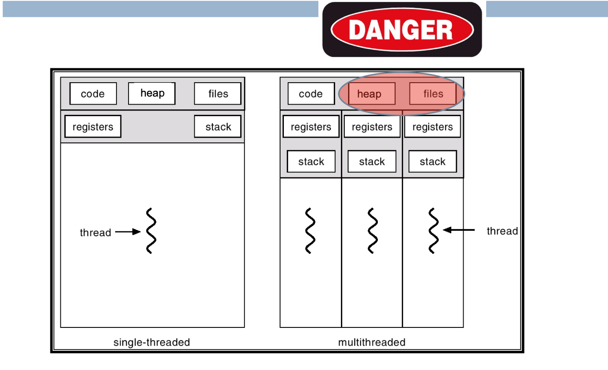
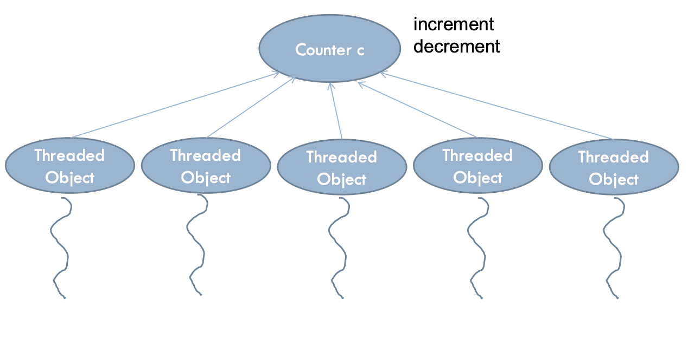
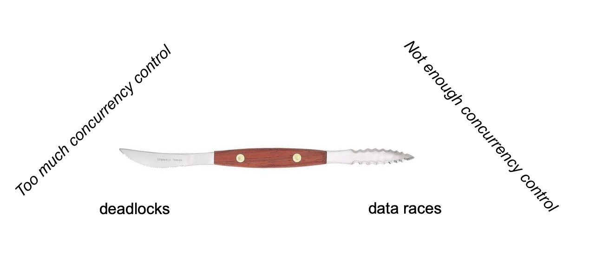

# Lecture 14

## Concurrency basics

### Concurrent programming

- More than one thing at a time
- Examples
	- Network server handling hundreds of clients
	- Data processing spread across multiple CPUs
	- App receiving input from several peripherals
- 1 CPU
	- CPU switches between tasks
	- Usually the job of a process scheduler
- Many CPUs
	- Tasks run on an assigned CPU
	- When there are more tasks than CPUs available, we go back to switching

### Processing vs. IO

- Tasks alternate between processing and IO
- IO must wait for data
- Runtime system will resume task when data becomes available

#### CPU bound tasks

- Most of the time is spent processing
- Examples
	- Math
	- Image processing

#### IO bound tasks

- Most of the time is spent doing IO
	- CPU is idle
- Example
	- User input
	- Networking
	- Files

### Shared memory

- Simultaneous access to memory space



### Separate processes, shared machine

- No shared memory
- Must use interprocess communication (like a PIPE)



### Different machines, distributed computing

- Networks (sockets)



## Shared memory (threads)



### Benefits

- Responsiveness
- Resource sharing
- Perfomance in multi-core machines

### Pitfalls

- Race conditions
- [Heisenbugs](https://en.wikipedia.org/wiki/Heisenbug)
- Easy to end up with a colossal code mess
- Heavy startup time for new threads
	- Can use thread pools to help

## Thread API examples

### Instantiate threads

```Java
class ThreadeObject implement Runnable {
	Thread t;
	ThreadedObject() {
		// Create a thread
		t = new Thread(this, "Demo Thread");
		System.out.println("Child thread: " + t);
		t.start(); // Start the thread
	}

	// This is the entry point for the ThreadedObject thread
	public void run() {
		for (int i = 5; i > 0; i--) {
			System.out.println("Child Thread: " + i);
			// Let thread sleep for a while
			Thread.sleep(50);
		}
		System.out.println("Exiting child thread.");
	}
}

public class ThreadDemo {
	public static void main(String args[]) {
		new ThreadedObject(); // create a new thread
		for (int i = 5; i > 0; i--) {
			System.out.println("Main Trhead: " + i);
			Thread.sleep(100);
		}
		System.out.println("Main thread exiting");
	}
}
```

### Extending threads

```Java
class ThreadedObject extends Thread {
	ThreadedObject() {
		super("Demo Thread");
		System.out.println("Child thread: " + this);
		start(); // Start the thread
	}

	// This is the entry point for the thread
	public void run() {
		for (int i = 5; i > 0; i--) {
			System.out.println("Child Thread: " + i);
			// Let the thread sleep for a while
			Thread.sleep(50);
		}
		System.out.println("Exiting child thread");
	}
}

public class ThreadDemo {
	public static void main(String args[]) {
		new ThreadedObject(); // create a new thread
		for (int i = 5; i > 0; i--) {
			System.out.prinlnt("Main Thread: " + i);
			Thread.sleep(100);
		}
		System.out.println("Main thread exiting");
	}
}
```

### Functional threads

#### Racket

```Racket
# lang racket

(thread (lambda ()
	(for ([i 10])
		(sleep 2)
		(printf "thread 1\n")
	)
))

(thread (lambda ()
	(for ([i 20])
		(sleep 1)
		(printf "thread 2\n")
	)
))
```

#### C++

```C++
#include <string>
#include <iostream>
#include <thread>
using namespace std;

// The funciton we want to make the thread run
void task1(string msg) {
	cout << "task1 says: " << msg;
}

int main() {
	// Constructs the new thread and runs it. Does not block
	thread t1(task1, "Hello");

	// Makes the main thread wait for the new threa to finish
	t1.join();
}
```

### Common operations of threads

- Create
- Start
- Sleep
- Suspend
- Resume
- Yield
- Stop

> Most thread APIs offer more than those listed here

## Concurrency control



### Shared data problems

```Java
class ThreadedObject extends Thread {
	Counter c;  
	ThreadedObject(Counter _c) {
		super("Demo Thread");
		 System.out.println("Child thread: " + this);
		  c = _c;  
		start(); // Start the thread
	}

	public void run() {  
		for (int i = 500; i > 0; i--) {
			System.out.println("Child Thread: " + i);
			if (i % 2 == 0) c.increment();
			else c.decrement();
			Thread.sleep(50);
		} 
		System.out.println("Exiting child thread.");
	}
}

class Counter {
	private inc = 0;
	
	public void increment() {
		c = c + 1;
	}

	public void decrement() {
		c = c - 1;
	}
}

public class ThreadDemo {
	public static void main(String args[]) {
		Counter c = new Counter();
		ThreadedObject[] ao = new ThreadedObject[5];
		// Create 5 threads
		for (int i = 5; i > 0; i--) {
			ao[i] = new THreadedObject(c)
		}
		// Wait for threads to finish
		for (ThreadedObject a: ao) {
			a.join();
		}
		System.out.println("Main thread exiting;");
	}
}
```



### Race conditions

- Corruptions of shared data due to thread scheduling
- Very hard to deal with
	- Non-deterministic
	- Hard to reproduce
	- Program may be Ok for long time until it hits a race condition

### Concurrency control

- Primitives for controlling the execution of concurrent threads over the same code

#### Java

- Only one thread at a time can enter the synchronized methods

```Java
class Counter { 
	private int c = 0;
	
	public synchronized void increment() {
		c = c + 1;
	}

	public synchronized void decrement() {
		c = c – 1; 
	}
}
```

- Only one thread at a time can enter the locked blocks

```Java
class Counter { 
	private int c = 0;
	
	public void increment() {
		lock(this) {
			c = c + 1;
		}
	}

	public void decrement() {
		lock(this) {
			c = c – 1; 
		}
	}
}
```

- Only one thread can acquire the lock

```Java
class Counter { 
	private int c = 0;
	Lock o = new Lock();
	
	public void increment() {
		o.acquire();
		c = c + 1;
		o.release();
	}

	public void decrement() {
		o.acquire();
		c = c – 1; 
		o.release();
	}
}
```

#### Locks

- Seem easy
- **Very hard** to manage
- Acquired locks must always be released
	- Including when exceptions occur
	- A lock that is not released will prevent any other thread from entering the block forever
- Overlocking -> deadlocks
- Underlocking -> data races

