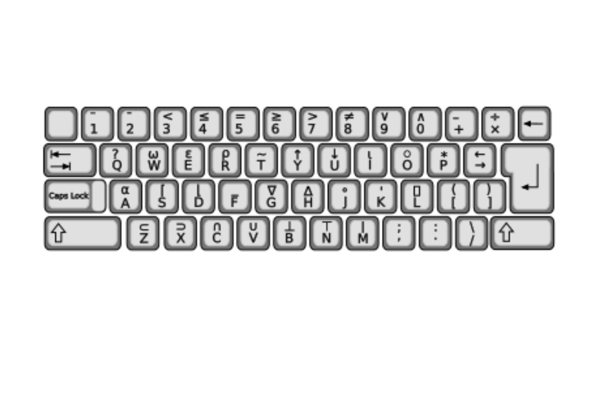
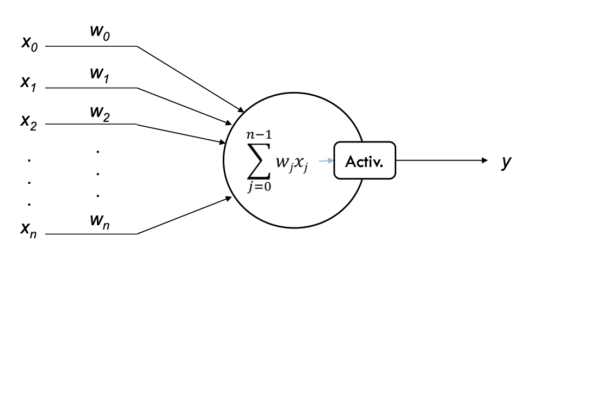
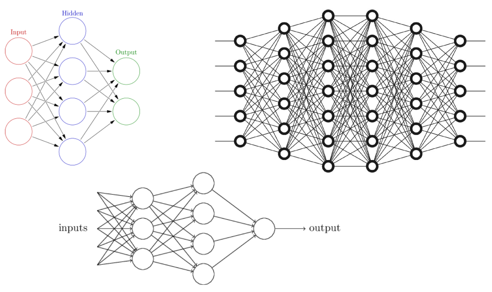
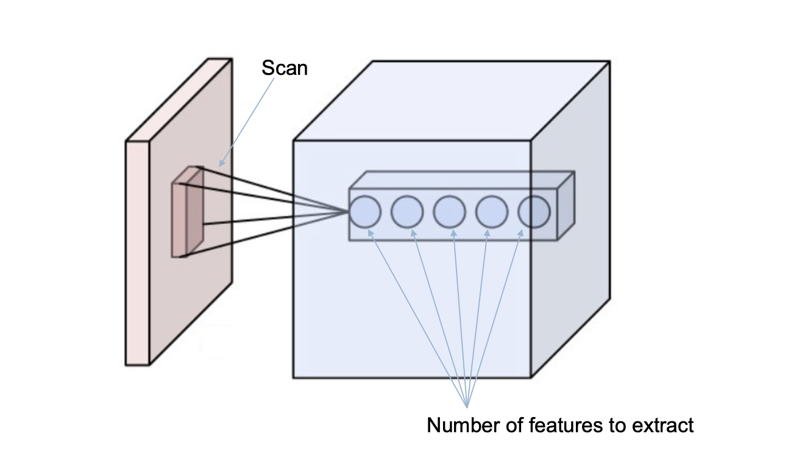

# Lecture 16

## Arrays

### What are they?

> Fixed-size collection of elements of the same type, occupying contiguous memory

### Array programming

- Application of operations to an entire array, at once
- Concise primitives about data manipulation
- Highly parallelizable
- Can be done be specialized processors (e.g. GPUs)

### Tired

- Iteration, scalar languages

```Java
String[] cars = {"Vovlo", "BMW", "Ford", "Mazda"};

for (int i = 0; i < cars.length; i++) {
	cars[i] = cars[i].toLowerCase();
}

List<String> oslice = new List<String>();
for (int i = 0; i < cars.length; i++)  {
	if (cars[i].contains('o'))
		oslice.append(cars[i])
}
```

### Wired

- Explicit iteration replaced by powerful declarative expressions within the array
- Leads to vectorization opportunities

```Java
String[] cars={"Volvo", "BMW", "Ford", "Mazda"};

cars = ToLowerCase(cars)

oslice = Where(cars.contains('o'))
```

### Tired vs. wired

- Shorter, more concise
- Abstraction of implementation details allows for optimized implementation (e.g. in GPUs)

### Languages with Array operations

- APL
- BASIC
- S
- Matlab
- Fortran 90
- R
- Python's numpy
- Julia

### Applications

- Scientific computing
	- Linear algebra
- Graphics
	- Images, videos (large, fixed-sized data)
- Machine learning

## APL



- Uses the specialized keyboard above
- Offers a multidimensional array as its basic data type
- Special graphic symbols for math notation

## Array programming style

- Man data type: array - a fixed sized collection of elements
- Iteration is replaced by high-level operations on the array (similar to map)
- Computation unfolds as search, selection, and transformation of data

## Neural networks

### Perceptrons



### What are they?

- Networks of perceptrons connected to each other in some topology

### Dataflow programming

- The network implements a *function*
	- Input neurons get the input
	- Output neurons show the output
- Neurons receive input from other neurons, and send their outputs to the neurons they are connected to
- Neurons are data transformers
- No memory - again, **pure function**

### How to model them?

- ~~Neurons-as-objects may seem appropriate
	- ~~Would capture network changes dynamically
- ~~Actors, maybe?
- Popular frameworks: no dynamicity, everything is static
- It's arrays all the way down

### Neural networks as array programming

- Static network allows for powerful array operations
- Highly parallelizable
- Use of GPUs

### Tensors

- Multidimensional arrays of numbers representing data transformation functions
- Values are **not** set upfront the programmer
- They are **inferred** during "training" using input/output examples

## Anatomy of neural network programs

1) Prepare the data
2) Define the network model
3) "Compile" the network model along with certain operational parameters
4) Train the model using the training data (fit)
5) Use the network on new data (predict)

### As monadic structures

Each layer is a function
Pure function: side effects are held off
Many layers = chain of functions
Chain is manipulated as ab object (compile)
Predict = run on given input

## Data representations

### Types of data

- Numerical: images, videos, scalar variables
- Categorical: strings, text, symbols
	- Must be converted to numbers before they are fed into a neural network

### Numbers only

- All data is encoded as vectors of numbers
- These encodings are an important part of solving problems in this style
	- Some encodings make the problem easy to solve
	- Others make the problem hard
- Deep neural nets can be seen as a sequence of data representation transformations
- The "learning" part is about searching for suitable representations of the data

### One hot encodings for categorical data

- Popular and simple, but quite expensive
- Given $N$ different things, use $N$ bits, where only one bit is $1$ and all others are $0$
- One hot encodings of the alphabet, 26 letters:
	- A = 10000000000000000000000000
	- B = 01000000000000000000000000
	- C = 00100000000000000000000000
- Compared to binary
	- A = 01000001
	- B = 01000010
- One hot has less rules than ASCII
- The ASCII rules don't mean anything in vector space

### Encodings vs. embeddings

- Both represent data in as numerical vectors
- Embeddings are encodings where the proximity in the space is meaningful
- For certain problems, it helps using embeddings to start with

## Popular network architectures

### Feed forward neural networks



### Convolutional neural networks

- The number and shape of filters is specified by programmer
- The exact values of the weight are learned



### Recurrent neural networks

- Problem: NNs don't have memory, they are stateless, but many functions depend on prior values
- Solution: Networks "with loops"

### Loops and arrays

- Problem: loops break the fixed-sized constraint of this style
- Solution: fixed-length loop unrolling

```Python
model = Sequential() 
model.add(Embedding(10000, 32))
model.add(SimpleRNN(32, return_sequences=True))
# How many "iterations"
```

## Neural network programming style

### Constraints

- All data is represented as vectors of numbers
- A network is a chain of pure functions
	- Each layer is a function over the vectorized data
- These functions are linear algebra transformations expressed as multi-dimensional vectors (tensors)
- Typically, the network architecture and hyperparameters are explicitly specified
- (with learning) the exact values of the weights are inferred during a training phase with in/out examples

### Observations

- Neural networks machines for **analog computing**
	- not $\{0 ,\, 1 \}$ but $[0, \, 1]$
- Well known programming concepts can be reinvented in this style
	- Containment verification -> convolution
	- Loops -> recurrence
	- Others stuff...