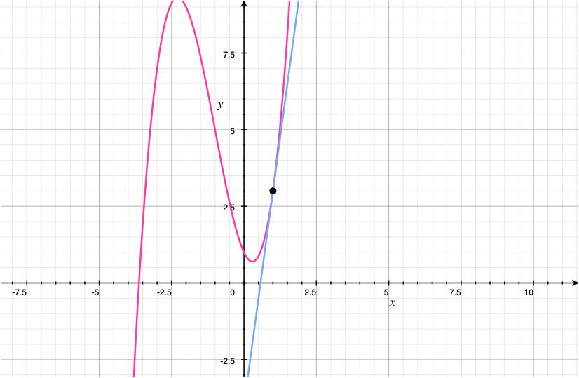
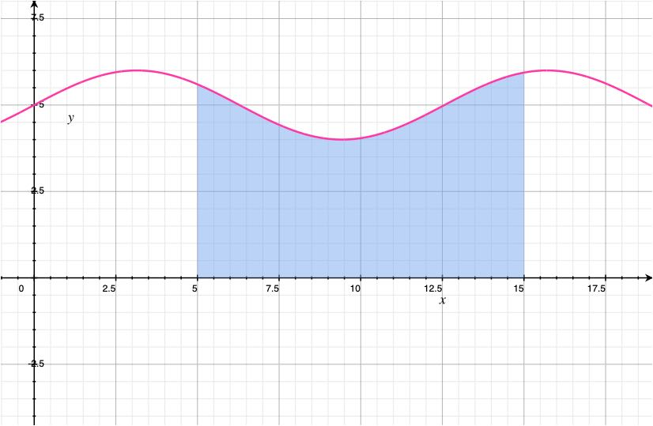

# Calculus with parametric curves

## Derivatives

### Traditional Derivatives

From Math 2A, $\dfrac{dy}{dx} = \lim_{\Delta x \to 0} \dfrac{\Delta y}{\Delta x}$

The slope of the tangent line at $A(a, f(a))$ is $f'(a) = \dfrac{df}{dx}(a)$

### Derivatives of Parametric Curves

Let a parametric curve be represented by

- $x = x(t)$
- $y = y(t)$

By eliminating the parameter, $y = y(x(t))$

Applying the chain rule to this representation reveals the first derivative of a parametric curve.

$\dfrac{dy}{dt} = \dfrac{dy}{dx} * \dfrac{dx}{dt}$

$\dfrac{dy}{dx} = \dfrac{dy/dt}{dx/dt}$

To obtain the second derivative, differentiate the first derivative of parametric curves

$\dfrac{d}{dx}(\dfrac{dy}{dx})$

$\dfrac{d^{2}y}{dx^{2}} = \dfrac{\dfrac{d}{dt}(\dfrac{dy/dt}{dx/dt})}{\dfrac{dx}{dt}}$

Note: $\dfrac{d^{2}y}{dx^{2}} \ne \dfrac{d^{2}y/dt^{2}}{d^{2}x/dt^{2}}$ is the incorrect second derivative.

Special cases for the first derivative

- $\dfrac{dy/dt}{dx/dt}$ if $\dfrac{dx}{dt} \ne 0$
- $\pm \infty$ if $\dfrac{dx}{dt} = 0$ and $\dfrac{dy}{dt} \ne 0$
- if $\dfrac{dx}{dt} = 0$ and $\dfrac{dy}{dt} \to$ Use L'Hopital's rule

### Example 1

Let a parametric curve be represented by

- $x = t^{2}$
- $y = t^{3} - t$

- There are two tangents at $(1, 0)$
	- $y = t^{3} - t = t(t^{2} - 1) = 0$
		- $y = t(t -1)(t+1) = 0$
		- $t = 0, 1, -1$
	- $x = t^{2} = 0$
		- $t = 1, -1$
	- The curve crosses itself at $(1, 0)$ at $t = -1$ and $t = 1$
		- $\dfrac{dy}{dx} = \dfrac{dy/dt}{dx/dt} = \dfrac{3t^{2} - 1}{2t} = \dfrac{3}{2}(t - \dfrac{1}{3t})$
		- At $t = -1$
			- $\dfrac{dy}{dx} = \dfrac{3(-1)^{2} - 1}{2(-1)} = \dfrac{2}{-2} = -1$
		- At $t = 1$
			- $\dfrac{dy}{dx} = \dfrac{3(1)^{2} - 1}{2(1)} = \dfrac{2}{2} = 1$
- Find the horizontal and vertical tangent lines
	- Horizontal ($\dfrac{dy}{dt} = 0$ and $\dfrac{dx}{dt} \ne 0$)
		- $3t^{2} - 1 = 0$
		- $t = \pm \sqrt{\dfrac{1}{3}}$
		- Plugging in t $\to (\dfrac{1}{3}, \pm \sqrt{\dfrac{1}{3}})$
	- Vertical ($\dfrac{dy}{dt} \ne 0$ and $\dfrac{dx}{dt} = 0$)
		- $2t = 0$
		- $t = 0$
		- Plugging in t $\to (0, 0)$
	- Determine curve's concavity
		- $\dfrac{d^{2}y}{dx^{2}} = \dfrac{\dfrac{d}{dt}(\dfrac{dy/dt}{dx/dt})}{\dfrac{dx}{dt}} = \dfrac{\dfrac{d}{dt}(\dfrac{3}{2}(t - \dfrac{1}{3t}))}{2t}$ 
		- $\dfrac{d^{2}y}{dx^{2}}$
			- $> 0$ for $t > 0$
			- $< 0$ for $t < 0$
## Integrals

### Traditionals Integrals

From Math 2A, the area under a curve $F(x)$ on $[a, b]$ is $A = \int_{a}^{b} F(x) \, dx$

### Integrals with Parametric Curves

For parametric equations

- $x = f(t)$
- $y = g(t)$

The area under the curve on $[a, b]$ is

$A = \int_{a}^{b} y \, dx = \int_{t_{1}}^{t_{2}} g(t) * f'(t) \, dt$

### Example 2

Let a parametric curve be represented by

- $x = t^{2}$
- $y = t^{3} - t$

Find the area under the curve on the interval $[0, 1]$

- $B = \int_{0}^{1} y \, dx$
	- $= \int_{0}^{-1} (t^{3} - t)(2t) \, dt$
	- $= \int_{0}^{-1} (2t^{4} - 2t{2}) \, dt$
	- $= \dfrac{2}{5} t^{5} - \dfrac{2}{3} t^{3} \vert_{0}^{-1}$
	- $= \dfrac{2}{5} (-1)^{5} - \dfrac{2}{3} (-1)^{3} = \dfrac{4}{15}$
- $A = 2B = 2(\dfrac{4}{15}) = \dfrac{8}{15}$

### Example 3

Let a cycloid be represented by

- $x = r(\theta - sin(\theta))$
- $y = r(1 - cos(\theta))$

Find the area under the curve on the interval $[0, 2\pi r]$

- $A = \int_{0}^{2\pi r} y\, dx$
	- $= \int_{0}^{2\pi} r(1 - cos(\theta)) r(1 - cos(\theta)) \, d\theta$
	- $= r^{2}\int_{0}^{2\pi} 1 - 2cos(\theta) + cos^{2}(\theta) \, d\theta$
	- $= r^{2} (0 - 2sin(\theta) + \dfrac{1}{4}sin^{2}(\theta) \vert_{0}^{2\pi})$
	- $= r^{2} * \dfrac{3}{2} * 2\pi = 3\pi r^{2}$

### Arc Length of Parametric Curves

- $L = \sum \sqrt{\Delta x^{2} + \Delta y^{2}}$
- $\lim_{\Delta \to 0} = \int_{a}^{b} \sqrt{1 + (\dfrac{dy}{dx})^{2}} \, dx$
- $L = \int_{\alpha}^{\beta} \sqrt{1 + (\dfrac{dy/dt}{dx/dt})^{2}} \dfrac{dx}{dt} \, dt$
- $L = \int_{\alpha}^{\beta} \sqrt{(\dfrac{dx}{dt})^{2} + (\dfrac{dy}{dt})^{2}} \, dt$

### Example 4

Let a parametric curve be represented by

- $x = cos(t)$
- $y = sin(t)$

Find the arclength of the curve on the interval $[0, 2\pi]$

- $L = \int_{0}^{2\pi} \sqrt{(-sin(t))^{2} + (cos(t))^{2}} \, dt$
- $= \int_{0}^{2\pi} \sqrt{sin^{2}(t) + cos^{2}(t)} \, dt = \int_{0}^{2\pi} 1 \, dt$
- $t \vert_{0}^{2\pi} = 2\pi$

### Example 5

Let a parametric curve be represented by 

- $x = e^{t}cos(t)$
- $y = e^{t}sin(t)$

Find the arclength of the curve on the interval $[0, 2\pi]$

- $\dfrac{dx}{dt} = e^{t}cos(t) - e^{t}sin(t)$
- $\dfrac{dy}{dt} = e^{t}sin(t) + e^{t}cos(t)$
- $(\dfrac{dx}{dt})^{2} = e^{2t}cos^{2}(t) - 2e^{2t}sin(t)cos(t) + e^{2t}sin^{2}(t)$
- $(\dfrac{dy}{dt})^{2} = e^{2t}sin^{2}(t) + 2e^{2t}sin(t)cos(t) + e^{2t}cos^{2}(t)$
- $L = \int_{0}^{2\pi} \sqrt{2e^{2t}} \, dt = \sqrt{2} \int_{0}^{2\pi} e^{t} \, dt = \sqrt{2}(e^{2\pi} - 1)$

### Example 6

Let a parametric curve be represented by

- $x = r(\theta - sin(\theta))$
- $y = r(\theta - cos(\theta))$

Find the arclength of the curve on the interval $[0, 2\pi]$

- $\dfrac{dx}{d\theta} = r(1 - cos(\theta))$
- $\dfrac{dy}{d\theta} = rsin(\theta)$
- $(\dfrac{dx}{d\theta})^{2} + (\dfrac{dy}{d\theta})^{2} = r^{2}(1 - cos(\theta))^{2} + r^{2}sin^{2}(\theta)$
- $= r^{2}(1 - 2cos(\theta) + cos^{2}(\theta) + sin^{2}(\theta))$
- $= 2r^{2}(1 - cos(\theta))$
- $L = \int_{0}^{2\pi} \sqrt{2r^{2}(1 - cos(\theta))} \, d\theta$
	- $cos(2\theta) = 1 - 2sin^{2}(\theta)$
	- $cos(\theta) = 1 -2sin^{2}(\dfrac{\theta}{2})$
- $L = 2r \int_{0}^{2\pi} \sqrt{sin^{2}(\dfrac{\theta}{2})} \, d\theta$
- $L = 2r \int_{0}^{2\pi} sin(\dfrac{\theta}{2}) \, d\theta$
- $L = 2r(-2cos(\dfrac{\theta}{2}) \vert_{0}^{2\pi}) = 2r(4) = 8r$

