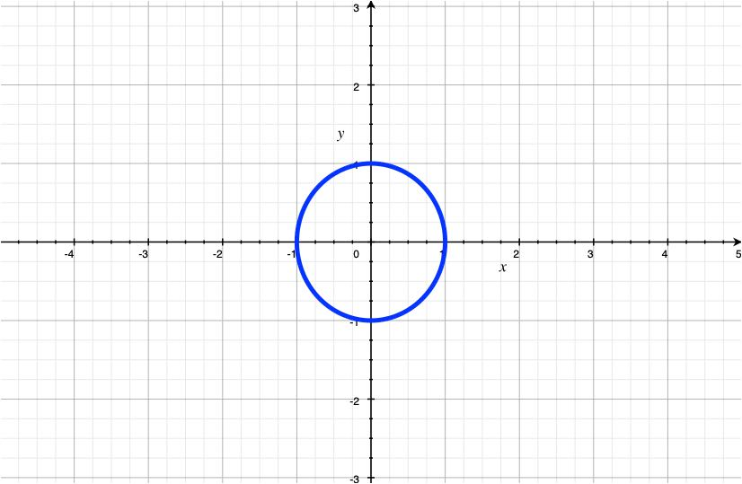
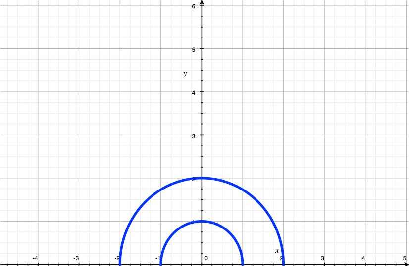

# Double Integrals Over Polar Regions

## Definition

Consider $\iint \limits_{R} f(x, y) \, dA$

Similar to rectangles in cartesian coordinates. A plane region $R$ of the form $R = \{(r, \theta) \vert \begin{cases} a \le r \le b \\ \alpha \le \theta \le \beta \end{cases}\}$ is called a polar rectangle.

However $dA \ne \Delta r \Delta \theta$

$R_{ij} = \{(r, \theta) \vert \begin{cases} r_{i - 1} \le r \le r_{i} \\ \theta_{j - 1} \le \theta \le \theta_{j} \end{cases}\}$

$\Delta A_{ij} = \dfrac{1}{2}r_{i}^{2} \Delta \theta - \dfrac{1}{2} r_{i - 1}^{2} \Delta \theta$

$\Delta A_{ij} = \dfrac{1}{2}(r_{i} + r_{i - 1})(r_{i} - r_{i - 1})\Delta \theta$

$\Delta A_{ij} = \dfrac{r_{i} + r_{i - 1}}{2} \Delta r \, \Delta \theta$

If $f$ is continuous in a polar region $R$ given by $a \le r \le b$ and $\alpha \le \theta \le \beta$ where $0 \le \beta - \alpha \le 2\pi$, then 

$\iint \limits_{R} f(x, y) \, dA = \int \limits_{\alpha}^{\beta} \int \limits_{a}^{b} f(rcos(\theta), rsin(\theta)) \, rdrd\theta$

If $f$ is continuous in a polar region of the form $D = \{ (r, \theta) \vert \begin{cases} \alpha \le \theta \le \beta \\ h_{1}(\theta) \le r \le h_{2}{\theta} \end{cases} \}$, then

$\iint \limits_{D} f(x, y) \, dA = \int \limits_{\alpha}^{\beta} \int \limits_{h_{1}(\theta)}^{h_{2}(\theta)} f(rcos(\theta), rsin(\theta) \, rdrd\theta$

In particular $A(D) = \int \limits_{\alpha}^{\beta} \int \limits_{h_{1}(\theta)}^{h_{2}(\theta)} 1 \, rdrd\theta = \int \limits_{\alpha}^{\beta} \dfrac{1}{2} (h_{2}(\theta))^{2} - \dfrac{1}{2} (h_{1}(\theta))^{2} \, d\theta$

## Examples

### Example 1

$R = \{ (r, \theta) \vert \begin{cases} 0 \le r \le 1 \\ 0 \le \theta \le 2\pi \end{cases}\}$

$R = \{ (r, \theta) \vert \begin{cases} 1 \le r \le 2 \\ 0 \le \theta \le \pi \end{cases}\}$

### Example 2

Evaluate $\iint \limits_{R} (2x - y^{2}) \, dA$

$R$ is the region in the upper half plane bounded by $x^{2} + y^{2} = 1$ and $x^{2} + y^{2} = 4$

$r$ is bounded by $0 \le r \le 2$ and $\theta$ is bounded by $0 \le \theta \le \pi$

$\iint \limits_{R} (2x + y^{2}) \, dA = \int \limits_{0}^{\pi} \int \limits_{0}^{1} 2rcos(\theta) + r^{2}sin(\theta) \, rdrd\theta$

$= \int \limits_{0}^{\pi} \dfrac{2}{3}r^{3}cos(\theta) + \dfrac{1}{4}r^{4}sin^{2}(\theta) \vert_{1}^{2} \, d\theta$

$= \int \limits_{0}^{\pi} \dfrac{14}{3} cos(\theta) + \dfrac{15}{4} sin^{2}(\theta) \, d\theta = \int \limits_{0}^{\pi} \dfrac{14}{3} cos(\theta) + \dfrac{15}{4} (\dfrac{1 - cos(\theta)}{2}) \, d\theta$

$= \dfrac{14}{3} sin(\theta) - \dfrac{15}{8} (\dfrac{sin(2\theta)}{2}) + \dfrac{15}{8} \vert_{0}^{\pi} = \dfrac{15}{8}\pi$

### Example 3

Use a double integral to find the area enclosed by one loop of the 3-leaf rose $r = cos(3\theta)$

$A(D) = \int \limits_{-\pi / 6}^{\pi / 6} \int \limits_{0}^{cos(3\theta)} rdrd\theta$

$= \int \limits_{- \pi / 6}^{\pi / 6} \dfrac{1}{2}cos^{2}(3\theta) \, d\theta$
note: $cos^{2}(3\theta) = \dfrac{1 + cos(6\theta)}{2}$

$= \int \limits_{-\pi / 6}^{\pi / 6} \dfrac{1}{2}(\dfrac{1 + cos() 6\theta}{2}) \, d\theta = \dfrac{1}{4}\theta + \dfrac{sin(6\theta)}{24} \vert_{- \pi / 6}^{\pi / 6}$

$= \dfrac{1}{4} * \dfrac{\pi}{6} + \dfrac{1}{4} * \dfrac{\pi}{6} = \dfrac{2\pi}{24} = \dfrac{\pi}{12}$
