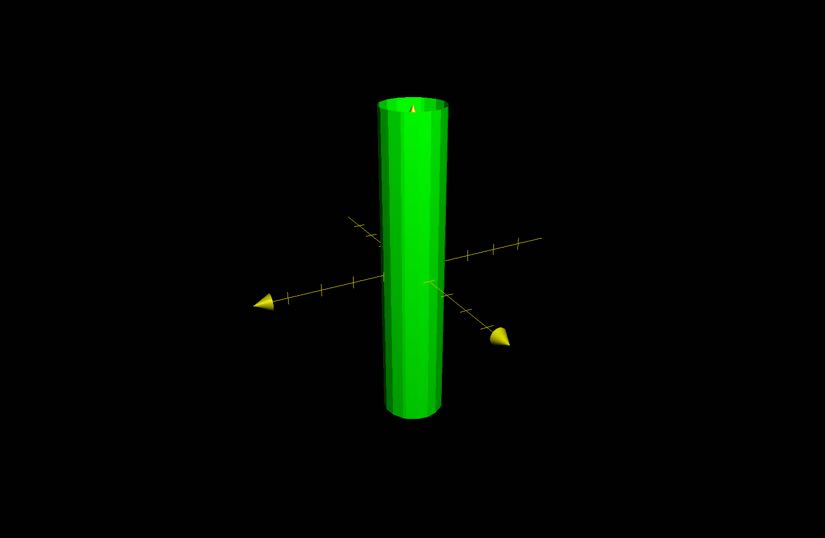
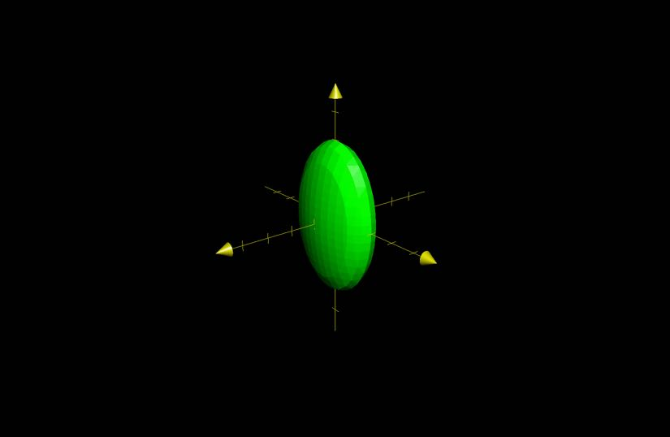
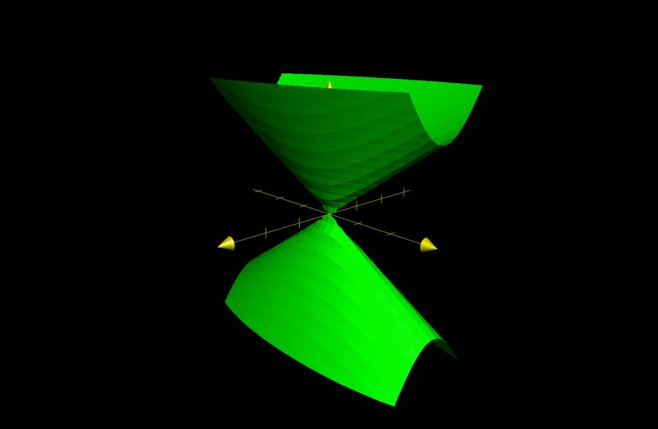
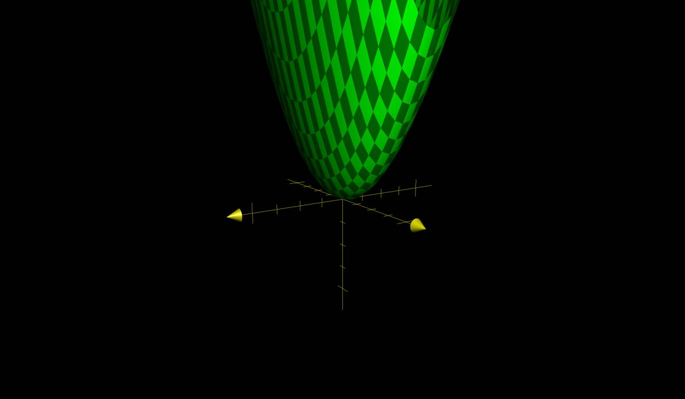
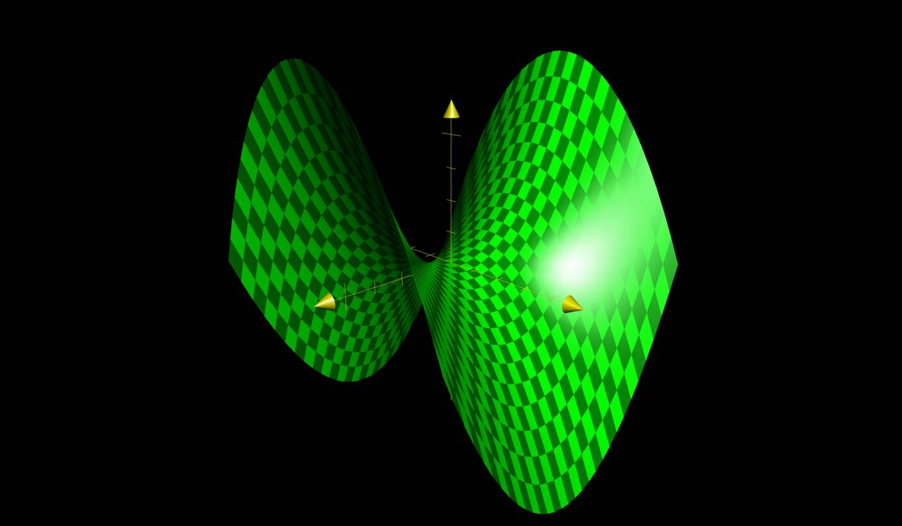

# Cylinders and Quadric Surfaces
## Traces

The curve of intersection of the surface with a plane parallel to the coordinate plane.

## Cylinder

A surface that consists of all lines that are parallel to a given line and passing through a given plane curve

### Example 1

The following equation graphs a cylinder with radius 1.

$x^{2} + y^{2} = 1$

## Quadric Surfaces

Quadric surfaces involve $x, \, y, \, z$.

Generally: $Ax^{2} + By^{2} + Cz^{2} + Dxy + Eyz + Fzx Gx + Hx + Iz + J = 0$

Reduces to:

- case 1
	- $Ax^{2} + By^{2} + Cz^{2} + J = 0$
- case 2
	- $Ax^{2} + By^{2} + Iz = 0$

### Example 2

Let $A$, $B$, and $C$ all be $> 0$

Then $x^{2} + \dfrac{y^{2}}{4} + \dfrac{z^{2}}{9} = 1$ creates an ellipsoid.

#### Horizontal Traces

Fix $z = k$

Traces are ellipsoids that  vary in size 

### Example 3

Let $A$ and $B$ be $> 0$ and $C$ be $< 0$

Then $\dfrac{z^{2}}{4} = x^{2} + \dfrac{y^{2}}{9}$ creates a cone.

#### Horizontal Traces

Ellipses whose radius increases and $z$ gets farther away from zero.

### Example 4

Let $\alpha$ and $\beta$ have the same sign in $z = \dfrac{x^{2}}{\alpha} + \dfrac{y^{2}}{\beta}$.

Then $z = 4x^{2} + y^{2}$ creates an elliptic paraboloid.

### Example 5

Let $\alpha$ and $\beta$ have the same sign in $z = \dfrac{x^{2}}{\alpha} + \dfrac{y^{2}}{\beta}$.

Then $z = x^{2} - y^{2}$ is a potato chip.

## Reference table of Quadric Surfaces

Consider quadric surfaces such that $\dfrac{x^{2}}{\alpha} + \dfrac{y^{2}}{\beta} + \dfrac{z^{2}}{\gamma} + J =0$.

- If $J \ne 0$
	- $\alpha, \, \beta, \, \gamma > 0 \, \to$ ellipsoid
	- two $> 0\, \to$ hyperboloid of one sheet
	- two $< 0\, \to$ hyperboloid of two sheet
- If $J = 0$
	- all positive or negative $\to$ only one point
	- two positive and one negative or two negative or one positive $\to$ cone

