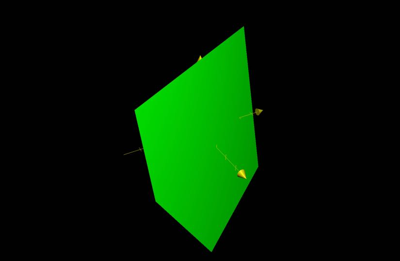
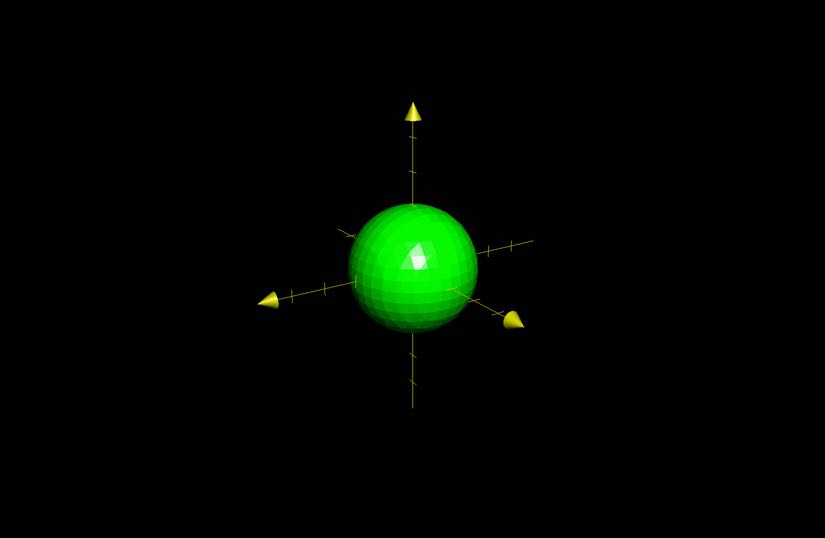
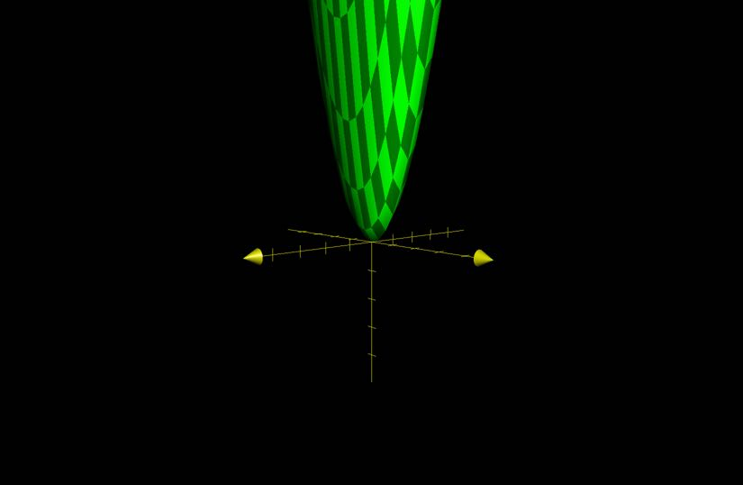

# Functions of Several Variables

## Definition

### Single Variable Functions

$f(x)$ is a function that maps a number to a number.

$x \to f(x)$

The domain is the subset of $\mathbb{R}$ for which $f(x)$ returns a value.

### Functions of Two Variables

$f(x, y)$ is a function that maps each pair $(x, y)$ to a number.

$(x, y) \to z$

The domain is the subset of $\mathbb{R}^{2}$ for which $f(x, y)$ returns a value.

## Examples

### Example 1

$f(x, y) = \dfrac{\sqrt{1 - x - y}}{x - 2}$

Evaluate $f(1, -2)$

- $f(1, -2) = \dfrac{\sqrt{1 - (1) - (-2)}}{(1) - 2}$
- $f(1, -2) = \dfrac{\sqrt{2}}{-1}$
- $f(1, -2) = -\sqrt{2}$

Find the domain of $f(x, y)$

- constraints
	- $1 - x - y \ge 0 \to y \le 1 - x$
	- $x \ne 2$
- The domain of $f(x, y)$ is all pairs $(x, y)$ such that the above constraints are satisfied.

### Example 2

$f(x, y) = ln(1 - x^{2} - y^{2})$

Find the domain of $f(x, y)$

- constraints
	- $1 - x^{2} - y^{2} > 0 \to 1 > x^{2} + y^{2}$
- The domain of $f(x, y)$ is all pairs $(x, y)$ such that they lie within the unit circle.

### Example 3

$f(x, y) = \sqrt{4 - x^{2} - y^{2}}$

Find the domain and range of $f(x, y)$

- D = $\{(x, y) \, \vert \, x^{2} + y^{2} \le 4\}$
- R = $\{f(x, y) \, \vert \, 0 \le \sqrt{4 - x^{2} - y^{2}} \le 2\}$

All points such that $z = f(x, y)$ where $(x, y) \in D$

### Example 4

$f(x, y) = 6 - 3x - 2y$

Functions of the form $f(x, y) = ax + by +c$ are called linear functions . Their graphs are planes.

Graph of $f(x, y)$

### Example 5

$f(x, y) = \sqrt{4 - x^{2} - y^{2}}$

$z = \sqrt{4 - x^{2} - y ^{2}} \to z^{2} + y^{2} + x^{2} = 4$

Sphere of radius 2 (only upper half)

Graph of $f(x, y)$

### Example 6

$f(x, y) = 4x^{2} +  y^{2}$

This function is a elliptic paraboloid.

## Level Curves

Given $f(x, y)$, its level curves are plane curves $f(x, y) = k$ projected onto the xy plane.

### Example 7

$f(x, y) = 6 - 3x - 2y$

The level curve of the equation $6 - 3x -2y = k$ 

- $y = -\dfrac{3}{2}x + \dfrac{6 - k}{2}$
- They are lines with $m = -\dfrac{3}{2}$ and $b = \dfrac{6 - k}{2}$

### Example 8

$f(x, y) = \sqrt{4 - x^{2} - y^{2}}$

The level curves of $f(x, y)$ are

- $k = \sqrt{4 - x^{2} - y^{2}} \to x^{2} + y^{2} = 4 - k^{2}$
- Circles or radius $r = \sqrt{4 - k^{2}}$

## Extensions to higher dimensions

$w = f(x, y, z)$

$D$ is the subset of $\mathbb{R}^{3}$ such that $f(x, y, z)$ is defined

$R$ is the set of values that $f(x, y, z)$ takes on

### Example 9

$f(x, y, z) = ln(z - y) + xsin(x)$

D = {$(x, y, z) \, \vert \, z > y$}
