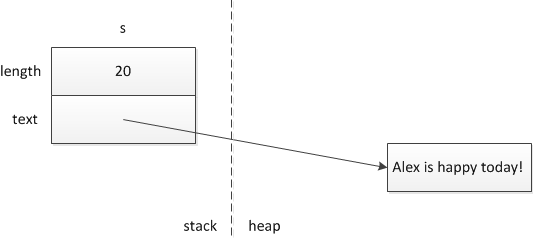

# Allocation

## Static allocation

- Memory determined before runtime
- Done by the compiler
- Occurs on the runtime stack

## Dynamic allocation

- Occurs on the free-store (aka the heap)
- `std::string s = 'Alex is happy today!'`

## Pointers

- A memory address
- It is its own type
    - `int* x` -> `x` is a pointer to an integer
- Can see which memory address a pointer points to
    - `&x` -> Some hexadecimal output
- Pointing a pointer to a pointer points both pointers to the same address
- Pointing a pointer to a pointer's address creates a pointer to a pointer to a memory address
- Can view the contents of a pointer by dereferencing it: `*x` 
- Null pointer
    - Tracks absence of an object
    - `int* p = nullptr`
    - Deferencing a null pointer is undefined behavior (crashes on the ics45c vm)
    - Can check `if (p != nullptr)` or `if(p)`

## `new`

- Caused memory to be dynamically allocated
- Memory allocated on the heap
- Memory leacks occur when you forget to free allocated memory on the heap

## `delete`

- Caused memory that was dynamically allocated to be freed
- Destroys the object
- Helps prevent memory leaks
- Following a pointer that has been deleted is undefined behavior (aka the dangling pointer problem)