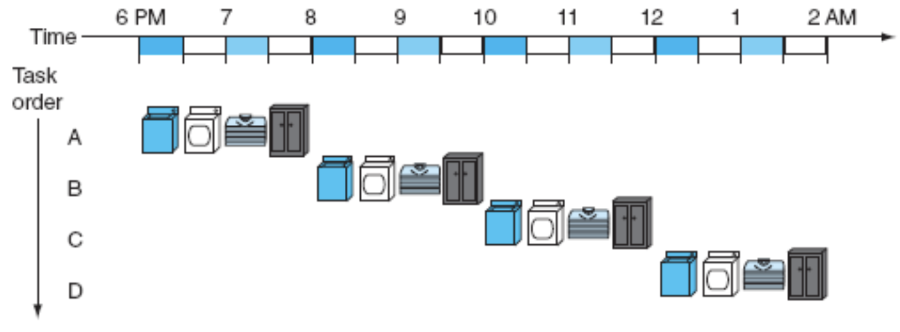
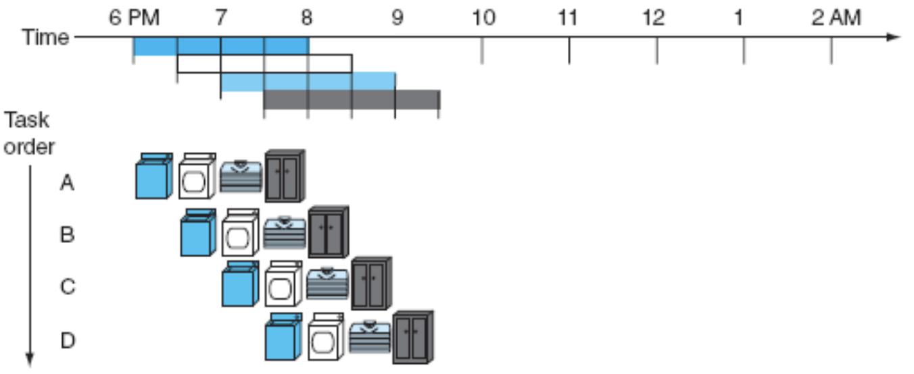
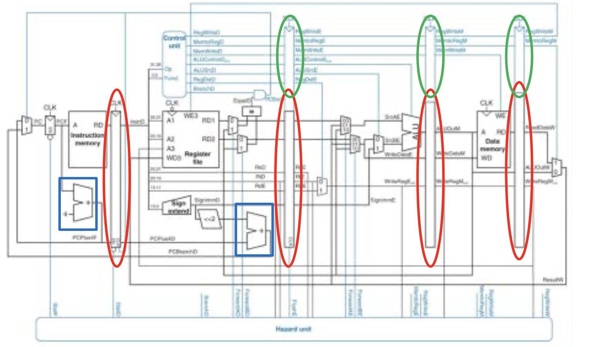

# Pipeline datapath

## Motivational example: laundry

### Dumb laundry

### Smart laundry

## Pipelined datapath execution

- Reusing the multicycle splits
    - Instruction fetch (IF)  
    - Instruction decode & register file read (ID)  
    - Execution of arithmetic operation or address calculation (EX)
    - Data memory access (MEM)  
    - Write back to register (WB)
- We can increase the throughput of our datapath.
- To implement the pipelined functionality the datapath becomes more complex.
    - Extra control (registers to hold control values) is required to manage the execution of multiple instructions simultaneously (circled in green)
    - Extra registers are required to hold the intermediate values of each instruction (circled in red).

- The maximum speed of the CPU will depend on how many stages we have.
- Not all instructions will require all stages, but they are still needed
- Each stage of the pipeline will be executing a different instruction, therefore all the data required from the current stage to the next stage much be stored in registers.

## Performance comparison

- For Single cycle datapath: The minimum cycle time is the length of the longest instruction
- For Multi cycle datapath: The minimum cycle time is the length of the longest stage, but each instruction requires multiple stages
- For pipelining, we are executing in a multi-cycle datapath, therefore the minimum cycle time is the length of the longest stage.

## Pipeline hazards

- Hazards are situations, caused by the sequence of MIPS instructions or the hardware, that prevent or complicate the execution of the next instruction in the pipeline.

### Structural hazards

- These hazards occur when there is a conflict for use of a resource.
- The MIPS pipelined datapathn require separate instructions and data memories to eliminate this structural hazard.

### Data hazards

- A data hazard occurs when an instruction depends on the completion of a previous instruction.
- We don't want to stall the pipeline in order to wait for the previous instructions  completion
- Forward/bypassing
    - Instead of waiting until the write back occurs, we will “forward” the data from the stage where it is available to the stage it is needed
    - To do this, extra wires and multiplexor options need to be added to the datapath
- Code scheduling
    - The order in which instructions are programmed can often be modified while still producing the same result.
    - One approach to eliminate stalls due to load instructions is to reorder the code to avoid the use of the load result in the next instruction.

### Control hazards

- Typical execution of instructions is one after another in memory. However, branch and jump instructions allow for the linear execution to be modified.
- During pipelining, the branch instruction will determine the next instruction to fetch. But the branch determination is not complete until the 4th stage
- If the branch outcome is determined in the MEM cycle, then the 3 subsequent instructions are already in the pipeline.
- We can reduce this branch delay by moving the branch address calculation and perform the branch comparison to the ID stage. Additional hardware is required.
- By performing the branch in the check in the decode stage, then when the branch is taken the control signals for the next instruction (in fetch stage) can be set to nop (IF.flush control signal).