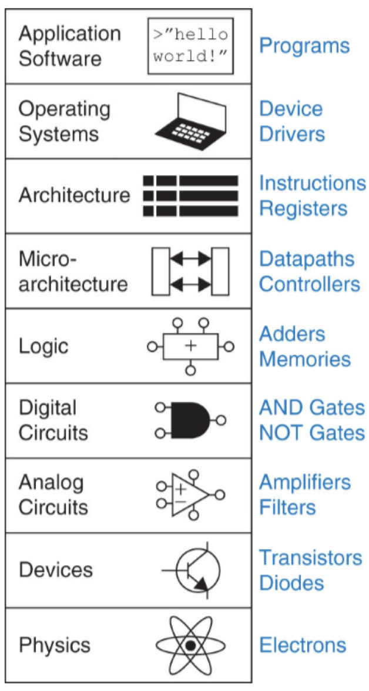
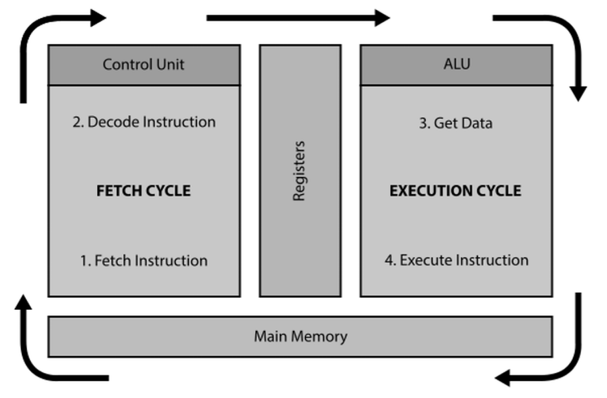

# Digital systems

## Computers today

> 3 main types of devices

1) Personal computers: general purpose; low computation machines
2) Servers & supercomputers: built for a specific purpose (storage, computation)
3) Embedded computers: special purpose computers embedded into a larger system

## Architecture vs organization

- **Computer architecture**: refers to aspects of hardware that are "visible" to the programmer
- **Computer organization**: refers to how physical components of the machine interact to implement an architecture

### 8 great ideas in architecture

1) [Moore's Law](https://en.wikipedia.org/wiki/Moore's_law)
    - Circuit complexity / speed doubles about every 2 years
    - Arguably reaching a physical limit
2) Use abstraction to simplify design
    - Ignore irrelevant details; focus on higher-level details
3) Make the common case first
    - Enhance performance of frequently occurring instructions
4) Increase performance through parallelism
    - Perform operations in parallel
5) Increase performance through pipelining
    - Single instructions are broken into multiple stages
    - Once instruction finishes a stage, next instruction begins that stage
6) Increase performance through prediction
    - "Guess" which instruction will be executed nexrt
    - Branch prediction
7) Implement a heirarchy of memory
    - Fastest and smallest at the top
    - Slowest and largest at the bottom
8) Increase dependability through redundancy
    - Duplicate components that can take over in event of failure

### Von Neumann architecture

- A particular computer hardware design
- Separates CPU and RAM
- Both instructions and data stored in RAM
- Data to be processed transferred from RAM to CPU, results put back into RAM

## Stored program computer

- Program stored in RAM alongside its data
- Programs consists of **binary** instructions
- Each instructions has a **memory address** to indicate its location
- The **program counter** is a register that stores the location of the next instruction to be executed

### Fetch/decode/execute cycle

- *Fetch*: retrieve the next instruction from RAM
- *Decode*: examine the instruction to detemine what the processor should do
- *Execute*: perform the instruction and store results back into RAM

## Instruction sets

- The repertoire of instructions the CPU can perform
- Determined by computer architects / designers
- "Hard wired" as part of the design
- Differs for each type of CPU (i.e. Intel chips vs Applie M1)

### RISC

- *R*educed *I*nstruction *S*et *C*omputers
- Provides a minimal set of instruction to carry out all essential operations
- Memory access is permitted with explicit load/store instructions only
- Instructions are a fixed length in memory
- Reduces clock cycles per instruction by increasing the number of instructions in a program

### CISC

- *C*omplex *I*nstruction *S*et *C*omputers
- Reduce instructions needed to write a program by having multiple operations in a single instruction
- Leads to multiple ways to access memory
- Instruction length can vary
- Reduces instructions needed to write a program by increasing number of clock cycles per instruction