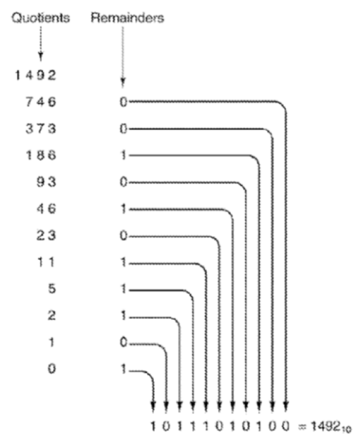
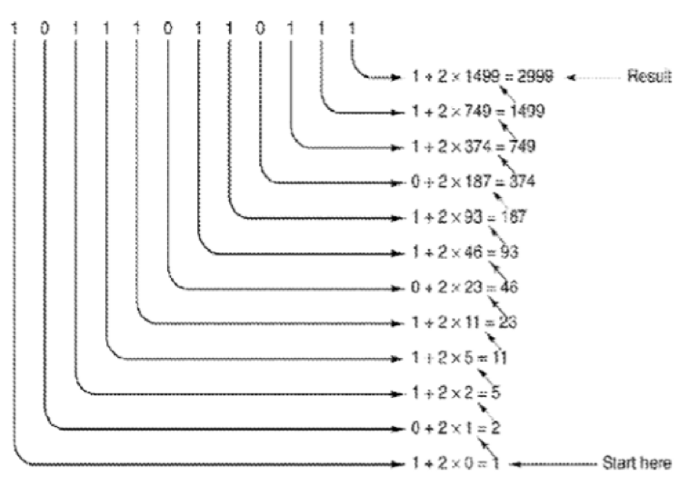
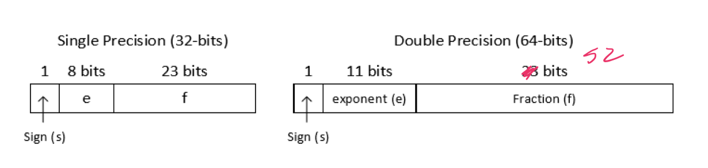

# Number representations

## Binary digits (bits)

- Like a light switch; has only two states
- Each bit can have the value `1` or `0`
- Groups of bits can be used to represent larger values
- Interpreting bits in different ways -> same bits can represent different things

## Base-10 notation

- The "real life" counting system
- Each digit has a specific value
- Move left -> value increases by a factor of 10
- Move right -> value decreases by a factor of 10
- Each place can have one of ten digits
- The value of a position is the digits in its place times is place value
- The value of each position is summed to get the total value

## Radix-k notation

- Use *k* distinct digits and place values change by a factor of *k*
- Numbers with terminating decimal representation might **not** have a terminating representation in other radixes
- Base must be specified because the same "number" can represent different decimal values

### Base-2 (binary)

- There are two digits: 0, 1
- Place values are powers of 2

### Base-8 (octal)

- There are eight digits: 0, 1, 2, 3, 4, 5, 6, 7
- Place values are powers of 8

### Base-16 (hexadecimal)

- There are sixteen digits: 0, 1, 2, 3, 4, 5, 6, 7, 8, 9, A, B, C, D, E, F
- Place values are powers of 16

## Converting between radix

### Decimal -> binary

- Generate bits from right-to-left (LSB -> MSB)
- Take remainder after dividing by 2 to get next bit of result
- Keep dividing until 0 reached
- For other radixes, divide by *k* instead of 2



### Binary -> decimal

- Start with initial value of 0
- Process left-to-right (MSB to LSB)
    - Double value from previous stage
    - Add next bit value
- For other radixes, multiply by *k* instead of 2



### Decimal fractions to binary

- Generate bits from left to right starting at the radix point
- Multiply decimal value by 2
    - If product > 1 -> next bit is one
    - Otherwise next bit is 0

### Conversions between power of 2 bases

#### Binary to octal

- Work right-to-left
- Take bits in groups of 3 and convert to corresponding octal digit

#### Binary to hexadecimal

- Work right-to-left
- Take bits in groups of 4 and convert to corresponding hex digit

#### Octal to binary

- Work left-to-right
- Convert each digit to its 3-bit binary equivalent

#### Hexadecimal to binary

- Work left-to-right
- Convert each digit to its 4-bit binary equivalent

### Radix k1 to radix k2

- Don't do it directly
- Convert radix k1 to decimal representation
- Then convert resulting representation to radix k2

## Integer encodings

- Two types: **signed** and **unsigned**
- Each has a *range of representation* depending on
    - The encoding
    - The number of bits

### Unsigned integers

- Typically encoded as follows

```
- 0       -> 000...00
- 1       -> 000...01
- 2       -> 000...10
- 3       -> 000...11
-        ...
- 2^N - 1 -> 111...11
```

- Mathematical operations, like addition are done the same way as base-10

```
        0 0 1 1
    +   0 1 0 1
    -----------
sum     0 1 1 0
carry   0 0 0 1
```

### Arithmetic overflow

- N-bit integer have a fixed precision
- Arithmetic operations can result in overflow
- Overflow means a value has exceeded the range of representable values
- Numbers greater $2^{n} - 1$ cannot be represented in an $n$ bit representation
- The leftmost "carry" gets dropped because it cannot be stored in the $n$ bit representation
- Be aware of the range of representable ranges to avoid unintentional overflow

## Signed integer encodings

- Permit the representation of positive and negative numbers
- Hardware designers choose between the encodings and programmers should be aware of which encoding is in use

### Signed magnitude

- The most significant bit is used as a sign (0 = "positive" and 1 = "negative")
- The remaining $N - 1$ represent the magnitude as in the unsigened encoding
- Range: $[-(2^{N - 1} - 1), (2^{N - 1} - 1)]$
- Problems
    - Two representation for $0$
    - Subtraction is somewhat complicated

### One's complement

- Positive number remain the same as in the signed magnitude encoding
- To obtain negative numbers, "flip" all the bits
- Addition requires "end around carry"
- Still two representations for $0$

### Two's complement

- Range: $[-(2^{N - 1}), (2^{N - 1} - 1)]$
- Positive numbers remain the same as in the signed magnitude encoding
- To obtain the negative numbers, either
    - Complement all bits and increment the result
    - Complement all bits to the left of the rightmost $1$
- Subtraction is accomplished by doing unsigned addition between the encodings
- Multiplication by $2$ is accomplished by a left shift
- Division by $2$ is accomplished by a right arithmetic shift
- Sign can be extended by filling it missing digits with the corresponding sign digit

## Other integer encodings: excess-k

- Helps represent floating point exponents
- Integer $i$ is represented by the unsigned encoding of $i + k$
- Range: $\left[-k, 2^{N} - k \right]$
- Ordering is preserved in the encoding

## Floating point encodings

- Integer encodings cannot represent a fractional parts
- A specific encoding is used to represent floating point numbers

### IEEE 754 floating point standard

- Specifies floating point representations of numbers and arithmetic operations used by most computers
- Uses a kind of scientific notation
    - $\pm 2 ^{\text{exponent}} \times 1.\text{fraction}$
    - $(-1)^{s} \times^{e - \text{bias}} \times (1 + f)$
- Includes three fields
    - sign bit ($s$)
    - exponent ($e$)
    - fraction ($f$)
- Several precisions are defined by the standard
    - Single precision: 32 bits ($10^{-38}$ to $10^{38}$)
    - Double precision: 64 bits ($10^{-308}$ to $10^{308}$)
- Signed bit
    - Same as signed magnitude representation
- Exponent
    - Base 2
    - Stored in "excess-k" with $k = 127$ for single and $k = 1023$ for double precision
    - Allows for comparison as if they were signed integers
- Fraction
    - Digits right of the decimal point
    - Normalized so that the digit to the left of the point is always $1$
    - Gives one bit of precision for free



### Conversion of IEEE 754 to decimal

- Simply separate the fields of the encoding
- Plug into the formula
    - Bias is 127 for single precision
    - Bias is 1023 for double precision

### Conversion to decimal to IEEE 754

- Convert the decimal number to binary representation
- Shift the binary representation (left or right) a single 1's digit is to the left of the decimal point
- Set the sign bit
- Convert exponent into "excess-k"
    - 127 for single precision
    - 1023 for double precision
- Convert "excess-k" value to binary
    - 8 bits for single precision
    - 11 bits for double precision
- Write binary digits to the right of the decimal place into the fraction field

### Special values

- `000...00` and `111...11` exponent representation are reserved for encodings special values
- Zero: Exponent and fraction fields are set to all 0's
- Infinity: Exponent field set to all 1's; fraction field set to all 0's
- NaN: Exponent field set to alll 1's; fraction field is any nonzero value

### Limitations

- $2^{32}$ different values that can be represented in single precision floating point
- Same as 32 bit integer encodings
- Many values do not have floating point representations
- **Caution**: results of floating point calculations are not exact (Do not use if exactness is essential)