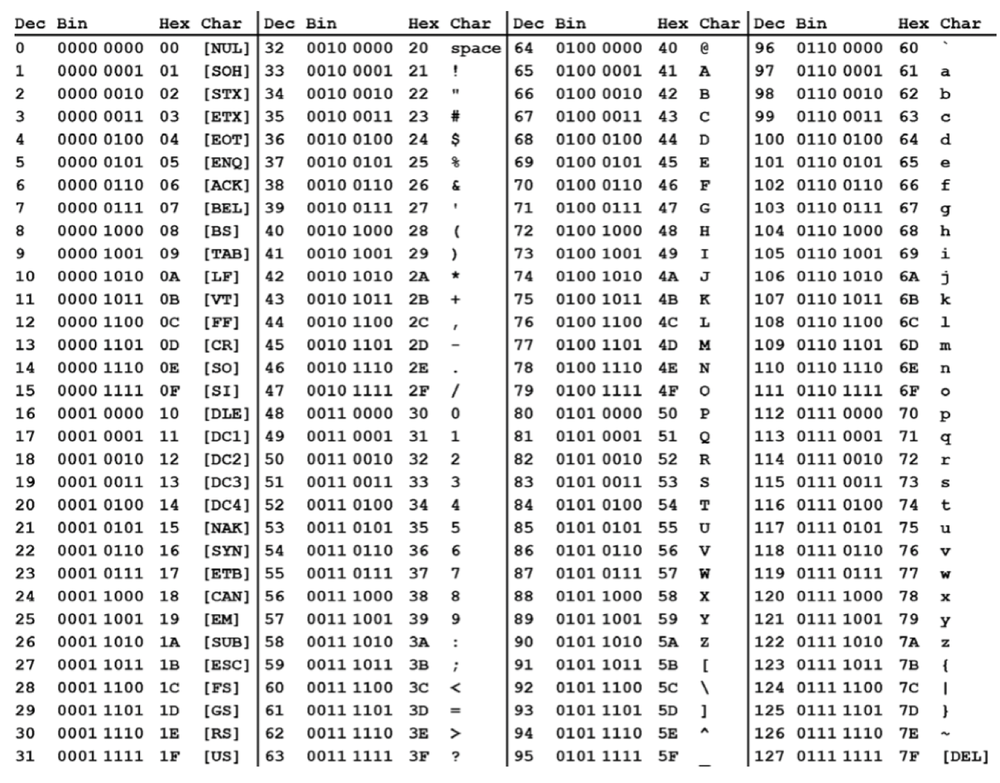

# Loops, arrays, and functions

## Control structures

### Implementation of a `for` loop

- In a high level language

```C
int sum = 0;
int i;
for (i=1; i<257; i=i*2) {
    sum = sum + i
}
```

- In MIPS

```Assemby
# Assume $s0 = i and $s1 = sum
add $s1, $0, $0
addi $s0 $0, 1
addi $t0 $0, 257
loop:
    slt $t1, $s0, $t0
    beq $t1, $0, done
    add $s1, $s1, $s0
    sll $s0, $s0, 1
    j loop
done
```

### Implementation of `case`/`switch` statement

- In a high level language

```C
switch(amount) {
    case 20:
        fee = 2;
        break;
    case 50:
        fee = 3;
        break;
    case 100:
        fee = 5;
        break;
    default:
        fee = 7;
}
```

- In MIPS

```Assembly
case20:
    li $t0, 20
    bne $s0, $t0, case50
    li $s1, 2
    j done
case50:
    li $t0, 50
    bne $s0, $t0, case100
    li $s1, 3
    j done
case100:
    li $t0, 100
    bne $s0, $t0, default
    li $s1, 5
    j done
default:
    li $s1, 7
done 
```

- Note the last case must wait for $n-1$ test before executing (slow)
- Can make a jump table for scalability
    - Array of words corresponding to each case
    - Program indexes into table and jumps
    - Load address from table


## Arrays

- Contiguously allocated bytes of memory
- Array name is the starting address of the array in memory (0th memory)
- Total memory used is (# bytes to hold data type) \* (# elements in the array)

### Array access

- Determine the starting address of the data you want
- Absolute addressing: directly specify offeset in load instruction
- Relative addressing: index is specified by a variable and must be calculated separately
    - `addr of array[i] = start addr of array + (index + size of data type)`

### Declare arrays

- `.space` assembler directive: declares a number of bytes without initialization
- `.word` assembler directive: declares integers with initialization
- `.byte` assember directive: declare bytes in memory with initialization
- `.ascii` assember directive: declare a C-style string
- `.asciiz` assember directive: declare a C-style string with a `NULL` terminator
- Length or data type is not stored or specified anywhere
- It is up to the program to know what it is loading/storing/using

### ASCII table

- Each character is represented with a unique bit representation



## Basic function calls

- Help structure large programs
- Make code easier to understand
- Make code reusable
- **Leaf functions**: a function that makes 0 additional function calls
- **Non-leaf functions**: a function that makes 1 or more additional function calls

### Register conventions

- Allow code to work correctly in all situations
- Making a function call
    1) Place parameters in argument registers `$a0-$a3`
        - This is where function expects arguments to be
        - Additional arguments are placed on the stack
    2) Save return address and transfer control
        - Save address into `$ra` register
        - This is the address of the line of code to execute after function call
    3) Allocate space for the function
        - Use temporary registers for operations
        - Create space on stack for local variables
    4) Perform the function
    5) Save return value
        - Return value is expected to be in `$v` registers after function ends
    6) Return control
        - `jr` to return address

### Local variables and MIPS register convetions

- Temporary registers
    - `$t0 - $t9`
    - Designed to hold value shortly
    - **NOT** guaranteed to be unmodified after function call
- Saved registers
    - `$s0 - $s7`
    - Designed to hold value for extended period of time
    - **IS** guaranteed to be unmodified after function call
    - Function must save current saved register value before using it themselves
    - Function must restore original saved register value before exiting
- Significance
    - Leaf function should only use temporary registers whenever possible