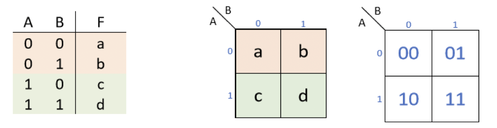
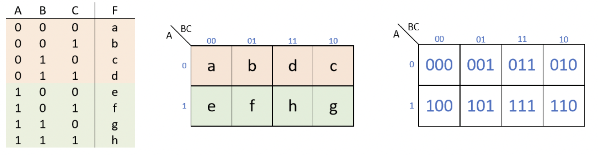
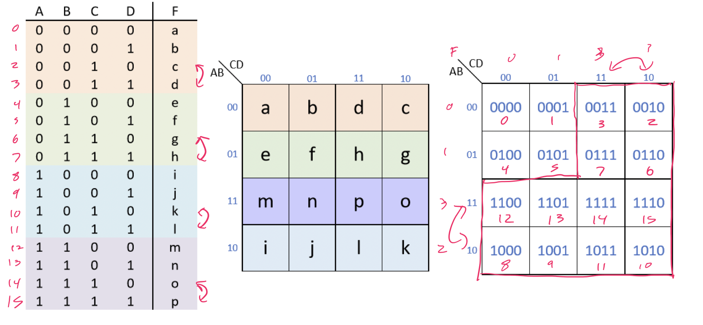
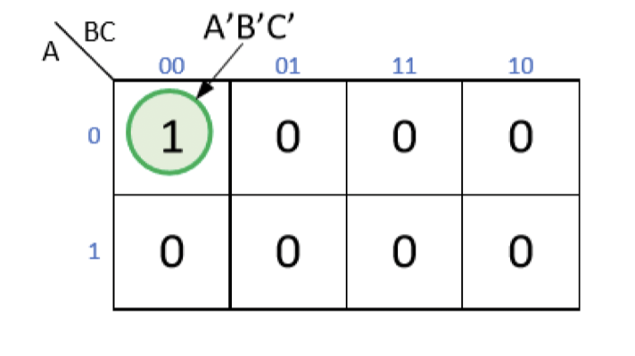
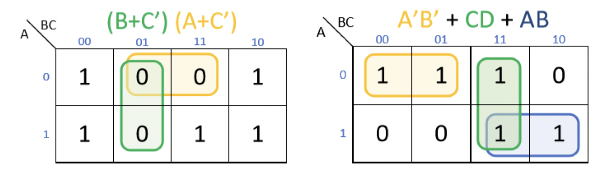
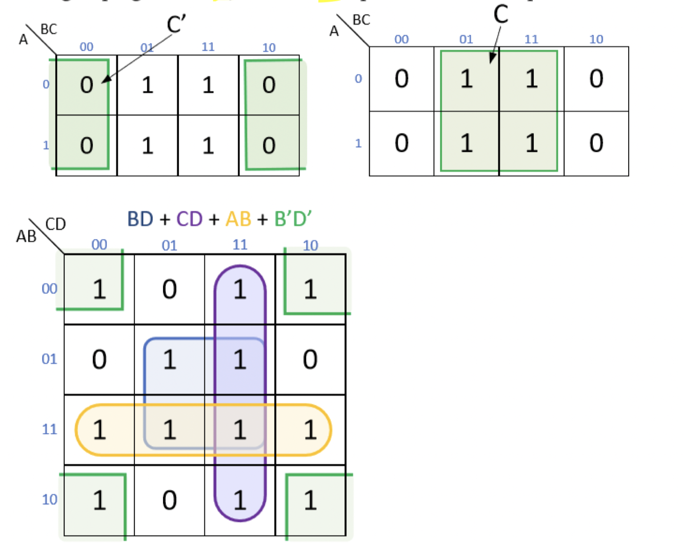

# Karnaugh Maps

## What are they?

- A graphical way to minimize Boolean expressions
- Helps group together expressions with common factors and eliminate unnecessary terms
- Similar to, but slightly modified, version of a truth table
- Provide a systematic approach to minimize Boolean expressions
- Given a truth table
    - The K-map has 1 square for every row
    - Rows and columns are labeled with all possible input values
    - Each square is filled with the corresponding output from the truth table

## Examples

### Two inputs

### Three inputs

- Can also be drawn vertically longer
- **Notice**: the last two columns of the K-map are *not* ordered
- Done because the input values adjacent differ by 1 (even if we wrap around)

### Four inputs

- **Notice**: both the positions of the last 2 rows and last 2 columns are swapped

## Rules of K-maps

- Minimization if performed by
    - Grouping together ones for SOPs
    - Grouping together zeros for POSs
- Group size **must** be a power of 2 (1, 2, 4, 8, ...)
- Groups must be a rectangle shape across rows and columns **only**. **NO DIAGONALS**
- Groups must consist of **only** ones or **only** zeros. **NO MIXED GROUPINGS**
- Groups can overlap or wrap around the map
- To find a minimal expession
    - Use the largest groupings possible to cover each value
    - Every value must be covered by at least one grouping
    - Use the minimal number of groupings

## Expressions from K-maps

- Each grouping will produce a single Boolean term
    - SOP term for ones
    - POS term for zeros
- The size of the group determines how many literals are removed from the term
- Input values whcih are **modified** across the grouping are eliminated

- A group size of 1 is $2^{0}$, therefore no terms are removed

- A group size of 2 is $2^{1}$, therefore one term is removed

- A group size of 4 is $2^{2}$, therefore two terms are removed

## K-map process

1) Create a truth table for the function (label all input and output signals)
2) Draw K-map of proper size, creating a separate table for each output signal
3) Fill in values (Be mindful of labels and any flips that might occur)
4) Decide whether to group 1's or 0's
5) Find the largest group, then continue with the remaining largest until all values are covered
6) Write the Boolean term for each grouping to get the minimal expression