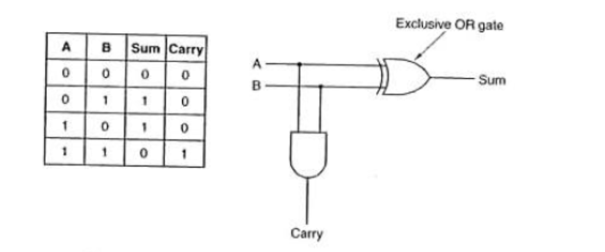
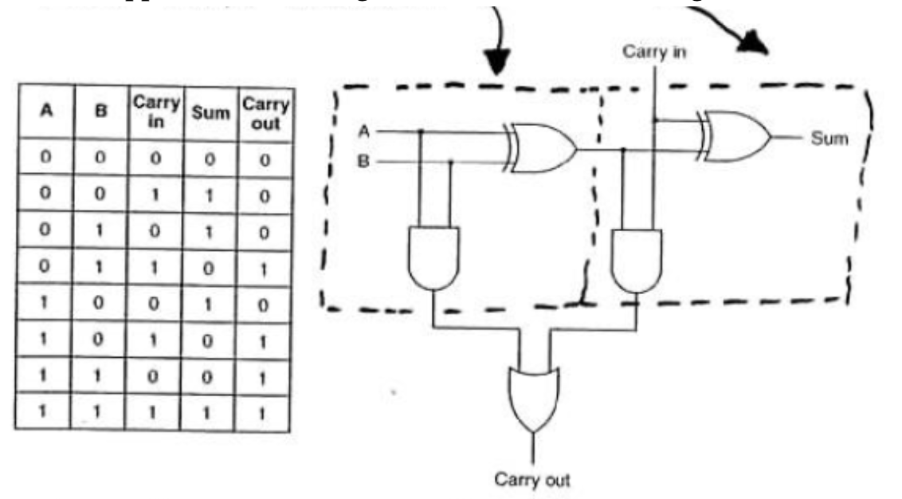
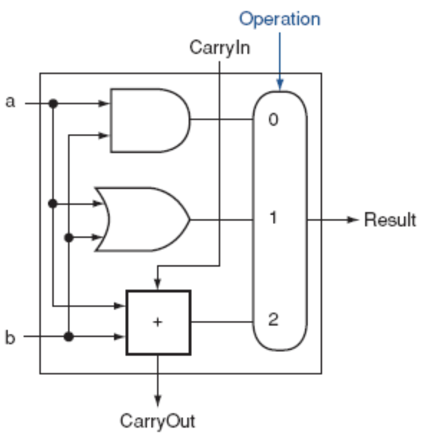
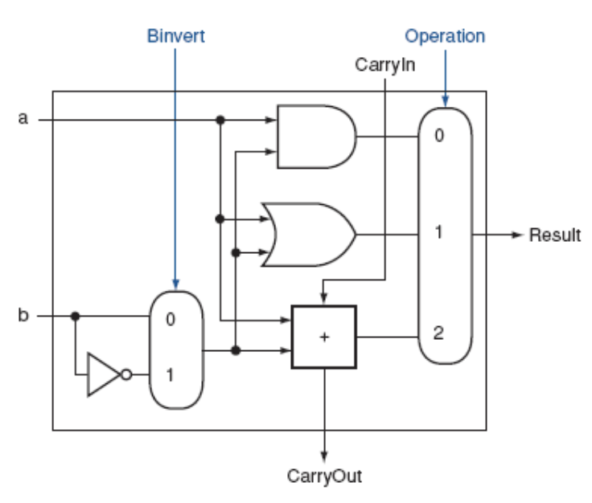
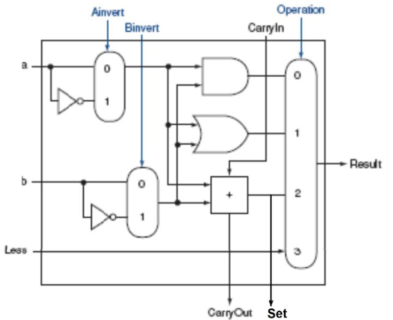

# Arithmetic logic units

## Introduction

- The Arithmetic Logic Unit (ALU) is the main component of the CPU
- If performs
    - Most instructions
    - Mathematics
    - Comparisons
- ALUs also have additional hardware for Overflow and Zero detection
- The main component of the ALU is the adder
    - To build a full 32-bit adder, we build a smaller version and combine them

### 1-bit half adder

- A 1-bit half adder takes the two 1-bit input values to perform the addition on
- It creates to outputs: sum and carray
    - $\text{sum} = A \oplus B = \overline{A}B + A\overline{B}$
    - $\text{carry} = AB$
- It is called a half adder because the unit does not take a carry-in value

### 1-bit full adder

- A 1-bit full adder takes two 1-bit input values and a 1-bit carry in value
- It outputs the sum of the inputs and a carry bit
    - $\text{sum} = A \oplus B \oplus C_{in}$
    - $\text{carry put} = \operatorname{Majority}(A, B, C_{in})$

- Carry out can occur by either of the two half-adders, so we must combine the outputs with an OR gate
- To build an n-bit adder, chain together n 1-bit full adders

## Building ALUs

- An ALU has more functionality than the addition of 2 values
- To build a single black box unit which can output different values, control bits are needed.
- The control bits specify to the hardware which operation to output.

| Operation Control Bit $C_{1}$ | Operation Control Bit $C_{0}$ | ALU Operation |
|:-----------------------:|:------------------------:|:--------------:|
| $0$ | $0$ | `AND` |
| $0$ | $1$ | `OR` |
| $1$ | $0$ | `ADD` |
| $1$ | $1$ | `---`

### Adding `NAND` & `NOR` operations

- Simply extend the logic with the appropriate gates
- Reuse existing hardware whenever possible

### Adding subtraction

- Using 2's complement addition
    - $A - B = A + \text{2's complement of } B$
    - $A - B = A + \text{1's complement of } B + 1$ 
- To add subtraction as an opertion
    - Reuse the adder, and choose between $B$ and $B'$ using a multiplexor
    - The new mux receives now external input, but uses a boolean expression

### Adding set on less than

- Add an output Set is added and a 1-bit input called Less.
- The Set is the result of the adder (before the multiplexor). The Set line of the MSB ALU unit is the sign bit of the result.
- The Less input enables the sign bit to be connected to the Result of the LSB.
- In this figure, `Ainvert` was added to support `NAND` and `NOR` functionality also
    - `Ainvert` and `Binvert` are Boolean expressions based on the Operation control bits

### Zero detection

- If the Result of the ALU operation is the value zero, then the OR-NOT (basically NOR) will result in a 1

### Overflow detection

- A special 1-bit ALU is built for the MSB (most significant bit) to add extra logic for overflow detection

