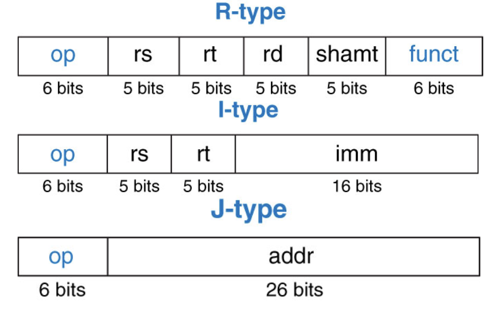
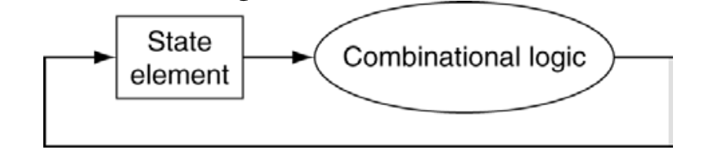
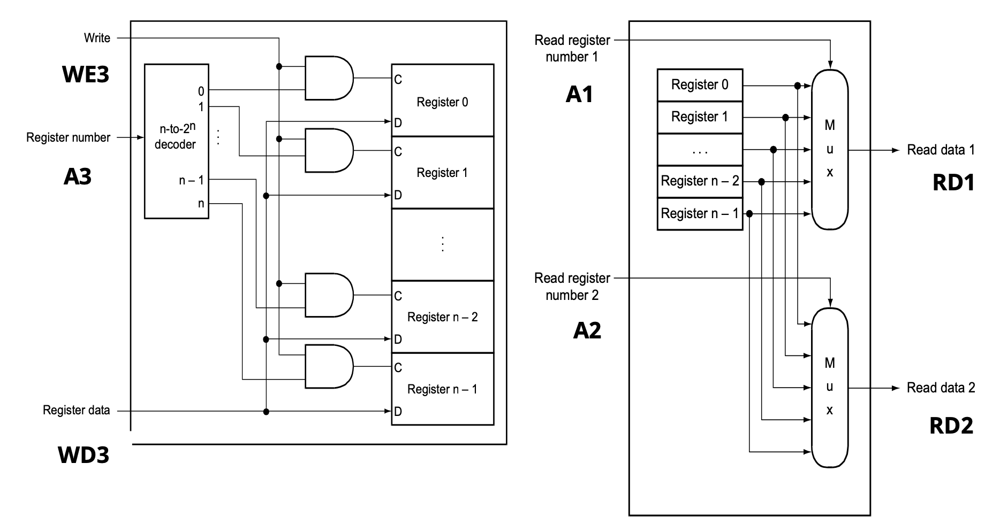
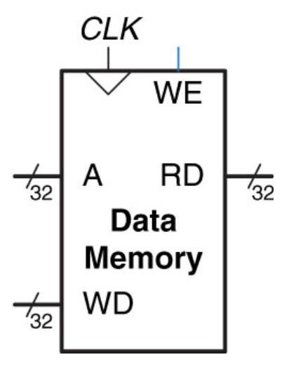
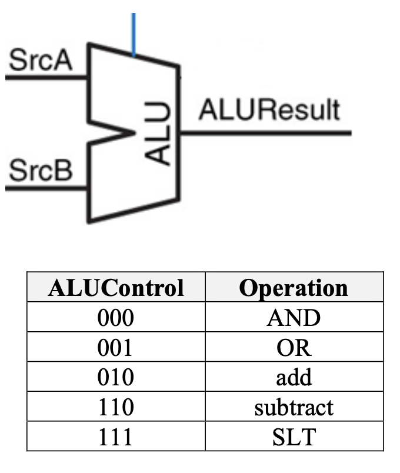
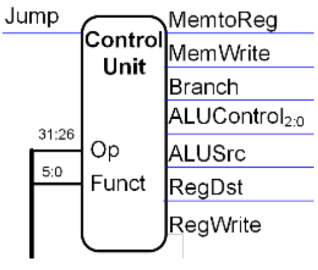
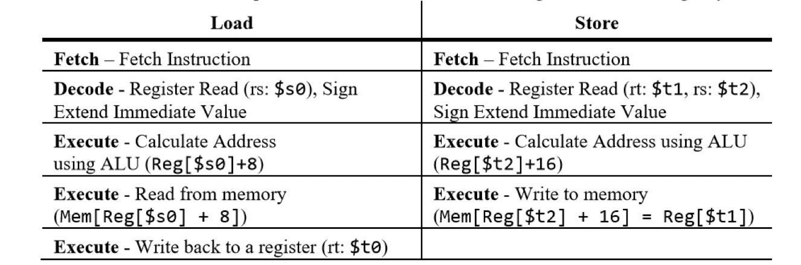
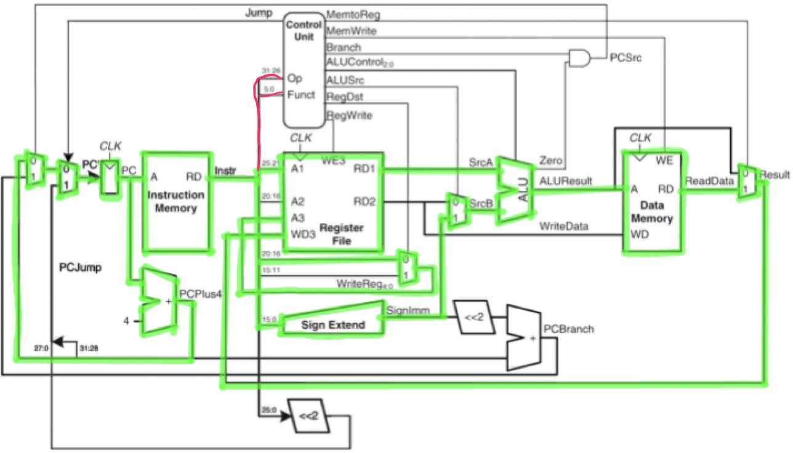
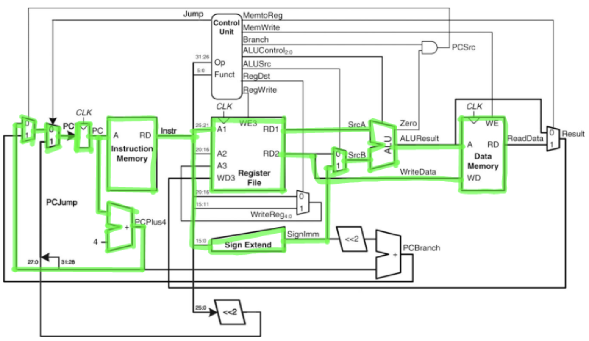
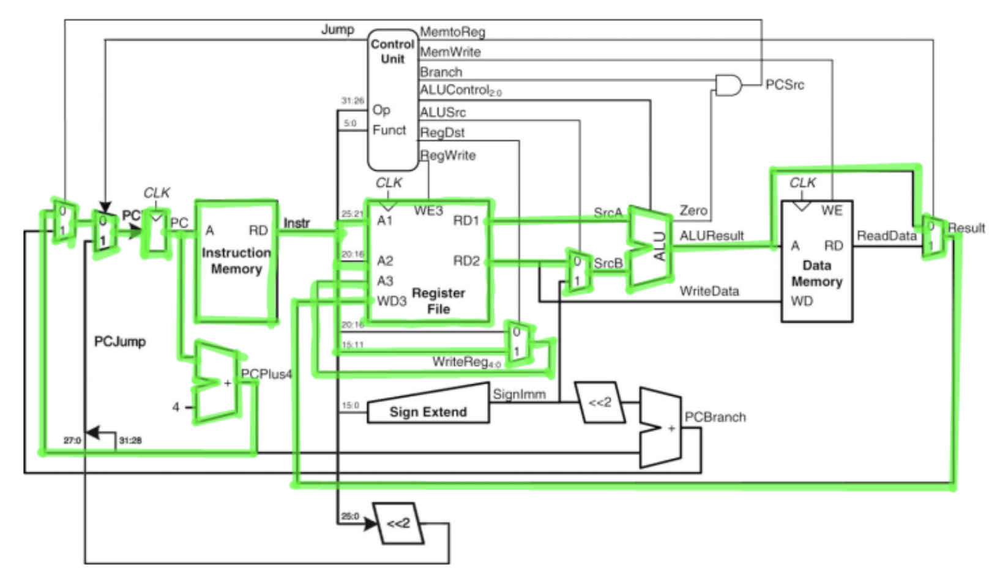

# Single cycle datapath (part 1)

## MIPS instruction set architecture recap

- Knowledge of the MIPS assembly language and the architecture theory come together.
- A few important points to remember
    - MIPS is a load-store architecture
    - MIPS is a register machine (32 general purpose registers)
    - Registers are fast memory located within the CPU datapath and are costly compared to other types of memory
    - All MIPS instructions are a fixed of length 32-bits
    - All MIPS instructions are formatted with one of 3 instruction formats: Register, Immediate, Jump.



- The assembly code we have been writing are basic instructions which use pneumonic “programmer friendly” naming conventions to reference the operation and the registers which are being used
- Each of these instructions is replaced by 1 or more assembly instructions when *assembled*
- Each assembled instruction is an instruction which is directly implemented by the datapath.
- Each hardware instruction is represented by 32-bit binary, also referred to as *bytecode*.

```Bytecode
# Hello World in bytecode

00111100000000010001000000000001
00110100001001000000000000000000
00100000000000100000000000000100
00000000000000000000000000001100
00100000000000100000000000001010
00000000000000000000000000001100
```

- Each instruction is stored in memory with an address associated with its position.
- A MIPS program is made of a sequence of hardware instructions and a set of data values.

## Abstract/basic MIPS single cycle architecture

### Clock and clock cycles

- Each of the digital circuits studied so far were combinational logic. This means when the values are supplied to the inputs of the gates the gates will output the computation after the associated delay of the gate.
- To ensure the inputs stay constant while the combinational logic (gate network) is computed, the input values are stored in state element devices
- Registers are memory storage devices which hold a value constant until instructed to change. They are a component of *sequential logic*.



### Register file

- The register file is a unit which holds all 32 general purpose registers for the single cycle datapath.



### Instruction and data memory

- The instruction and data memory units are the main memory of the processor.
- Each unit takes in a single 32-bit address and returns the 32-bit value stored at the address.
- The data memory has the additional functionality of writing (storing) data into memory.



### ALU unit

- The 32-bit ALU within the single-cycle datapath is built using the concepts discussed [previously](../week7/alus.md).
- `SrcA` and `SrcB` are both 32-bit values
- `ALUResult` is the calculated 32-bit result
- 3-bits are used for the `ALUControl`



## Fetch-decode-execute cycle

### Fetch stage

- The bits of the instruction to be executed during the clock cycle must first be fetched from the instruction memory
- The PC (program counter) contains the address of the current instruction to execute
- When the execution of this instruction is completed, the address of the next instruction to execute must be stored into the PC
- We increment the PC to point to the next instruction to execute in the program.
- We ALWAYS fetch the instruction and increment the PC (Even if we branch or jump)

### Decode stage

- The opcode bits of the instruction are used by the Control Unit to determine which instruction is to be executed
- The Control Unit is combinatorial logic -- it creates all the control signals for all the units of the datapath.
- Since most instructions use values in the registers, while the control unit is working, the register file is read in parallel.



### Execute stage

- Once the instruction is decoded, the task of executing/performing all required operations for the instruction is completed by the units of the datapath based on the control signals.

## Single cycle datapath



### Load instructions

- Fetch
    1) Get instruction address
    2) Get instruction bits
    3) Calculate next instruction address
- Decode
    1) Determine instruction type
    2) Load register values
    3) Sign extend immediate
    4) Calculate register address
- Execute
    1) Get value from memory
    2) Calculate destination register
    3) Store in destination register



### Store instructions

- Fetch
    1) Get instruction bits
    2) Get next instruction address
- Decode
    1) Pass to control unit
    2) Read form register
    3) Sign extend immediate
- Execute
    1) Calculate store address
    2) Store in memory



### ALU instructions

- Fetch
    1) Fetch instruction address
    2) Fetch instruction bits
- Decode
    1) Send opcode and func to control unit
    2) Read `$rs` and `$rt` values
- Execute
    1) Calculate result
    2) Return result to register file
    3) Store into register




