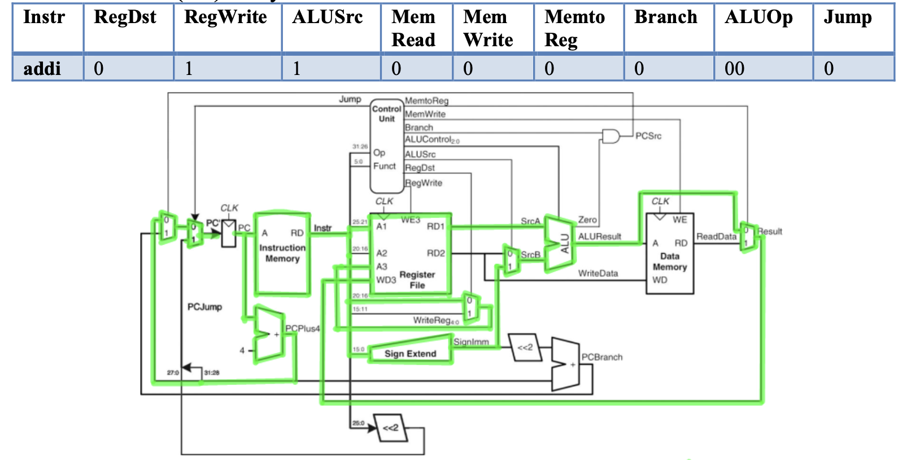
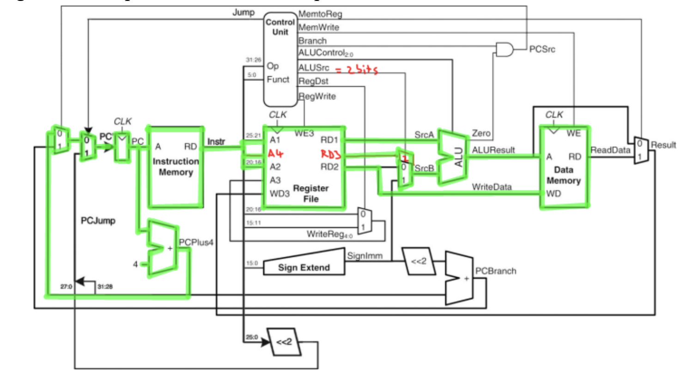
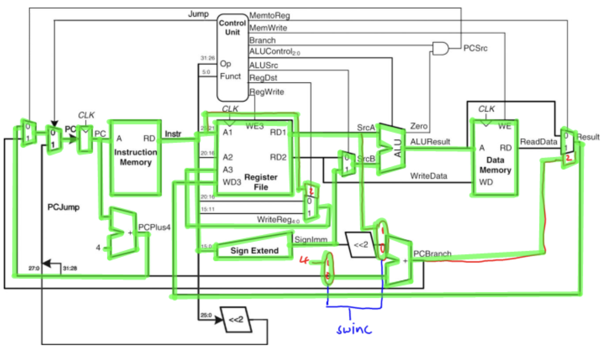
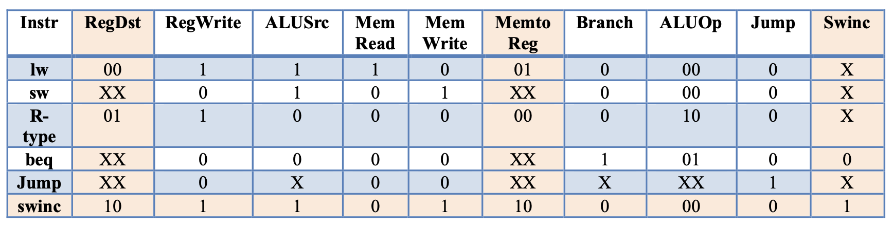
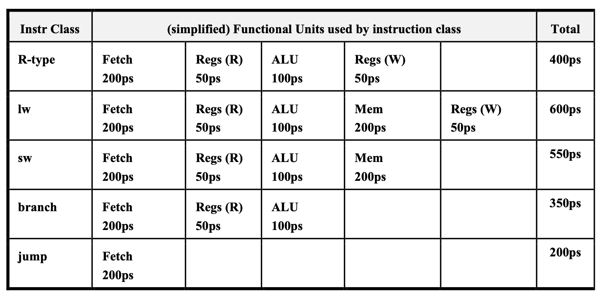

# Single cycle datapath (part 3)

## Adding instructions

To add a new instruction to the datapath, the key steps are:

1) Determine which group of existing instructions the new instruction is most like
2) Determine the flow of the data through the datapath, starting after the Fetch stage
    - The Fetch stage is the same for all instructions
3) Determine any necessary changes to the existing datapath and any additional hardware that may be required (always add hardware as a last resort)
4) Determine the control signals for the existing system and added hardware
    - You may need to change existing controls to add more bits.
    - Make sure you change the control values for the existing instructions and specify any new controls

### `addi` instruction

```
addi rt, rs, immediate # Reg[rt] = Reg[rs] + sign-extended immediate
```



### `swr` instruction

```
swr rt, rs(rd) # Mem[ Reg[rd] + Reg[rs] ] = Reg[rt]
```

- The instruction stores data in memory like `sw`, but to the address specified by the addition of 2 registers
- We need to read the `rs` and `rd` registers from the register file and send the stored values to the ALU to be added.
- We must modify the register file to read 3 registers: `rs`, `rt`, and `rd`



- The `ALUSrc` control must be expanded for all instructions and the control signals defined for the new instruction


### `swinc` instruction

```
swinc rt, immediate(rs) # Mem[Reg[rs]+immediate] = Reg[rt]
                        # Reg[rs] = Reg[rs] +4
```

- This instruction performs the standard sw instruction and additionally increments `Reg[rs]` by 4
- The `sw` portion of the instruction is unchanged. No datapath modifications are required for this half.
- For the second half of the instruction, the value in the `rs` register must be incremented by 4



- A new control for the added multiplexors is needed (swinc) and the existing control signals must be defined for the new instruction



## Critical path of the single cycle datapath

- We must wait for everything (all signals) to propogate & the correct values to be calculated
- We use write signals along with clock to determine when to write (falling edge of clock cycle)
- Clock cycle time determined by length of the longest path in the datapath
- Cycle time can be calculated based on the critical timing of each component.



- Critical path: load instruction
- Because each instruction will take a single clock cycle, all instructions must wait the length of time of the Load instruction.
- Not feasible to vary period for different instructions (violates the MIPS design principle)