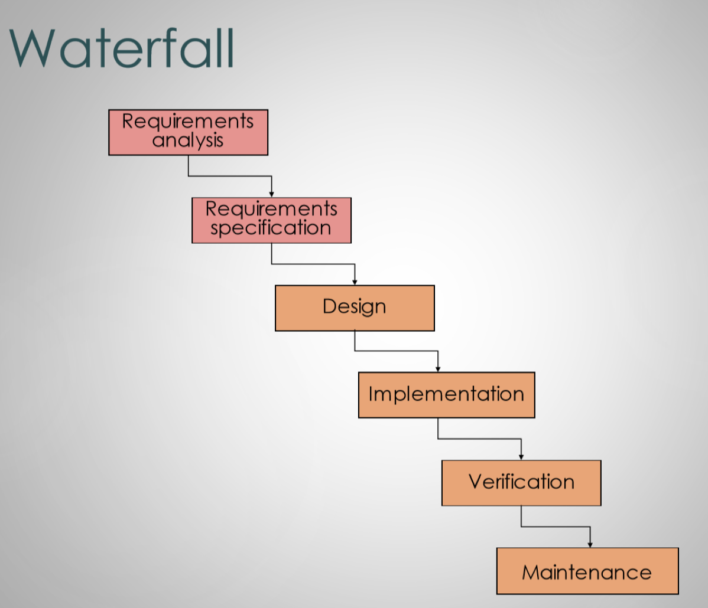
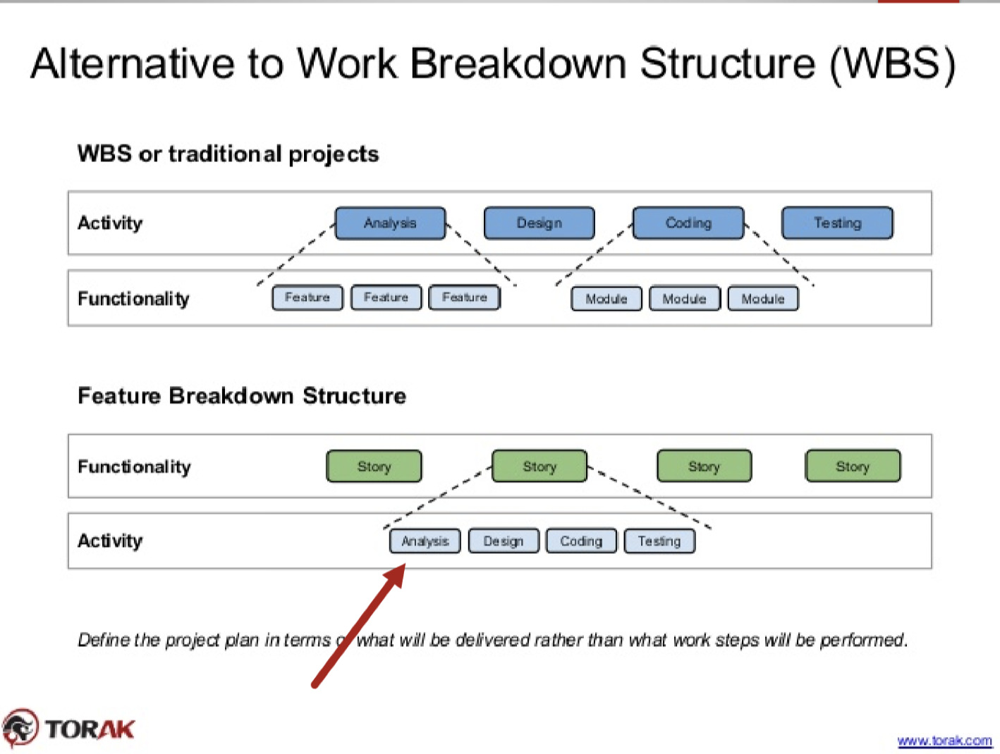

# Lecture 3: How do we know what to build?

## Software failures

- Possible reasons for failure
    - Complexity
    - Conformity
    - Progress is hard to measure
    - "Legacy" systems (update systems)
    - "Hubble psychology" (unrealistic expectation)
- Some stats
    - Only 5/10 projects delivered on time and on budget
    - About 34% projects delivered late and 100% over budget
    - 29% considered successful
    - 52% considered challenged
    - 19% considered failed

## Why requirements?

### Let's build a todo list app

- Users must be able to add to do list items with a single actions
- To do list items must consist of text and a binary completed state
- Users must be able to edit to do list item text
- Users must be able to toggle the completed state
- Users must be able to delete to do list items
- All edits to do list item state must save without user intervention

> Should be complete, unambiguous, non-conflicting, and verifiable

### Requirement issues lead to failures

- Lack use user input/involvment
- Incomplete requirements and specifications
- Changing requirements and specifications

### Definition

- **What** the software should do (without saying **how** it should do it)
- Does not include implementation or design details
- Address customer **needs**, not their **wants**

## Requirements engineering

### Requirements phase

- Requirement analysis: activity of discovering/observing/gathering customer's needs
- Requirement specification: activity of describing/documenting customer's needs

### Requirements analysis

#### Techniques

- Interview customers
- Observe customers
- Create use cases/scenarios/user stories
- Prototype solutions
- Identify important objects/roles/functions/goals
- Perform research
- Construct models

#### Data driven analysis (used to generate requirements)

- Usage data
- Business metrics
- A/B testing
- Market research

### Requirements specification

- Serves as the fundamental reference point between customer and sofware producer
- Acts as the source for all future steps in the software life cycle
- Changes early on cost less than changes in later stages

#### Introduction / executive summary

- What is the document about
- Who created it / who is it for
- Include a short, succinct, concise, to-the-point description

#### Application context

- Situations in which the software will be used
- Identify all things that the system affects

#### Environmental requirements

- Platforms
    - OS, hardware specs
    - Type of software
- Programming language(s)
- Standards

#### Functional requirements

- All concepts, functions, features and information the system provides to users
- Provide abstractions by characterizing those that are relevant to the user

#### Software qualities

- Correctness
- Reliability
- Efficiency
- Usability
- Maintainability
- Portability (cross platform)
- Reuseability
- Interoperability (interface)
- Robustness (predictable)
- Security
- Scalability (growth)

#### Other requirements

- Costs
- Documentation/manuals/tutorials/training
- Any other requirement that don't fit into other categories

#### Schedule

- Deadlines
- Milestone to meet

#### Risks

- Events that can cause loss
- Make them known up-front

#### Assumptions

- Factors believed to be true
- Changes may negatively impact project outcomes

#### Future changes

- Any project faces changes over time
- Document should be structured to easily absorb change

#### Glossary

- Precise definition of terms used throughout the document

#### Reference documents

- Pointers to 
    - Existing tools and processes
    - Existing software with similar functionality
    - Relevant literature

#### User interface

- Approximate / rough UI is typically included

### Creating the document

#### Observation

- Address the following
    - Rigor
    - Separation on concerns
    - Anticipation of change
    - Generality
    - Incrementality
- Not every project requires every section

#### Specification methods

- Natural language: SRS, user stories
- Diagrams: data flow, finite state machines
- Formal languages: Z, TLA+
- Models: domain, usage, or goal models

#### Verification

- Specification should be complete and understandable
- Should not be ambiguous or conflict with other requirements
- All terms and defined and each requirement can be verified as complete or incomplete
- Should be bias free

#### Acceptance test plan

- Specifies how it will be determined if a requirement has been met or not
- Can include specific test cases or a target number of test cases

#### Ziv's law

> Software development is unpredictable and the documented artifacts such as requirements will never be fully understood. Uncertainty is inherent and inevitable in software engineering processes and products

- TL;DR: Assume the requirements will change