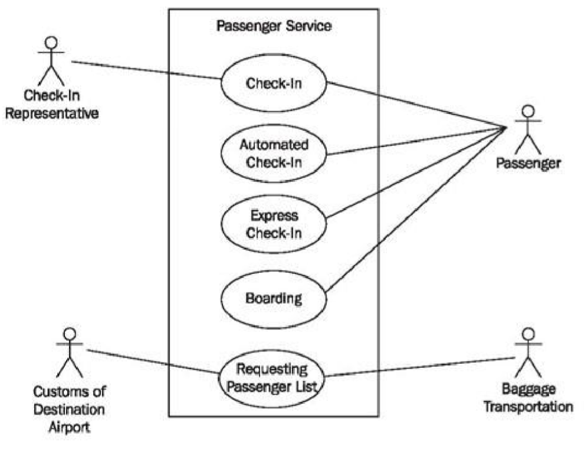
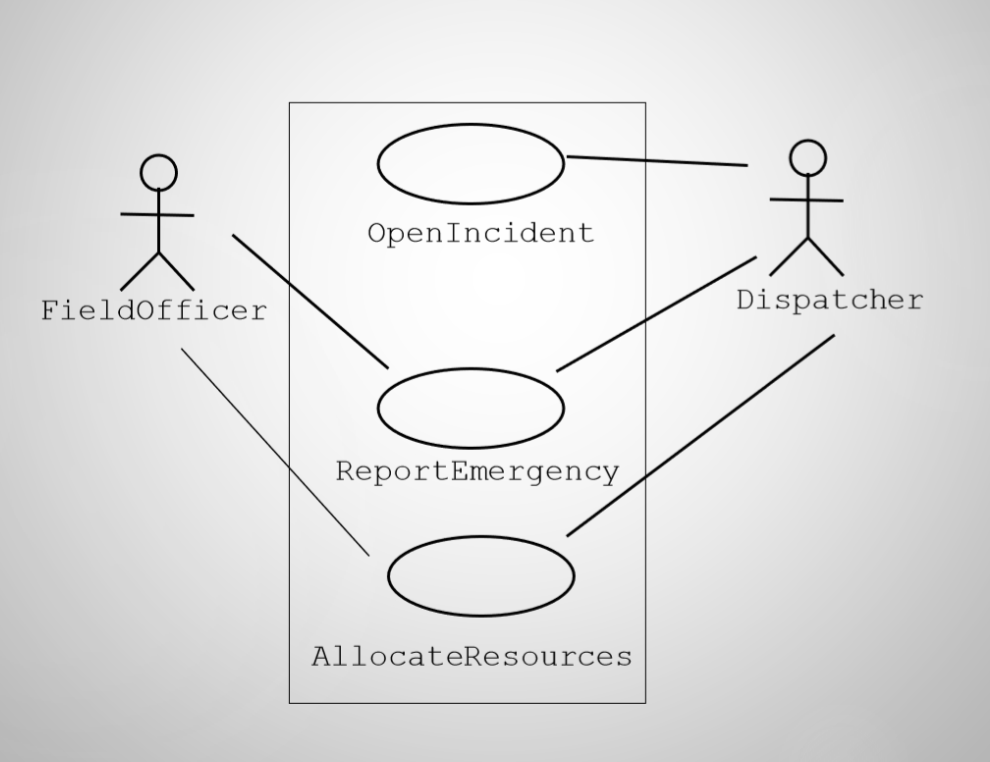
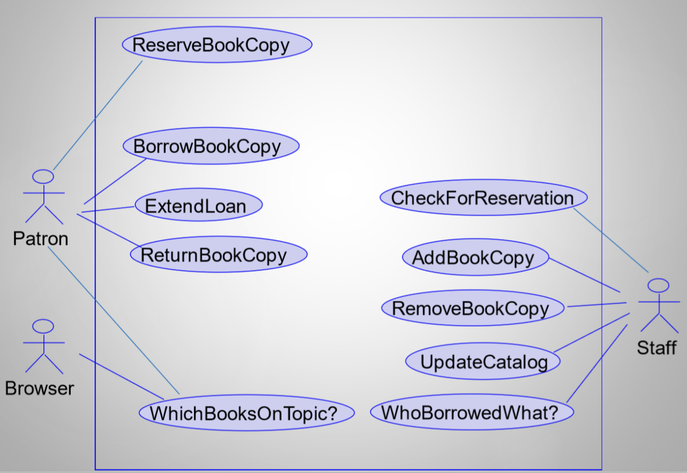
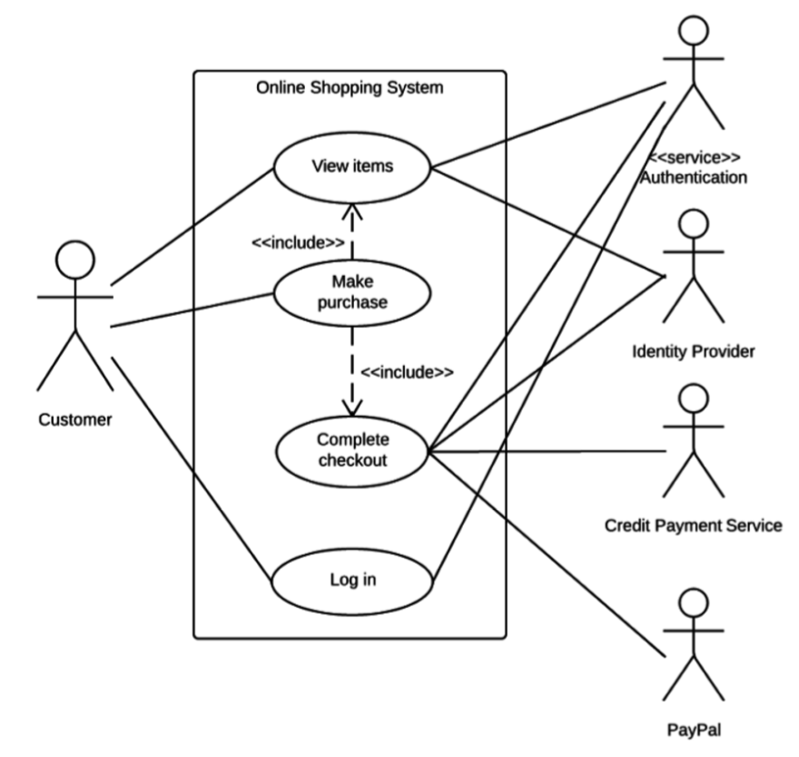

# Lecture 4: use cases

## What and why

### What is a use case?

- A textual description of a set of actions defining interactions between an actor and a system
- Includes goals, preconditions, event flows, postconditions, and error condition/alternate flows
- Go hand-in-hand with requirements

### Flows

- A sequence of steps describing an interaction between a "user" and a "system"
- Use cases describe a set of flows that accomplist a specific user goal
- Types of flows
    - **Basic**: everything is fine scenario
    - **Alternate**: same goal achieved, but in an alternate way
    - **Exception**: goal is not achieved

### Why use a use case

| Other methods | Use cases |
|---------------|-----------|
| May not map well to design or code | Maps nicely to implementation constructs |
| May not translate well to acceptance tests | Make it easy to verify / validate against user goals |
| Can be difficult for non-experts to understand | Framed in terms of the user and their goals

### Why not user cases

- Struggle to specify
    - User interfaces
    - Data formats
    - Business rules
    - Non-functional requirements

### Actors

- Represent external entities that interact with the system
- Use cases are initiated by an actor
- A use case is a dialogue between actors and the system
- Actors are discovered by
    - Reading system documents
    - Talking with domain experts or customers

## How

### Identifying use cases

- What functions will the actor want from the system?
- What are the tasks of each actor?
- Does the system store information? What actors will create, read, update, or delete information?
- What use cases will support and maintain the system?
- Can all functional requirements be performed by the use cases?

### Scope of a use case

- *What* not *how*
- Use audience-friendly terminology
- Include
    - How the use cases starts and ends
    - The interactions, in sequence, between system and actors
    - Data needed by/exchanged during the use case
    - Basic flow
    - Alternative/exception flows (if applicable)

### Building a use case

1) Name the use case
2) Describe basic flow
3) Add variations, if applicable
    - Alternate flows
    - Exception flows

## Use case diagrams

- A graphical view of actors, use cases, and their interactions
    - System represented as a box
    - Use cases represented as labeled bubbles within the box
    - Actors represented as stick figures outside of the box
    - Lines connect the actor(s) that participate in a use case

### Air travel use case diagram

### Incident management use case diagram

### Library software use case diagram

### Online shopping use case diagram

## Use cases as tools

- There is generally **one use case model** per system
    - One of more use case diagrams
    - Textual descriptions of use cases
- There are a variety of readers for use cases
    - Use cases are used to unify them throughout development
    - Use cases are a communication/understanding tool among diverse stakeholders
- 