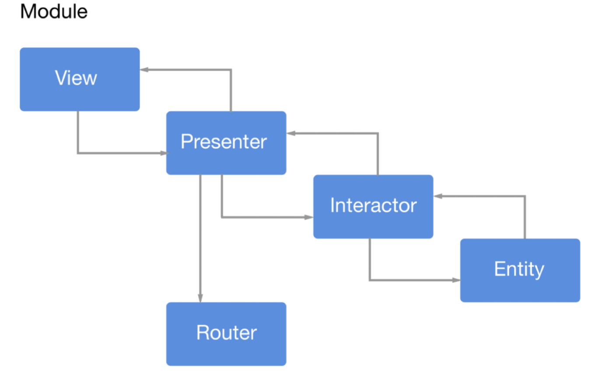
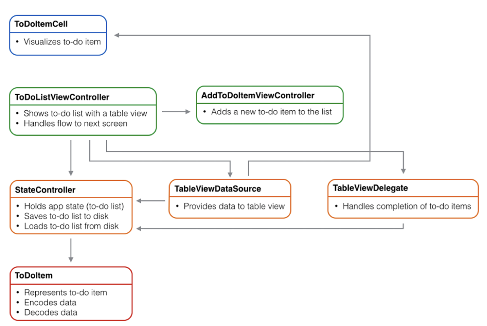

# Lecture 5: Sofware architecture (part 1)

## Introduction to software architecture

### Next steps

- Requirements have been gathered
- Must now determine the high level structure of the software

```
+----------------------+-----------------------+--------------------+
|         UI           |         Logic         |       Storage      |
+----------------------+-----------------------+--------------------+
| - display            | - process             | - data schema      |
| - home view          | - list(s) logic       | - database system  |
| - lists view         | - notifications logic |                    |
| - list view          | - calendar logic      |                    |
| - item view          |                       |                    |
| - notifications view |                       |                    |
+----------------------+-----------------------+--------------------+
```

### Viper diagram



### Model-view-controller diagram



### Software architecture

- Explain the magic in software engineering
- Take requirements and turn it into code
- Architecture and design is the most mysterious part for the users
    - Architecture is high level
    - Design is low level

### Analogy to building architectures

- A distinctive and character in a project
- Broad training
- Extensive experience
- Deep understanding of the domain
- Leads the team
- Good communicator
- Decision maker
- Deals with high level abstractions
- Serves as the interface to key business stakeholders/customers

### Limitations of the analogy

- Software is dynamic when compared to building architecture
- Software serves a much broader range
- Software architecture is a much newer field than building architecture
- Software is more malleable than physical materials
- Software is a machine / invisible
- Software architect is often given to the most senior developer

### Why architecture in software engineering?

- Intellectual control
- Conceptual integrity
- Effective project communication
- Reusability and maintainability

## Defining software architecture

> A software system's architecture is the set of **principal design decisions** about the system

> Software architecture is the **blueprint for a** software system's **construction and evolution**

## Architecture in action

### WWW in a nutshell

- The web is a collection of resources, each with a unique name (URL)
- A URL can be used to determine the identity of a machine on the internet
- Clients make requests of servers for their resources
- Clients manipulate representations of resources
- All communication between clients and servers is handled by the HTTP protocol
- Communication must be fully self-contained

### WWW's architecture

- No single piece of code implements the architecture
- Stylistic contraints are not apparent in code
- Architecture is only adequately understood

## Software architecture's elements

- **Components**: data and processing
- **Connectors**: interactions between components
- Components and connectors are arranged into **configurations**

## Architectural erosion

- *Prescriptive architecture*: as-designed/as-intended architecture
- *Descriptive architecture*: as-implemented/as-realized architecture
- Ideally, we modify the prescriptive architecture first
- In practice, the descriptive architecture is directly modified
- Results from
    - Developer sloppiness
    - Short deadlines
    - Lack of a prescriptive architecture
    - Code optimizations
    - Inadequate techniques or tool support