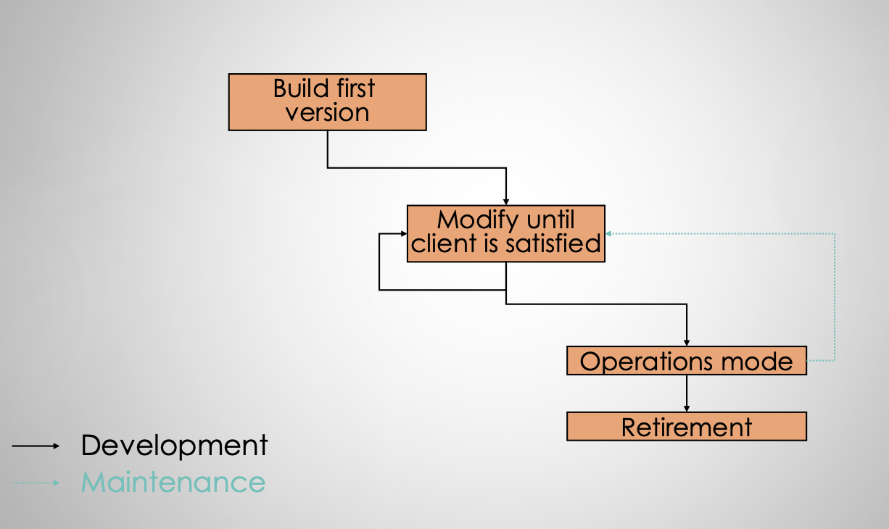
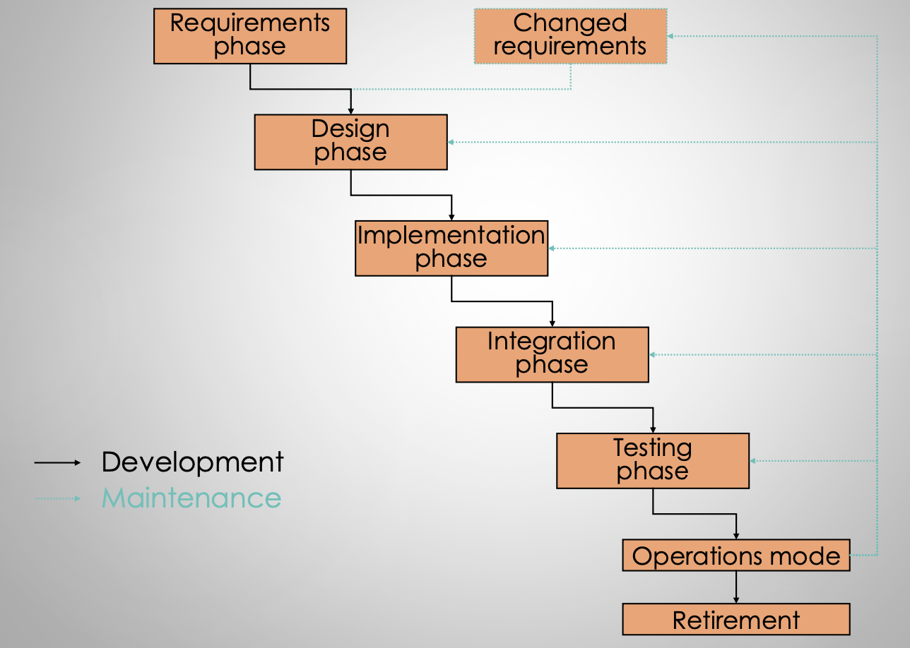
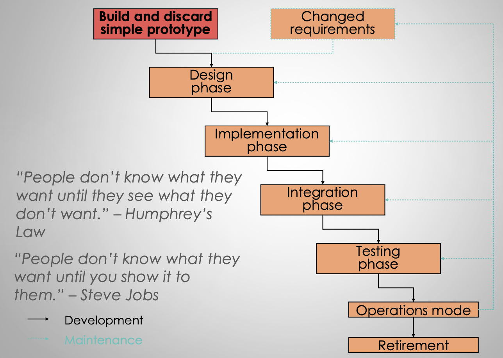
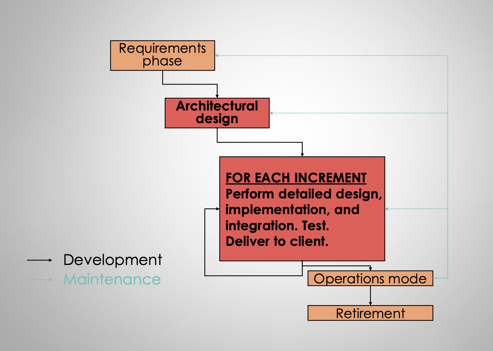

# Lecture 15: software processes (part 1)

## Processes as a rememdy

- Processes are one of the three essential ingredients for software engineering
- Software is engineered via a defined process
- Make sure that we
    - Do the right things
    - Do the things right
    - Don't forget anything
- There are different processes for different situations

### What is a software process model

- *Prescriptive*: enforcing rules
- *Descriptive*: serving to describe or characterize

## Software process models

### Build-and-fix

- Strengths
    - Good for small programs
    - Does not require much maintenance or many developer
- Weaknesses
    - Not rigorous for non-trivial projects

### Waterfall

- Strengths
    - Promotes understanding of requirements first
    - Disciplined, rigorous, and formal
    - Lots of documentation
    - Good if project's requirements are well understood and not likely to change
    - Provides a starting point for other processes
- Weaknesses
    - Rigid, not amendable to change
    - Limited user input
    - Bad for projects with any ambiguity in requirements or technology
    - Often run out of time for testing

### Rapid prototyping

### Incremental

