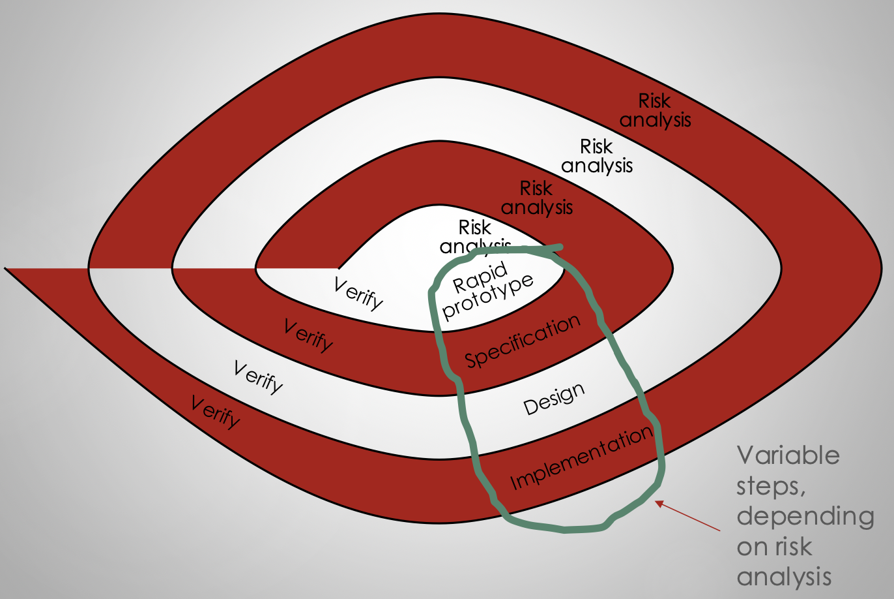
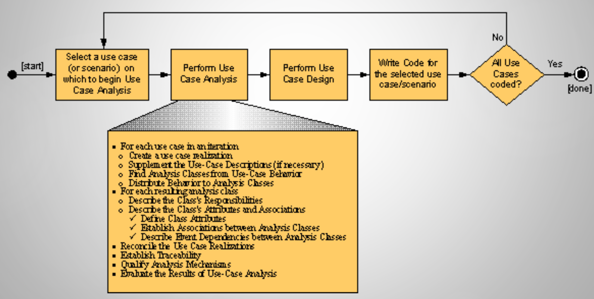

# Lecture 16: software process (part 2)

## More software process models

### Spiral

- Strengths
    - Good for projects with uncertain, complex requirements
    - Riskiest parts get developed first
- Weaknesses
    - Developers have to be competent at risk analysis
    - "End of project" may not be known

### Rational unified process (RUP)

- Use case driven
- Architectural centric
- Iterative and incremental
- Strengths
    - Risk driven, incremental
    - Lots of tools to support
    - Provides lots of guidance
- Weaknesses
    - Complicated (needs special expertise to implement it)

#### Architectural analysis

#### Analysis and design

### Use case analysis

### Open source software (OSS)

- Source code is freely available and redistributable
- Many contributors working in a distributed manner
- Heavy reliance on software tools
- Scales up amazingly well
- Strengths
    - Accessibility -> huge user base -> novel features and higher quality code
    - Some of the greatest minds, motivated and working together to solve hard problems can result in huge advances
- Weaknesses
    - Not appropriate for 
        - Proprietary software
        - Software with strict requirements and/or tight deadlines
    - Technical support/maintenance can be iffy
    - Developers are often not compensated financially
    - Loss of control/knowledge when reusing an OS component

1) Develop the initial version (usually by one or a small number of developers)
2) Maintain and evolve
    - Corrective maintenance
    - Perfective maintenance
    - Adaptive maintenance