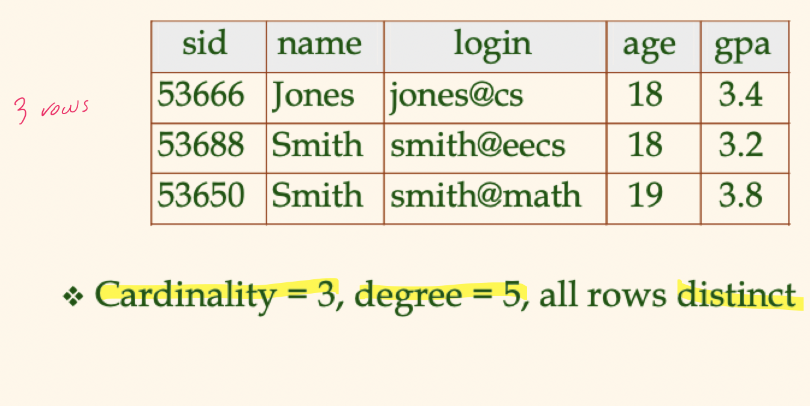
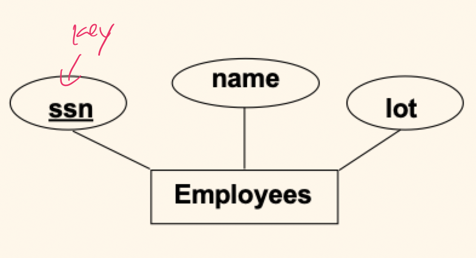
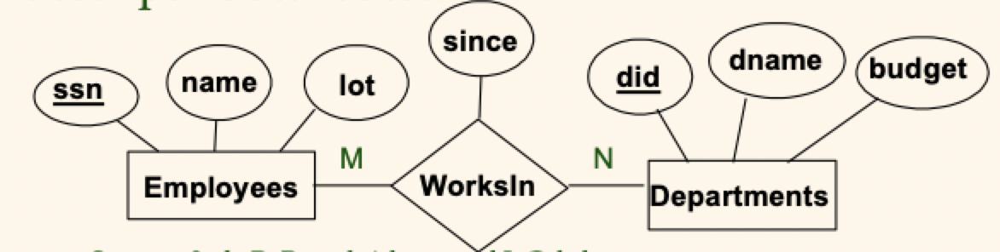
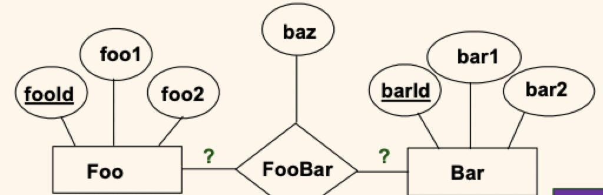

# Lecture 4

## Relational database definitions

- **Relational database**: a set of *relations*
- **Relation**: consists of 2 parts
	- *Instance*: a table with rows and columns
		- Number of rows is the cardinality
		- Number of fields is the degree
	- *Schema*: specifies name of relation, plus name and type of each column

> Can think of a relation as a *set* of rows or tuples in the pure relational model



## Relational query languages

- A major strength of the relational model: supports simple, powerful *querying* of data
- Queries can be written intuitively, and the DBMS is responsible for efficient evaluation
	- The key: precise (and set-based) semantics for relational queries
	- Allows the optimizer to extensively re-order operations, and still ensure that the answer does not change

### SQL query language

- Developed by IBM (system R) in the 1970's
- Need for a standard, since it is used by many vendors
- ANSI/ISO standards
	- SQL-86
	- SQL-89 (minor revision)
	- SQL-92 (major revision, very widely supported)
	- SQL-99 (major extensions, current standard)
- To find all 18-year-old students, we can write

```SQL
SELECT *
FROM Students S
WHERE S.age = 18
```

- To find just names and logins, replace the first line with

```SQL
SELECT S.name, S.login
FROM Students S
WHERE S.age = 18
```

- Query multiple relations

```SQL
SELECT S.name, E.cid
FROM Students S, Enrolled E
WHERE S.sid = E.sid and E.grade = 'A'
```

- Relations `Students` and `Enrolled` will be joined on the common `sid` attribute

## Integrity constraints

- **Integrity constraint**: condition that must be true for *any* instance of the database (a.k.a domain constraints)
	- Specified when the schema is defined
	- Checked when relations are modified
- A *legal* instance of a relation is one that satisfies all specified constraints
	- DBMS should not allow illegal instances
- If the DBMS checks constraints, stored data is more faithful to real-world meaning
	- Avoids data entry errors too!

### Primary key constraints

- A set of fields is a *key* for a relation if 
	1) No two distinct tuples have the same values in all key fields
	2) This is not true for any subset of the key
- Part 2 false? -> this is a "superkey"
- If there is more than 1 key for the relation, one of them is chosen by the DBA to be the *primary key*

### Candidate keys in SQL

- Possibly several *candidate keys* (specified using `UNIQUE`, but one is chosen as the *primary key*)
- Used carelessly, an integrity constraint can prevent the storage of database instances that arise in practice

```SQL
-- For a given student + course, there is a single grade
CREATE TABLE Enrolled (
	sid VARCHAR(20),
	cid VARCHAR(20),
	grade CHAR(2),
	PRIMARY KEY (sid, cid)
)

-- Students can take only one course and receive a single grade;
-- further, no two students in a course may ever receive the same grade
CREATE TABLE Enrolled (
	sid VARCHAR(20),
	cid VARCHAR(20),
	grade CHAR(2),
	PRIMARY KEY (sid),
	UNIQUE (cid, grade)
)
```

### Foreign keys and referential integrity

- **Foreign key**: set a fields in one relation used to "refer" to a tuple in another relation. (Must refer to the primary key of the other relation). Like a logical pointer
- If all foreign key constraints are enforced, *referential integrity* is achieved.  (no dangling references)

#### Foreign keys in SQL

```SQL
CREATE TABLE Enrolled (
	sid VARCHAR(20),
	cid VARCHAR(20),
	grade CHAR(2),
	PRIMARY KEY (sid, cid),
	FOREIGN KEY (sid) REFERENCES Students
)
```

#### Enforcing referential integrity

- Consider `Students` and `Enrolled`: `sid` in enrolled is a foreign key that references `Students`
- What should be done if an `Enrolled` tuple with a non-existent student ID is inserted? **REJECT IT**
- What should be done if a `Students` tuple is deleted?
	- Also delete all `Enrolled` tuples that refer to it (cleanup)
	- Disallow deletion of a `Students` tuple if it is referred to (in use)
	- Set `sid` in `Enrolled` tuples that refer to it to a *default ID*
- Similar if primary key of `Students` tuple is updated

#### Referential integrity in SQL

- SQL-92 and SQL-1999 support all 4 options on deletes and updates
	- Default is `NO ACTION` (delete/update is rejected)
	- `CASCADE` (also delete/update all tuples that refer to the deleted/modified tuple)
	- `SET NULL` or `SET DEFAULT` (sets foreign key value of the referring tuples)

```SQL
CREATE TABLE Enrolled (
	sid VARCHAR(20),
	cid VARCHAR(20),
	grade CHAR(2),
	PRIMARY KEY (sid, cid),
	FOREIGN KEY (sid) REFERENCES Students
		ON DELETE CASCADE
		ON UPDATE SET DEFAULT
)
```

### Source of integrity constraints

- Based upon the **semantics of the real-world enterprise** that is being described in the database relations
- We can check a database instance to see if an integrity constraint is violated, but we can **NEVER** infer that an integrity constraint is true by looking at an instance
	- An integrity constraint is a statement about *all possible* instances
- Key and foreign keys are the most common, but more general ones are supported too

## Logical DB design: ER to relational

### Entity sets to tables



- In translating an entity set to a relation, attributes of the relation should include
	- Key uniquely identifying a row in the resulting relation
	- All descriptive attributes
	- Any constraints to be enforced on the entities attributes

```SQL
CREATE TABLE Employees (
	ssn CHAR(11),
	name VARCHAR(20),
	lot INTEGER,
	PRIMARY KEY(ssn)
)
```

### Relationship sets to tables



- In translating a relationship set to a relation, attributes of the relation should include
	- Keys for each participating entity set (as foreign keys)
	- All descriptive attributes

```SQL
CREATE TABLE Works_In(
	ssn CHAR(11),
	did INTEGER,
	since DATE,
	PRIMARY KEY (ssn, did),
	FOREIGN KEY (ssn) REFERENCES Employees
	FOREIGN KEY (did) REFERENCES Departments
)
```

### With key constraints

- Map the relationship to a table

```SQL
CREATE TABLE Manages (
	ssn CHAR(11),
	did INTEGER,
	since DATE,
	PRIMARY KEY (did),
	FOREIGN KEY (ssn) REFERENCES Employees,
	FOREIGN KEY (did) REFERENCES Departments
)
```

- Note that *each* department has a **unique** manager, we can fold the relationship information into the `Departments` table

```SQL
CREATE TABLE Departments (
	did INTEGER,
	dname VARCHAR(20),
	budget REAL,
	mgr_ssn CHAR(11),
	mgr_since DATE,
	PRIMARY KEY (did),
	FOREIGN KEY (mgr_ssn) REFERENCES Employees
)
```

- This reduces the number of overall tables needed to represent a conceptual design

### Properly reflecting key constraints




- `FooBar` is $M:N$ -> `FooBar(fooId, barId, baz)` 
	- Separate table needed
	- Primary key is `(fooId, barId)`
- `FooBar` is $N:1$ -> `FooBar(fooId, barId, baz)`
	- Primary key is `(fooId)`
	- Can be folded into the `Foo` table
- `FooBar` is $1:N$ -> `FooBar(fooId, barId, baz)`
	- Primary key is `(barId)`
	- Can be folded into the `Bar` table
- `FooBar` is $1:1$ -> `FooBar(fooId, barId, baz)`
	- Separate table needed
	- Primary key is `(fooId)` or `(barId)`
	- `(fooId, barId)` is a potential super key

### Participation constraints in SQL

- We can capture participation constraints involving the **N-side** entity set in a binary relationship, but little else

```SQL
CREATE TABLE Departments (
	did INTEGER,
	dname VARCHAR(20),
	budget REAL,
	mgr_ssn CHAR(11) NOT NULL, -- guarantee a value that references a real employee
	mgr_since DATE,
	PRIMARY KEY (did),
	FOREIGN KEY (mgr_ssn) REFERENCES Employees ON DELETE NO ACTION
)
```