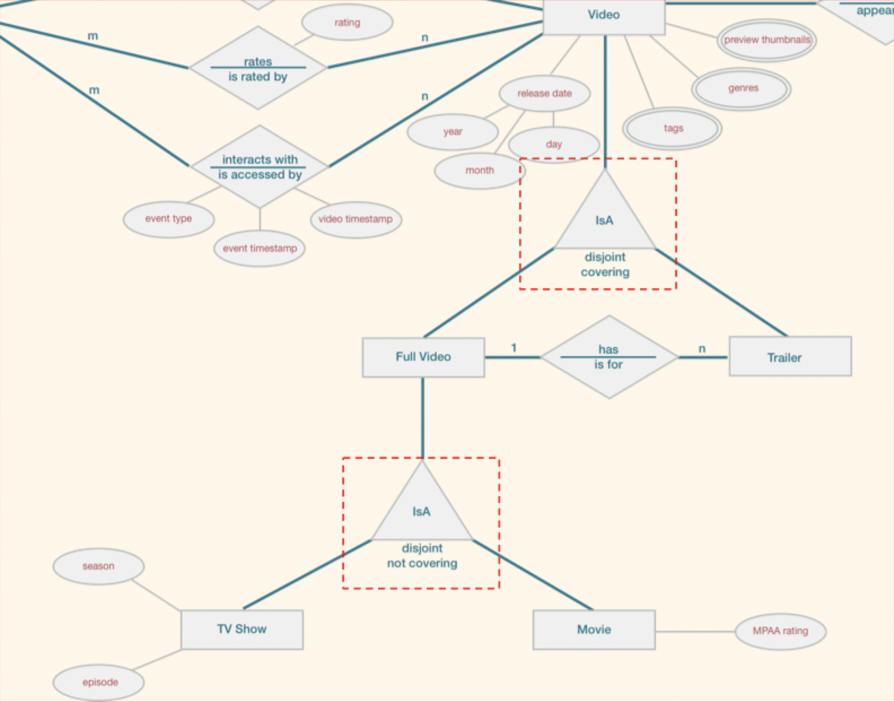

# Lecture 5

## More ER to relational

### Translating weak entity sets

- Weak entity set and identifying relationship set are translated into a *single* table
- When the owner entity is deleted, all of its owned weak entities must also be deleted

```SQL
CREATE TABLE Dependents (
	dname VARCHAR(20),
	age INTEGER,
	cost REAL,
	ssn CHAR(11) NOT NULL,
	PRIMARY KEY (dname, ssn),
	FOREIGN KEY (ssn) REFERENCES Employees ON DELETE CASCADE
)
```

### From IsA hierarchies to relations



#### Delta table approach (I)

- Maintain a generalized table storing the attributes in common with all subclasses
- Subclass tables will store a copy of the generalized primary key as a foreign key

```SQL
CREATE TABLE Video ( -- general video table stores attributes in common with all specialized tables
	id INTEGER PRIMARY KEY,
	title VARCHAR,
	description VARCHAR,
	...
);

CREATE TABLE Full_Video (
	id INTEGER PRIMARY KEY,
	FOREIGN KEY (id) REFERENCES Video
);

CREATE TABLE Trailer (
	id INTEGER PRIMARY KEY,
	trailer_for INTEGER,
	FOREIGN KEY (id) REFERENCES Video,
	FOREIGN KEY (trailer_for) REFERENCES Full_Video
);

CREATE TABLE TV_Show (
	id INTEGER PRIMARY KEY,
	season INTEGER, 
	episode INTEGER,
	FOREIGN KEY (id) REFERENCES Full_Video
);

CREATE TABLE Movie (
	id INTEGER PRIMARY KEY,
	rating VARCHAR,
	FOREIGN KEY (id) REFERENCES Full_Video
)
```

#### Union of tables approach (II)

- No generalized table stored
- Store the common attributes of in each of the subclass table (redundantly stored)

```SQL
-- No need for a generalized tables if the relation is covering
CREATE TABLE Movie ( -- one table per entity type
	id INTEGER PRIMARY KEY,
	title VARCHAR,
	description VARCHAR,
	...,
	rating VARCHAR
)
```

#### Mashup table approach (III)

- All attributes of the general and specific stored in a single table
- Attribute of a specific subclass are used and the rest are `NULL`

```SQL
CREATE TYPE VIDEO_KIND AS ENUM (
	'full_video',
	'trailer',
	'tv_show',
	'movie'
);

CREATE TABLE Video ( -- Complete attribute set
	id INTEGER PRIMARY KEY,
	title VARCHAR,
	description VARCHAR,
	...,
	trailer_for INTEGER,
	season INTEGER,
	episode INTEGER,
	rating VARCHAR,
	kind VIDEO_KIND,
	FOREIGN KEY (trailer_for) REFERENCES Video
)
```

#### IsA considerations

- Query convenience -> method I or III
- PK enforcement -> method I or III
- Relationship (FK) targets -> method I or II
- Handling of overlap constraints -> any method
- Space and query performance tradeoffs -> method II

### Mapping advanced ER features

- Multi-valued attributes
	- Separate table for the multi-valued attribute
	- Primary key is the owner's primary key (as a foreign key) and the individual value
- Composite attributes: flatten address and add each sub-attribute to the entity's table
- Mandatory attributes: flag the required attribute as `NOT NULL`
- Derived attributes: see DBMS documentation for supported methods

## SQL views and security

- A *view* is just a relation, but we store its definition rather than storing the materialized set of tuples

```SQL
CREATE VIEW YoungStudents(name, login) AS -- Can see student's name and login, but no other attributes
	SELECT S.name, S.login
	FROM Students S
	WHERE S.age < 19;
```

- Views can be used to present needed information while hiding details of underlying table(s)
- Other view uses in ER translation context might include
	- Derived attributes
	- Simplifying/eliminating join paths
	- Beautifying the "mashup table" approach to IsA hierarchies

```SQL
CREATE VIEW EmployeeView (ssn, name, bdate, age) AS
	SELECT E.ssn, E.name, E.bdate, date_part('year', age(E.bdate))::int
	FROM Employees E;
```