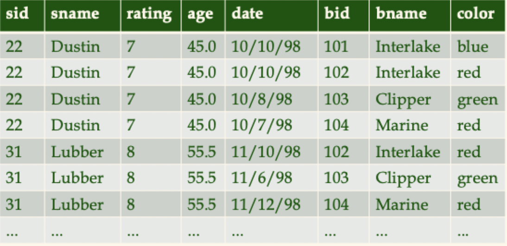
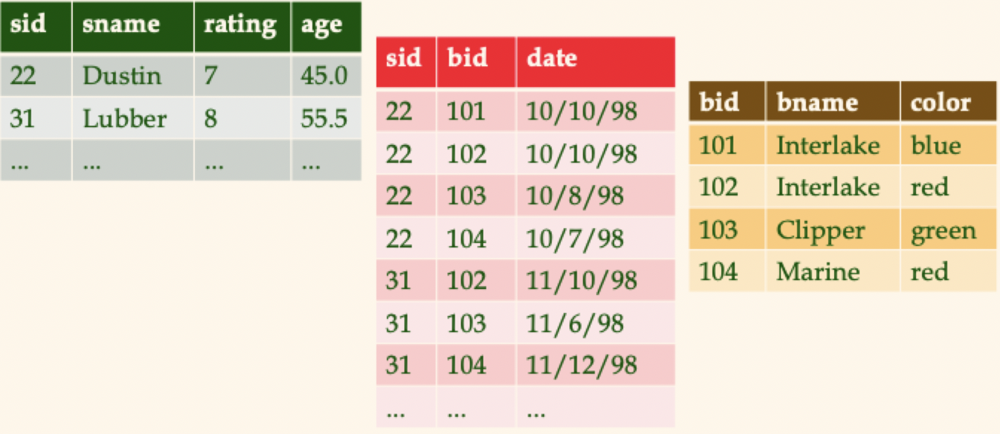
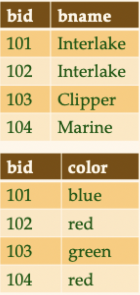

# Lecture 6

## Relational database design

- Two aspects to the RDB design problem
	1) *Logical schema design*: ER modeling and the relational translation step
	2) *Physical schema design*: what indexes should be utilized
- Starting with logical design, we have the following tools
	- Functional dependencies
	- Normal forms

> How do I know if my relational schema is a "good" logical database design or not?

### Example: Wisconsin sailing club

#### Proposed schema design 1

- Puts everything into 1 table (spreadsheet style)
- Attributes are redundantly stored
- Age is stored, but could be derived
- Does not separate concerns of boats and sailors

#### Proposed schema design 2

- Solves redundancy issues with design 1

#### Proposed schema design 3

- Allows for more flexibility with boats table
- Really depends on expected queries to choose design 3 over design 2
## The evils of redundancy

- *Redundancy* is at the root of several problems associated with relational schemas
	- Redundant storage -> extra disk space required
	- CRUD anomalies -> variable query results
- *Functional dependencies* can help in identifying problem schemas and suggest refinements
	- Main technique: decomposition
	- Replace $R(ABCD) \to R1(AB) + R2(BCD)$
	- Decomposition should be used judiciously

### Functional dependencies

- A functional dependency $X \to Y$ (read as "$X$ determines" $Y$) holds over relation $R$ if for every allowable instance
	- For $t1$ and $t2$ in $r$, $t1.X = t2.X$ implies $t1.Y = t2.Y$
- A functional dependency is a statement about **all** allowable relations
	- Identified based on *application semantics*
	- Given some instance $r1$ of $R$, we can check to see if $r1$ violates some functional dependency
	- We **cannot** tell if some functional dependency holds over relation $R$
- Saying $K$ is a candidate key for $R$ means $K \to R$
	- Note that $K \to R$ alone does not require $K$ to by *minimal*
	- If $K$ is minimal, then $K$ is a candidate key (else it's a *superkey*)

### Constraints on an entity set

- Consider the following relation: `HourlyEmps(ssn, name, lot, rating, hrly_wages, hrs_worked)`
- Let's denote this relational schema by simply listing the attributes: `SNLRWH`
	- This is really a set of attributes: $\{ S ,\, N ,\, L ,\, R ,\, W ,\, H \}$
	- Sometimes, we will refer to *all* attributes of a relation by using the relation name
- Suppose we have some functional dependencies on `HourlyEmps`
	- `ssn` is the key: $S \to SNLRWH$
	- `rating` determines `hrly_wages`: $R \to W$
- Problems with $R \to W$
	- *Update anomaly*: changing $W$ violates the constraints
	- *Insertion anomaly*: inserting a new employee with unknown wage violates the constraints
	- *Deletion anomaly:* deleting all employees with a given rating causes loss of information

### Functional dependencies recap

- $X \to Y$ is read as $X$ determines $Y$ or as $Y$ is functionally dependent $X$
- Functional dependencies *are* a form of consistency constraint
- $X \to Y$ **does not** mean we have a function $f(X)$ that we can use to compute $Y$ from $X$