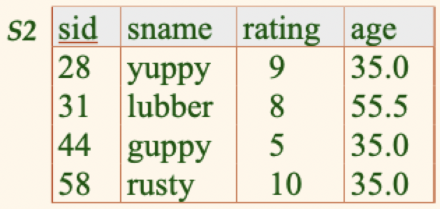
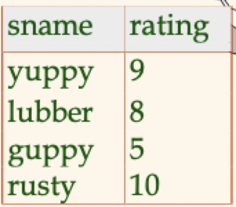
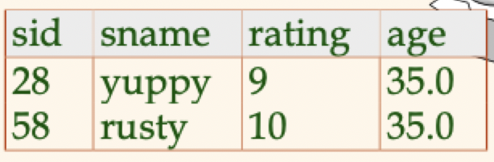
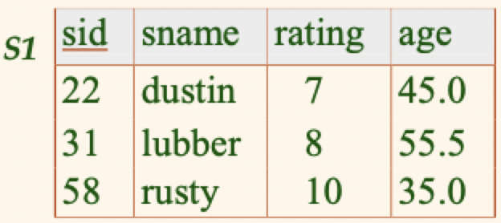
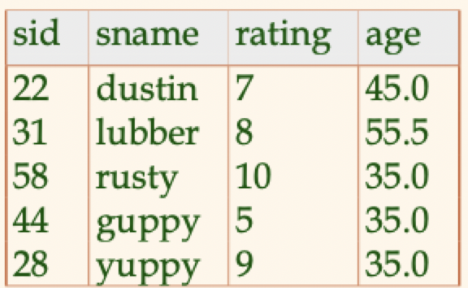
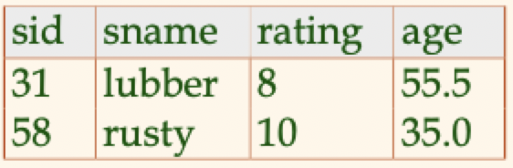
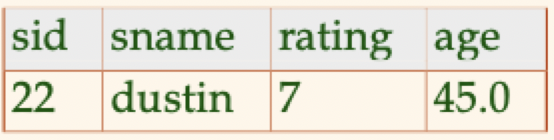
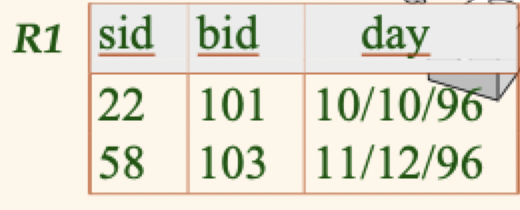
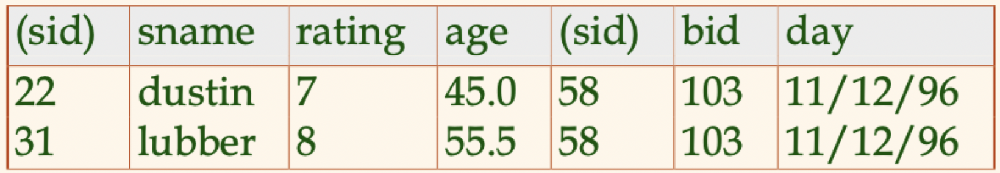
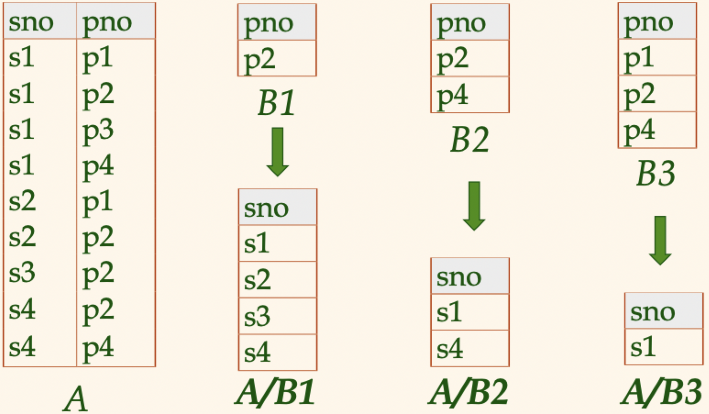

# Lecture 9

## On relational languages

- **Query language**: allow manipulation and retrieval of data from a database
- Relational model supports simple, powerful query languages
	- Strong formal foundation based on logic
	- Allows for many optimizations
- Query languages **are not** programming languages
	- **Not** expected to be "Turing complete"
	- **Not** intended to be used for complex calculations
	- *Do* support easy, efficient access to large datasets

### Formal relational query languages

There are two mathematical query languages form the basis for "real" languages and their implementation

- *Relational algebra*: more **operational**, very useful for representing execution plans
- *Relational calculus*: lets users describe **what** they want, rather than how to compute it

### Preliminaries

- A query is applied to *relational instances*, and the result of a query is also a relational instance
	- *Schemas* of input relations for a query are fixed (but will run regardless of instance)
	- The schema of the *result* for a given query is also fixed
- Positional vs. named-field notation
	- Positional notation easier for formal definitions, but named-field notations are far more readable
	- Both usable in SQL (but try to avoid positional stuff)

## Relational algebra

### Projection

- Removes attributes that are not in the *projection list*
- *Schema* of result contains exactly the fields in the projection list, with the same names that they had in the (only) input relation
- *Relational* projection operator has to eliminate *duplicates* (because they are sets)
	- Note that real systems don't do duplicate elimination unless explicitly asked for

$$
	\pi_{sname, rating} (S2)
$$

### Selection

- Selects rows that satisfy a *selection condition*
- *Schema* of result relation is identical its input input schema
- *Result* relation can be an *input* for another relational algebra operation

$$
	\sigma_{rating > 8} (S2)
$$

### Union, intersection, set difference

- All of these operations take two input relations, which must be *union-compatible*
	- Same number of fields
	- Corresponding fields are of the same type

#### Union

$$
	S1 \cup S2
$$

#### Intersection

$$
	S1 \cap S2
$$

#### Set difference

$$
	S1 - S2
$$

### Cross product

- $S1 \times R1$: each $S1$ row is paired with each $R1$ row
- *Result schema* has one field per field of $S1$ and $R1$, with field names inherited if possible

### Renaming

- *Conflict*: $S1$ and $R1$ both have `sid` fields
- Can use renaming notations
	- Positional: $\rho(S1R1(1 \to sid1), S1 \times R1)$
	- Name-based: $\rho(TempS1(sid \to sid1), S1)$

### Joins

#### Conditional joins

- Result schema is the same as that of cross-product
- Typically fewer tuples than a cross product, so may be more efficient to compute

$$
	S1 \bowtie_{S1.sid < R1.sid} R1
$$

#### Equi-joins

- A special case of conditional join where the condition $c$ contains only equalities
- *Result schema* is similar to cross-product, but only one copy of fields for which equality is specified

$$
	S1 \bowtie_{S1.sid = R1.sid} R1
$$

#### Natural joins

- An equi-join on *all* commonly named fields
- Denoted simply with $\bowtie$

### Division

- Like join, division is not a primitive operator, but is extremely useful for expressing queries
- Let $A$ have 2 field, $x$ and $y$, while $B$ has the single field $y$,
	- $A(x, y)$ and $B(y)$
	- $A/B$ contains the $x$ tuples such that for *every* $y$ tuple in $B$, there is an $xy$ tuple in $A$
	- If the set of $y$ values associated with an $x$ value in $A$ contains all $y$ values in $B$, the $x$ values is in $A/B$
- In general, $x$ and $y$ can be any list of fields; $y$ is the field list of fields in $B$, and $x \cup y$ is the list of fields of $A$

