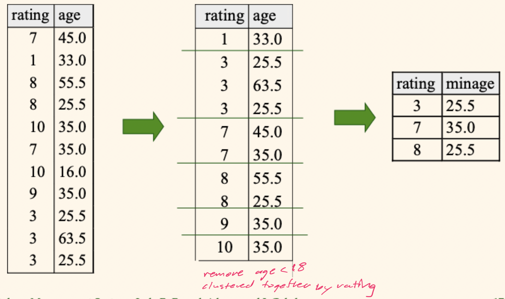

# Lecture 13

## More SQL

### Nested queries

- A very powerful feature of SQL: a `WHERE` clause can itself contain an SQL query (so can `FROM` and `HAVING` clauses)
- To understand the semantics (including cardinality) of nested queries, think *nested loop* evaluation

> Find names of sailors who've reserved boat #103

```SQL
SELECT S.sname
FROM Sailors S
WHERE S.sid IN (
	SELECT R.sid
	FROM Reserves R
	WHERE R.bid = 103
);
```

- `EXISTS` is another set comparison operator like `IN`
- Illustrates why, in general, a subquery must be recomputed for each `Sailors` tuple (conceptually)

```SQL
SELECT S.sname
FROM Sailors S
WHERE EXISTS (
	SELECT *
	FROM Reserves R
	WHERE R.bid = 103 AND S.sid = R.sid
);
```

- Can also use `NOT IN` and `NOT EXISTS`
- Also, comparison operators can be used with `ANY` and `ALL`

> Find sailors whose rating is greater than that of some sailor called Horatio

```SQL
SELECT *
FROM Sailors S
WHERE S.rating > ANY (
	SELECT S2.rating
	FROM Sailors S2
	WHERE S2.sname = 'Horatio'
)
```

### Rewriting `INTERSECT` queries using `IN`

> Find the `sid`'s of sailors who've reserved both a red boat and a green boat

```SQL
SELECT S.sid
FROM Sailors S, Boats B, Reserves R
WHERE S.sid = R.sid AND R.bid = B.bid AND B.color = 'red' AND S.sid IN (
	SELECT S2.sid
	FROM Sailors S2, Boats B2, Reserves R2
	WHERE S2.sid = R2.sid AND R2.bid = B2.bid AND B2.color = 'green'
)
```

This is something you would have to do in using [MySQL](https://www.mysql.com) since the set operations are not available there

### Division, SQL style

> Find sailors who've reserved **all** boats

```SQL
SELECT S.sname
FROM Sailors S -- Sailors S such that ...
WHERE NOT EXISTS (
	(SELECT B.bid FROM Boats B) -- the set of all boat IDs
	EXCEPT ( -- minus
		SELECT R.bid
		FROM Reserves R -- this sailor's reserved boat IDs
		WHERE R.sid = S.sid
	)
); -- ... is empty
```

- Without `EXCEPT`

```SQL
SELECT S.sname
FROM Sailors S -- Sailors S such that ... 
WHERE NOT EXISTS (
	SELECT B.bid
	FROM Boats B -- there is no boat B without
	WHERE NOT EXISTS (
		SELECT R.bid
		FROM Reserves R -- a Reserves tuple saying that S reserved B
		WHERE R.bid = B.bid AND R.sid = S.sid
	)
);
```

### Ordering and/or limiting query results

> Find the ratings, IDs, names, and ages of the three best sailors

```SQL
SELECT S.rating, S.sid, S.sname, S.age
FROM Sailors S
ORDER BY S.rating DESC -- ASC is the default
LIMIT 3 -- cut off after the first 3
```

- The general syntax for this is

```SQL
SELECT [DISTINCT] expressions
FROM tables
[WHERE condition]
...
[ORDER BY expression [ ASC | DESC ]]
LIMIT number_rows [OFFSET offset_value] -- offset is a skip count
```

## Aggregate operators

- A significant extension of relational algebra

```SQL
COUNT(*)
COUNT([DISTINCT] A)
SUM([DISTINCT] A)
AVG([DISTINCT] A)
MAX(A)
MIN(A)
```

- Where `A` is a single column

> Find the name and age of the oldest sailors(s)

```SQL
SELECT S.sname, MAX(S.age)
FROM Sailors S
```

- If you run the snippet, it will fail because you **cannot** combine field access and aggregates
- We can solve this issue right now using the following nested query

```SQL
SELECT S.sname, S.age
FROM Sailors S -- Keep sailors with ...
WHERE S.age = (
	SELECT MAX(age) FROM Sailors -- the biggest age
)
```

### Motivation for Grouping

- So far, we've applied aggregate operators to **all** (qualifying) tuples. Sometimes, we want to apply them to each of *several groups* of tuples

> Find the age of the youngest sailor for each rating level

- In general, we **don't know how many rating levels** exist, and what rating values for these levels are
- Suppose we know that rating values go from 1 to 10; we could write 10 queries that look like

```SQL
SELECT MIN(S.age)
FROM Sailors S
WHERE S.rating = i -- for i = 1, 2, ..., 10
```

### Queries with `GROUP BY` and `HAVING`

```SQL
SELECT [DISTINCT] target_list
FROM relation_list
WHERE qualification
GROUP BY grouping_list
HAVING group_qualification
```

- The target list contains
	1) Attribute names
	2) Terms with aggregate operations
- Conceptual evaluation
	1) The cross product of `relation_list` is computed
	2) Tuples that fail `qualification` are discarded
	3) Unnecessary fields are deleted
	4) Remaining tuples are partitioned into groups by the value of attributes in `grouping_list`
	5) The `group_qualification` is applied to eliminate some groups (1 answer tuple is generated per qualifying group)

> Find age of the youngest sailors with age $\ge$ 18 for each rating with at least $2$ such sailors

```SQL
SELECT S.rating, MIN(S.age) AS minage
FROM Sailors S
WHERE S.age >= 18
GROUP BY S.rating
HAVING COUNT(*) >= 2
```




