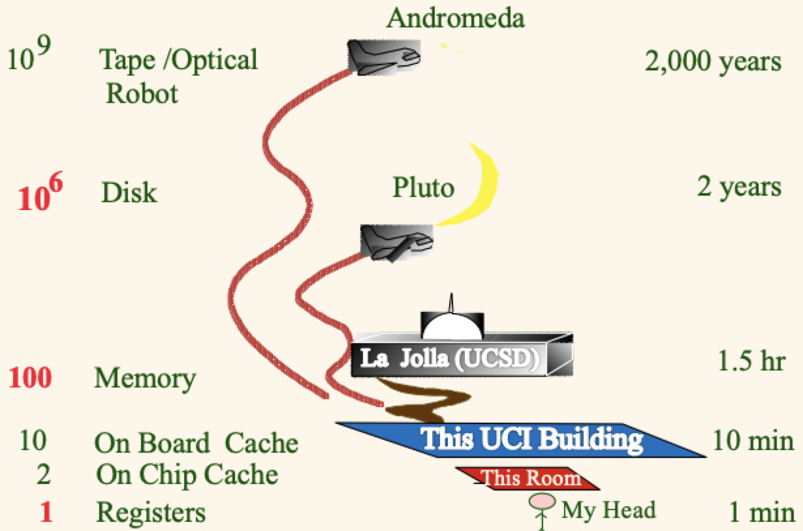
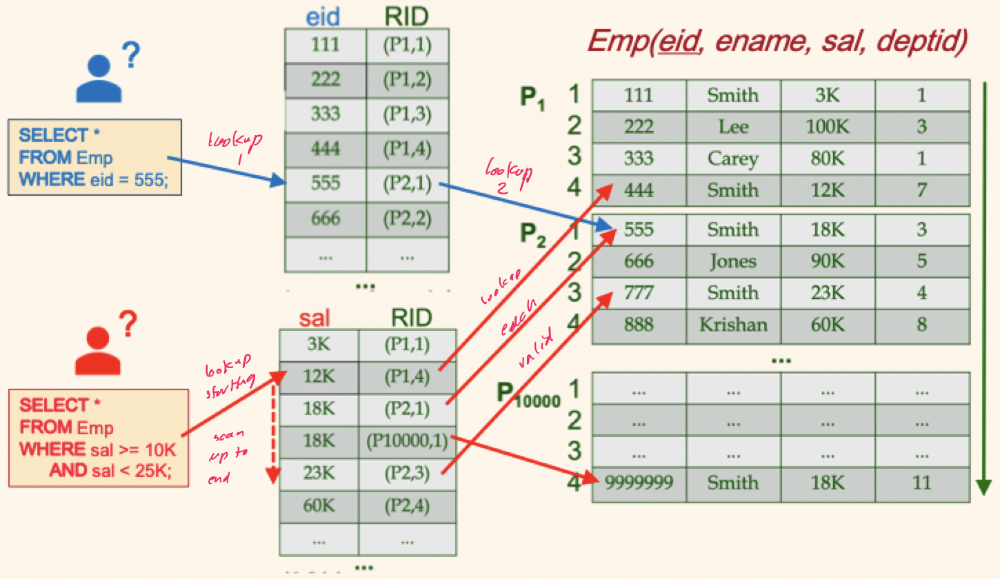
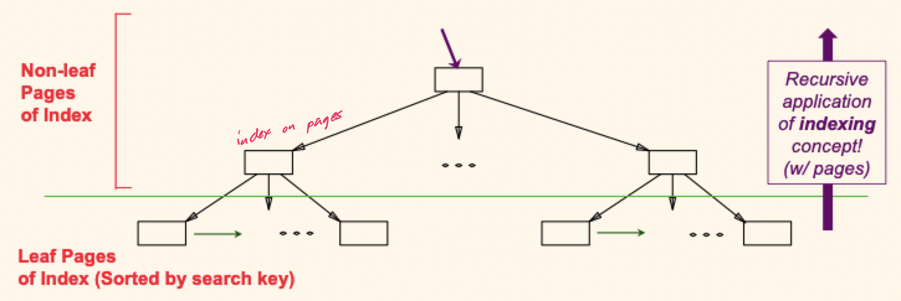
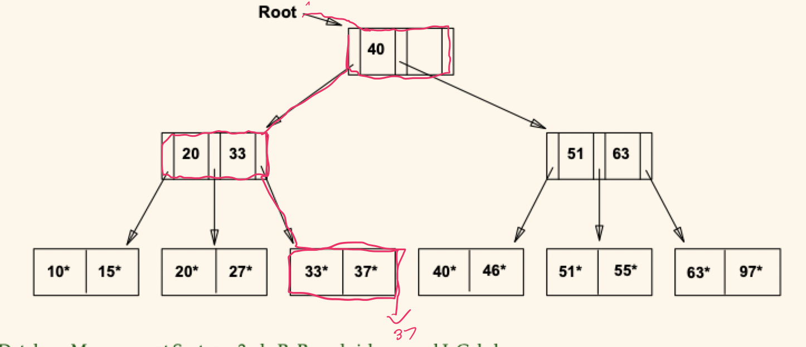
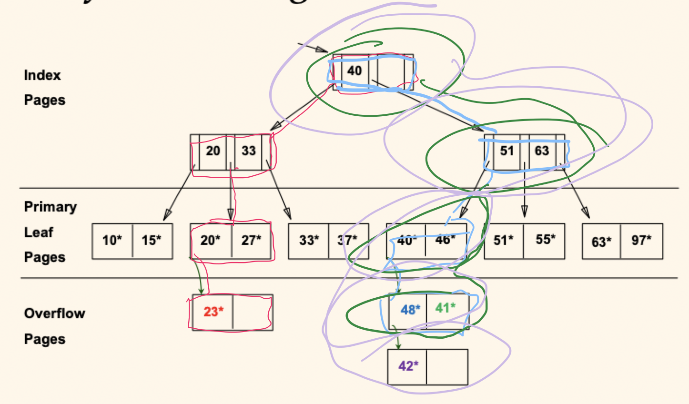
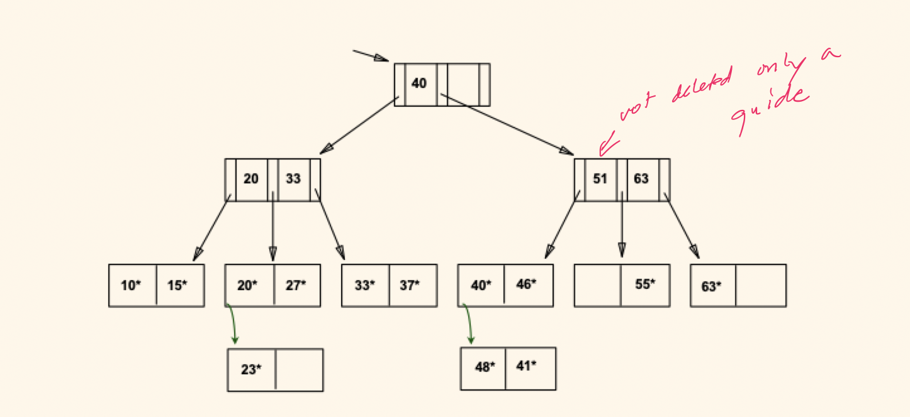

# Lecture 18

## Disks and files

- DBMS stores data on *secondary storage*
- Read and write operations become much more expensive relative to in-memory operations
- Must be considered carefully for DBMS design

### Storage hierarchy



### Why not main memory?

- Simply put: cost
	- RAM costs about $22/GB
	- An SSD costs about $1/GB (22 times cheaper than RAM)
	- Disks costs about $0.16/GB (138 times cheaper than RAM)
- Main memory is *volatile*. Data should persist between runs

### Components of a hard disk

- The platters spins (10,000 rpm)
- The arm assembly is moved in or out to position a head on a desired track
- Only one head read/write at one time
- *Block size* is a multiple of *sector size* (which is fixed)

### Accessing a disk page

- Time to access (read/write) a disk block
	- *Seek time*: moving arms to position disk head on track
	- *Rotational delay*: waiting for block to rotate under head
	- *Transfer time*: actually moving data to/from disk surface
- Seek times and rotational delays dominate
	- Key to I/O cost: reduce seek/rotation delays
	- Bottom line: random vs sequential I/O

### What about SSD storage?

- NAND flash: *block-oriented* interface like HDD
	- *Random reads*: 20-100 $\mu$sec
	- *Transfer rate*: 500-3000 GB/sec
	- *Read performance*: 10,000+ IOPS
- Writes are more complicated than HDD
	- *Random writes*: 100 $\mu$sec
	- *Write performance*: 10,000+ IOPS
	- Limited life, wear leveling, flash translation layer
	- Bottom line: no seeks, but still block-oriented

## Processing a query

- Suppose someone asks a simple SQL query

```SQL
SELECT * FROM Emp WHERE eid = 12345;
```

- Some processing options include
	1) Sequentially scan the data
	2) Binary search the data
- Even if option 2 is generally faster, we'd like to do better (especially with large datasets)

### Indexing

- An *index* maps from keys to associated info $I$
	- $I(k)$ can be the **data record itself** with key $k$
	- $I(k)$ can be the **RID** of the data record with key $k$
	- $I(k)$ can be a **list of RIDs** of data records with key $k$
	- Alternatively, we could map from data field values to the primary key values of the associated records
- An index on a file speeds up selection on *search key fields* for the index
	- Any subset of the fields of a relation can serve as the search key for an index on a relation
	- *Search key* is **not** the same as *key*
- An index contains a collection of *data entries*, and it supports efficient retrieval of *all* data entries $k^{*}$ with given value $k$

### Indexed tables under the hood



### Tree indexes



- Leaf pages contain *data entries* and are chained
- Non-leaf pages have *index entries*
- Query process becomes
	1) Choose a good index to use (if available)
	2) Search the index to determine the interesting RIDs
	3) Use the RIDs to fetch the corresponding records
- As for **any** index, the 3 alternatives for data entries $k^{*}$
	- Data record with key value $k$
	- $\langle k,\, \text{RID of record with search value k} \rangle$
	- $\langle k,\, \text{list of RIDs of data records with search key k} \rangle$
- This data entry choice is orthogonal to the *indexing technique* used to locate data entries $k^{*}$
- Tree structured indexing techniques support both *range searches* and *equality searches*

## Indexed sequential access method (ISAM)

- An index file may be quite large, but we can apply the same idea **recursively** to address that

### Operations

- *File creation*: leaf (data) pages first allocated sequentially, sorted by the search key; then index pages allocated, and then overflow pages
	- *Index entries*: direct searches for data entries
- *Search*: start at the root, use key comparisons to go to leaf: $O(\log_{f}{n})$
- *Insert*: find leaf data entry belongs to, put entry there
- *Delete*: find and remove entry from leaf, if overflow page now empty -> deallocate it

### Search

> Find 37 is the following tree



### Insertion

> Insert 23 (red), 48 (blue), 41 (green), 42 (purple)



### Deletion

> Delete 42, 51, 97



- Note that $51$ still appears in index levels, but **not** as a leaf node
- This is due to the *static* tree structure: inserts/deletes only affect leaf nodes and reorganization does not occur in index levels or the tree