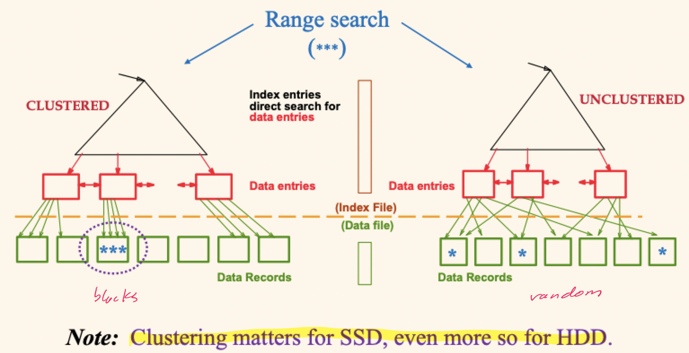
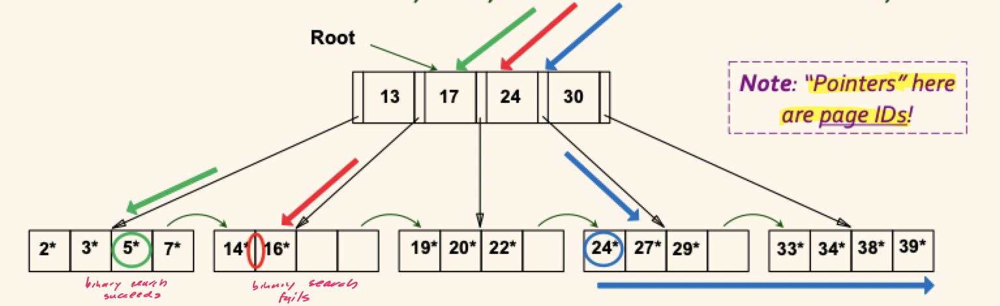
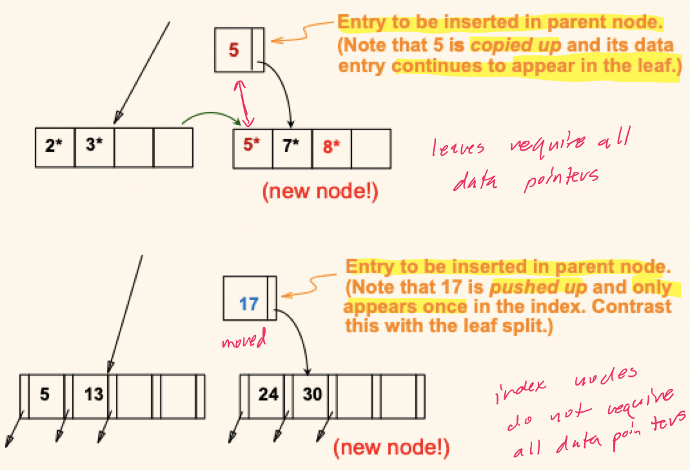
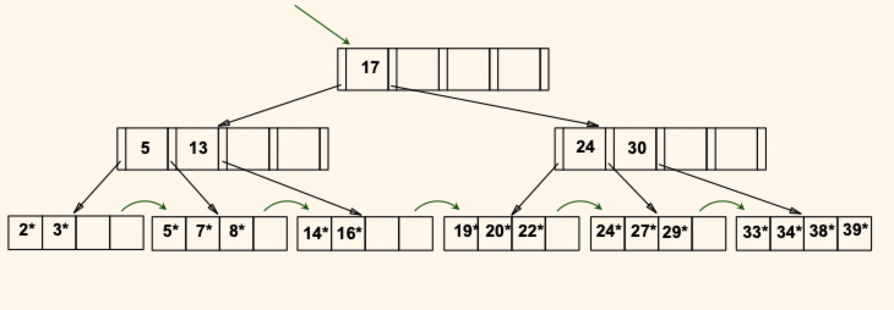
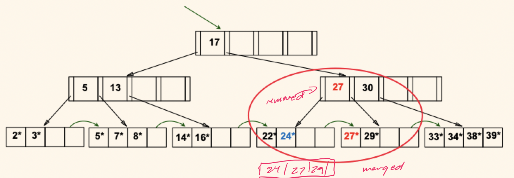
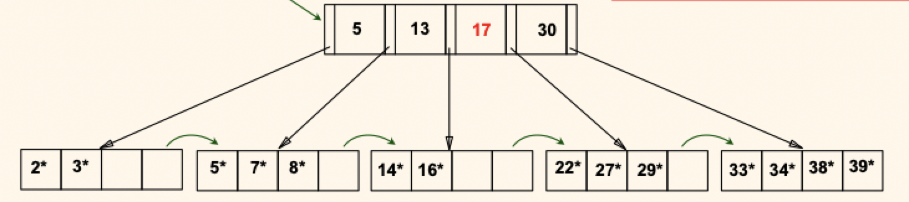

# Lecture 19

## Index classification

- *Primary vs. secondary*: if search key contains the primary key, the index is primary; otherwise the index is secondary
- A *Unique* index is one where the search key contains a *candidate key*
- *Clustered vs unclustered*: if order of index entries is the same as of "close to" the order of stored data records, the index is clustered; otherwise the index is unclustered

## B+ trees

- They are the most widely used index
- Inserts and deletes can be done in $O(\log_{f} N)$ as along as the tree is height balanced
	- $f$ is the fanout or width of the tree
	- $N$ is the number of leaf pages
- A minimum occupancy of 50% for each node is maintained (except for the root)
- Each node contains $d \le m \le 2d$ entries
- The mythical $d$ is called the *order* of the B+ tree
- Supports **equality** and **range-searches** efficiently
- Useful [Visualization Tool](https://www.cs.usfca.edu/~galles/visualization/BPlusTree.html)

### Searching

Searches begin at the root and key comparisons direct the search to a leaf

> Search for 5 (green), 15 (red), and all entries greater than or equal 24 (blue)

- If doing an equality lookup, we binary search the leaf node for the given key
	- Search for 5 finds an exact match
	- Search for 15 does not find an exact match, but we know it is between 14 and 16
- If doing a range lookup, binary search leaf node and then continue across the leaves
	- Search for $\ge 24$ finds and exact match, and also includes any following leaves

### Inserting

- Find correct leaf $L$ (by searching for the new key $k$)
- Put the new data entry in leaf $L$
	- If $L$ has enough space, we're done (most likely case)
	- Else, we must split $L$ into $L1$ and $L2$
		- Redistribute entries evenly and **copy** up the middle key
		- Insert new index entry pointing to $L2$ into the parent of $L1$
- This can happen *recursively*
	- To split an index node, redistribute entries evenly but **push up** the middle key
	- Splits grow the tree; splits at the root increase the height

> Search for 8

> Insert 8

- Observe how the minimum occupancy is guaranteed in both leaf and index page splits
- Note the difference between **copy-up** and **push-up**

> Balance 8

- Notice how the root was split, leading to *increase in height*

### Deletion

- Start at the root, find leaf $L$ where entry should be
- Remove the entry
	- If $L$ is still at least half-full -> we're done
	- If $L$ has only $d - 1$ entries
		- Try to *redistribute* by borrowing from sibling node
		- If redistribution fails, *merge* $L$ and sibling
- If merge occurred, must delete search-guiding entry from parent of $L$
- Merge could propagate to the root, decreases the tree's height

> Delete 19 and 20

- Delete of 19 is easy
- Delete of 20 is done with redistribution
- Notice how the middle leaf key (27) was *copied up*
- Further deletes in this leaf would require a merge

> Delete 24

- Observe the toss of index entry between and pull down of index entry below
- This delete propagates to the root, decreasing the height

### Bulk loading

- If we have a large collection of records, and we want to create a B+ tree on some field, to do so by repeatedly inserting records would be slow
- *Bulk loading* can be done much more efficiently
- *Initialization*: sort all entries, insert pointer to first (leaf) page in a new (root) page
- Index entries for leaf pages always entered into right most index page just above leaf level
- When one fills, it splits (and may up the right-most path to the root)
- Much (much) faster than repeated inserts