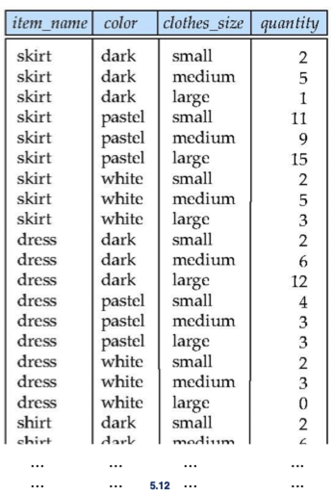
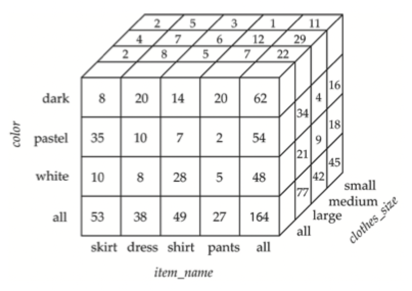
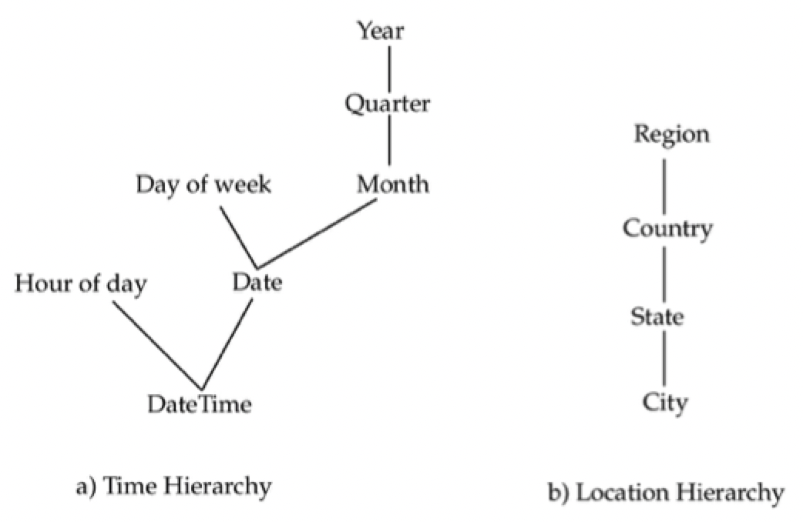

# Lecture 24

## Ranking in SQL

- *Ranking* is done in conjunction with an `ORDER BY` specification
- Suppose we are given a relation `student_grades(ID, GPA)` giving the grade-point average of each student

> Find the rank of each student

```SQL
SELECT ID, rank() OVER (ORDER BY GPA DESC) AS s_rank
FROM student_grades;
```

> An extra `ORDER BY` clause is needed to get the results in sorted order

```SQL
SELECT ID, rank() OVER (ORDER BY GPA DESC) AS s_rank
FROM student_grades
ORDER BY s_rank;
```

- Ranking may leave gaps (2 students have the same top GPA, both will have rank 1 and the next rank will be 3)
- `dense_rank` does not leave gaps
- The `rank()` syntax is syntactical sugar and can be done using basic SQL aggregation

```SQL
SELECT ID, (1 + (SELECT COUNT(*)
				 FROM student_grades B
				 WHERE B.GPA > A.GPA)) AS s_rank
FROM student_grades A
ORDER BY s_rank;
```

- Note that the resultant query is very inefficient
- A query optimizer would not be able to take the given query and convert it into `rank()`
- Ranking can also be done within *partitions* of the data

> Find the rank of students within each department

```SQL
SELECT ID, dept_name, rank() OVER (PARTITION BY dept_name ORDER BY GPA DESC) AS dept_rank
FROM dept_grades
ORDER BY dept_name, dept_rank;
```

- Multiple `OVER` clauses can occur in a single `SELECT` clause
- Ranking `OVER` is done *after applying* `GROUP BY` clause/aggregation
- Useful for discovering the top $N$ results

```SQL
SELECT * 
FROM (SELECT ID, rank() OVER (ORDER BY GPA DESC) AS s_rank
	  FROM student_grades)
WHERE s_rank >= 3;
```

- PostgresQL permits the user to specify `NULL`s first or `NULL`s last

```SQL
SELECT ID, rank() OVER (ORDER BY GPA DESC NULLS LAST) AS s_rank
FROM student_grades;
```

- Other ranking function
	- `row_number()` (non-deterministic in presence of duplicates)
	- `cume_dist` (cumulative distribution)
	- `percent_rank` (within partition, if partitioning is done)
- For a given constant $n$, the ranking function `ntile(n)` takes the tuples (in each partition) in the specified order, and divides then into $n$ buckets with equal numbers of tuples

```SQL
SELECT ID, ntile(4) OVER (ORDER BY DPA DESC) AS quartile
FROM student_grades;
```

## Windowing in SQL

- Makes it possible to annotate tuples based on some related context
- Useful for smoothing out random variations
- Window specification in SQL

```SQL
SELECT date, AVG(value) OVER (ORDER BY date ROWS BETWEEN 1 PRECEDING AND 1 FOLLOWING) AS daily
FROM daily_sales;
```

- Some more examples
	- `ROWS BETWEEN UNBOUNDED PRECEDING AND CURRENT`
	- `ROWS UNBOUNDED PRECEDING`
	- `RANGE BETWEEN 10 PRECEDING AND CURRENT ROW`
- All rows with values between the preceding bound and following bound

```SQL
SELECT date, SUM(value) OVER (ORDER BY date ROWS UNBOUNDED PRECEDING) AS total
FROM daily_sales;
```

- Windowing can occur *within partitions*

> Find total balance (running total) **of each account** after each transaction on the account

```SQL
SELECT account_number, date_time, SUM(value) OVER (PARTITION BY account_number ORDER BY date_time ROW UNBOUNDED PRECEDING) AS balance
FROM transaction
ORDER BY account_number, date_time
```

## Data analysis and OLAP

- OLAP: **O**n**l**ine **A**nalytical **P**rocessing
	- Interactive analysis of data, allowing data to be summarized and viewed in different ways -- in an *online* fashion
- Data that can be modeled as **dimension attributes** and **measure attributes** are called *multidimensional data*
	- Measure attributes
		- Measures some value
		- Can be aggregated upon
	- Dimension attributes
		- Define the dimensions on which measure attributes (or aggregates thereof) are viewed
- Let's first look at theses concepts in general



- Cross tab of sales by `item_sales` and `color`


### Data cubes

- A **data cube** is a multidimensional generalization of a cross-tab
- Can have $n$ dimensions
- Cross tabs can be thought of as *views on a data cube*



### Hierarchies on dimensions

- Hierarchy on dimension attributes: lets the dimensions be viewed at *different levels of details*
- Provides data at different granularities



- Cross-tabs can be extended to deal with hierarchies
- Cross-tabs can be represented as relations
	- The value **all** is used to represent aggregates
	- SQL actually uses `NULL` values instead of **all** despite confusion with regular `NULL` values

## Extended aggregation

- The `cube` operations computes union of `GROUP BY`s on every subset of the specified attributes

```SQL
SELECT item_name, color, clothes_size, SUM(quantity)
FROM sales
GROUP BY cube(item_name, color, clothes_size)
ORDER BY item_name, color, clothes_size
```

- This computes the *union of eight* different grouping
	1) `(iten_name, color, clothes_size)`
	2) `(iten_name, clothes_size)`
	3) `(item_name)`
	4) `(clothes_size)`
	5) `(item_name, color)`
	6) `(color, clothes_size)`
	7) `(color)`
	8) `()`
- For each grouping, the result contains null values for those attributes that are not present in the grouping
- The relational representation of the cross-tabs, but with `NULL` in place of **all** is computed like so

```SQL
SELECT item_name, color, SUM(quantity)
FROM sales
GROUP BY cube(iten_name, color)
ORDER BY item_name, color;
```

- The function `grouping()` can be applied on an attribute
	- Returns 1 if the values is `NULL` representing all, or return 0 in all other cases

```SQL
SELECT item_name, color, clothes_size, SUM(quantity)
	grouping(item_name) AS item_name_flag,
	grouping(color) AS color_flag,
	grouping(clothes_size) AS size_flag
FROM sales
GROUP BY cube(item_name, color, clothes_size);
```

- Can use the function `coalesce()` in the `SELECT` clause to replaces `NULL`s with a value such as 'all'
- The `rollup` construct generates unions on every *prefix* of a specified list of attributes

```SQL
SELECT item_name, color, clothes_size, SUM(quantity)
FROM sales
GROUP BY rollup(item_name, color, clothes_size)
```

- Generates a union of 4 grouping
	1) `(item_name, color, size)`
	2) `(item_name, color)`
	3) `(item_name)`
	4) `()`
- Rollup is usually used to generate aggregates at multiple levels of a hierarchy

## Python pandas

A fast, powerful, flexible and easy to use open source [data analysis and manipulation tool](https://pandas.pydata.org) built on top of the Python programming language.