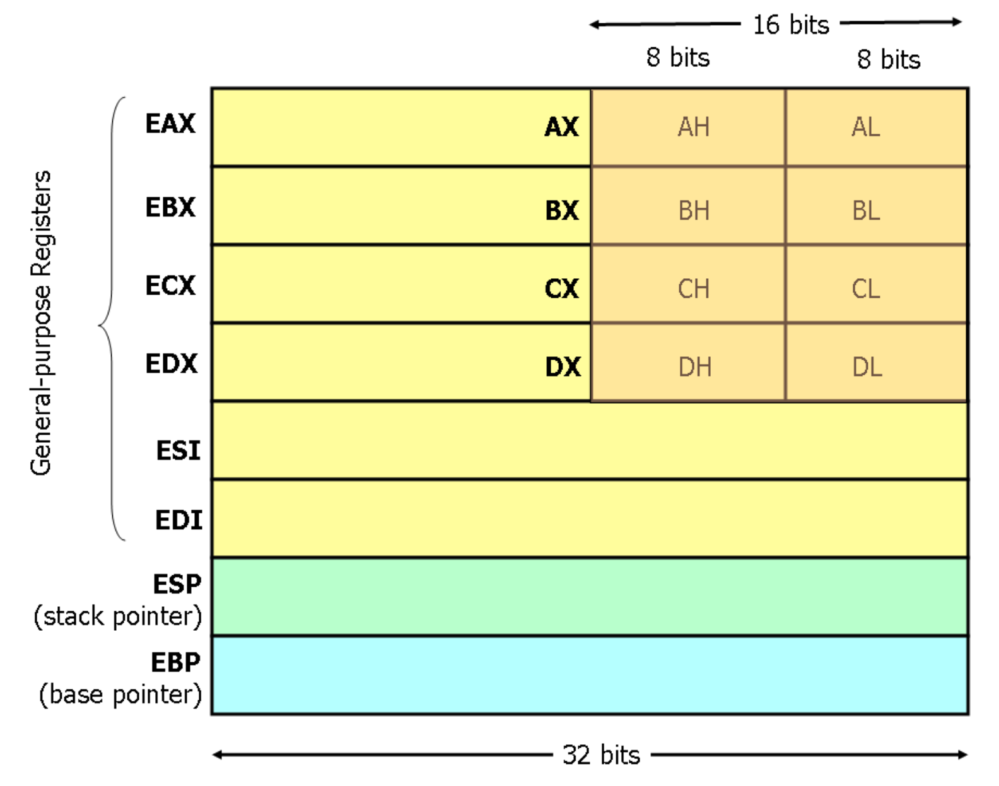

# x86 assembly

## The instruction set

- The full x86 instruction set is large and complex
	- But don't worry, the core part is simple
	- The rest are various extension (often you can guess what they do, or quickly look it up in the manual)
- Three main groups
	1) Data movement (from memory and between registers)
	2) Arithmetic operations (additions, subtraction, etc)
	3) Control flow (jumps, function calls)

### General registers

- 8 general registers (32 bits each)
- Two (`ESP` and `EBP`) have a special role
- Others are more or less general. Used for
	- Arithmetic instructions
	- Control flow decisions
	- Passing arguments to functions



### Data movement instructions

#### Useful notation

- `<reg32>`: any 32-bit register (EAX, EBX< ECX, EDX, ESI, EDI, eXP, or EBP)
- `<reg16>`: any 16 bit register (AX, BX, CX, or DX)
- `<reg8>`: any 8-bit register (AH, BH, CH, DH, AL, BL, CL, or DL)
- `<reg>`: any register
- `<mem>`: a memory address or dword ptr
- `<con32>`: any 32-bit constant
- `<con16>`: any 16-bit constant
- `<con8>`: any 8-bit constant
- `<con>`: any 8, 16, or 32 bit constant

#### `mov` instruction

- Copies the data item referred to by its second operand into the location referred to by its first operand
	- Register to register moves are possible
	- Direct memory to memory moves are not
- Syntax
	- `mov <reg>, <reg>`
	- `mov <reg>, <mem>`
	- `mov <mem>, <reg>`
	- `mov <reg>, <const>`
	- `mov <mem>, <const>`

```assembly
mov eax, ebx          ; copy the value in ebx into eax
mov byte ptr [var], 5 ; store 5 into the byte at location var
mov eax, [ebx]        ; move the 4 bytes in memory at the address contained in EBX into EAX
mov [var], ebx        ; move the contents of EBX into the 4 bytes at memory address var
mov eax, [esi-4]      ; move 4 bytes at memory address ESI + (-4) into EAX
mov [esi+eax], cl     ; move the contents of CL into the byte at address ESI+EAX
```

```C
struct point {
	int x;
	int y;
}

struct point points[128] // array of 128 points

// load y coordinate of i-th point into y
int y = points[i].y // mov edx, [ebx + 8*eax + 4]
```

#### `lea` load effective address

- The `lea` instruction places the address specified by its second operand into the register specified by its first operand
- The contents of the memory location are not loaded, only the effective address is computed and placed into the registor
- This is useful for obtaining a pointer into a memory region

```C
// load the address of the y coordinate of the i-th point into p
int *p = &points[i].y; // lea esi, [ebx + 8*eax + 4]
```

- Often used instead of add
- Compared to `add`, `lea` can
	- Perform addition with either two or three operands
	- Store the result in any register; not just one of the source operands

### Arithmetic and logic instructions

#### Add instructions

- The `add` instruction adds together its two operands storing the result in its first operand
	- Both operands may be registers
	- At most one operand may be a memory location
- Syntax
	- `add <reg>, <reg>`
	- `add <reg>, <mem>`
	- `add <mem>, <reg>`
	- `add <reg>, <con>`
	- `add <mem>, <con>`

#### Subtract instructions

- The sub instruction stores in the value of its first operand the result of subtracting the value of its second operand from the value of its first operand

```asm
sub al, ah      ; AL <- AL - AH
sub eax, 216    ; subtract 216 from the value stored in EAX
```

#### Increment and decrement instructions

- The `inc` instruction increments the contents of its operand by one
- The `dec` instruction decrements the contents of its operand by one

```asm
dec eax               ; subtract one from the contents of EAX
inc DWORD PTR [var]   ; add one to the 32-bit integer stored at location var
```

#### Bitwise logical instructions

- These instructions perform the specified logical operation on their operands, placing the result in the first operand location

```asm
and eax, 0fH     ; clear all but the last 4 bits of EAX
xor edx, edx     ; set the contents of EDX to zero
```

### Shift instructions

- These instructions shift the bits in their first operand's contents left and right, padding the resulting empty bit positions with zeros
- The shifted operand can be shifted up to 31 places, which can be either an 8-bit constant or the register `CL`

```asm
shl eax, 1      ; multiply the value of EAX by 2 (if most significant bit is 0)
shr ebx, cl     ; store in EBX the floor of result of dividing the value of EBX by 2^n there n is the value in CL
```

### Control flow instructions

#### `EIP` instruction pointer

- `EIP` is a 32 bit value indicating the location in memory where the current instruction starts
- `EIP` cannot be changed directly
	- Normally, it increments to point to the next instruction in memory
	- But it can be updated implicitly by provided control flow instructions

#### Labels

- `<label>` refers to a labeled location in the program text
- Labels can be inserted anywhere in x86 assembly code text by entering a label name followed by a colon

```asm
		mov esi, [ebp+8]
begin:  xor ecx, ecx
		mov eax, [esi]
```

#### `jump` instruction

- Transfers program control flow to the instruction at the memory location indicated by the operand

```asm
begin:  xor ecx, ecx
		...
		jum begin     ; jump to instruction labeled begin
```

#### Conditional jumps

- Jumps only if a condition is true
	- The status of a set of condition codes that are stored in a special register (`EFLAGS`)
	- `EFLAGS` stores information about the last arithmetic operation performed 
		- Bit 6 of `EFLAGS` indicates if the last result was zero
		- Bit 7 indicates if the last result was negative
- Based on these bits, different conditional jumps can be performed
	- The `jz` instruction performs a jump to the specified operand label if the result of the last arithmetic operation was zero
	- Otherwise, control proceeds to the next instruction in sequence
- Syntax
	- `je <label>` (jump when equal)
	- `jne <label>` (jump when not equal)
	- `jz <label>` (jump when last result was zero)
	- `jg <label>` (jump when greater than)
	- `jge <label>` (jump when greater than or equal to)
	- `jl <label>` (jump when less than)
	- `jle <label>` (jump when less than or equal to)

`cmp` instruction

- Compare the values of the two specified operands, settings the condition codes in `EFLAGS`
	- The instruction is equivalent to the sub instruction, except the result of the subtraction is discarded instead of replacing the first operand
- Syntax
	- `cmp <reg>, <reg>`
	- `cmp <reg>, <mem>`
	- `cmp <mem>, <reg>`
	- `cmp <reg>, <con>`

## Stack and procedure calls

### What stack?

- Just a region of memory
- Pointed by a special register `ESP`
- Changing `ESP` gives you a new stack
- Stacks main purpose
	- Store the return address for the current procedure
	- **Caller** pushes return address on the stack
	- **Callee** pops it and jumps
- Other uses
	- Local data storage
	- Parameter passing
	- Evaluation stack (register spill)

### Calling functions

- Stack contains information for *how to return* from a subroutine
- Functions can be called from different places in the program

### Call and return

- `call` instruction
	- Makes an unconditional jump to a subprogram and pushes the address of the next instruction on the stack
	- `push eip + sizeof(CALL)`
	- `jmp _my_function`
- `ret` instruction: pops off an address and jumps to that address

### Manipulating the stack

- `ESP` register: contains the memory address of the topmost element in the stack
- `PUSH` instruction: subtracts 4 from `ESP` and inserts data on the stack
- `POP` instruction: removes data from the stack by saving it into a register/memory and adding 4 to `ESP`