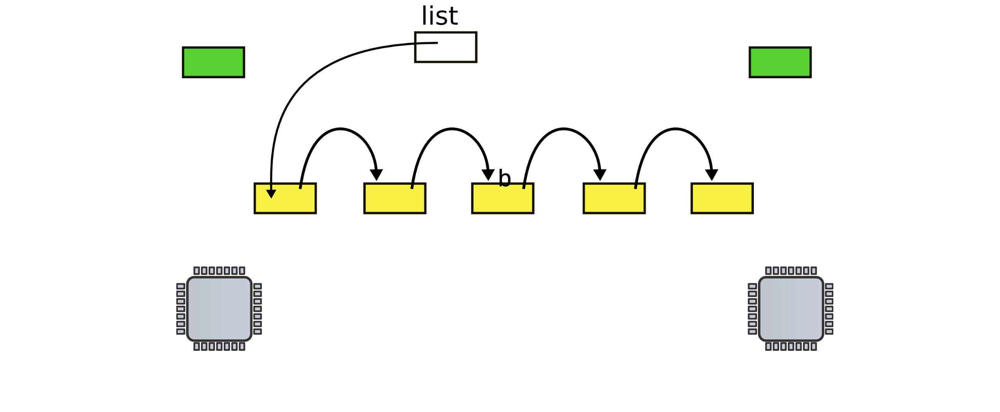
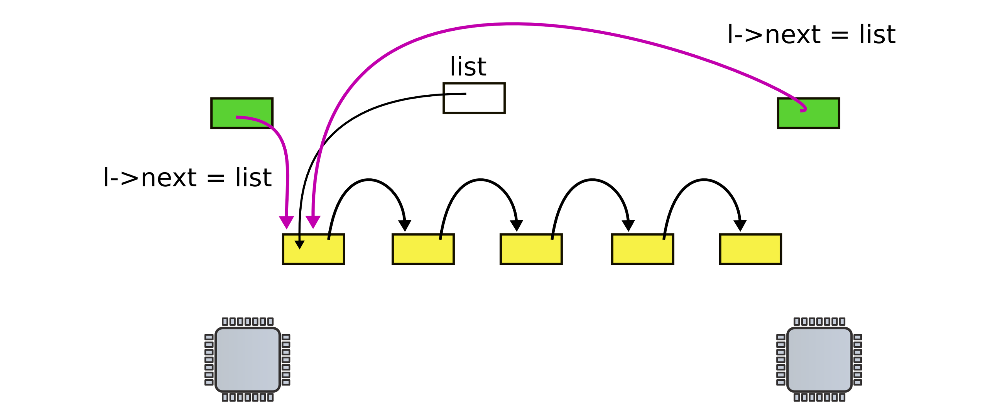
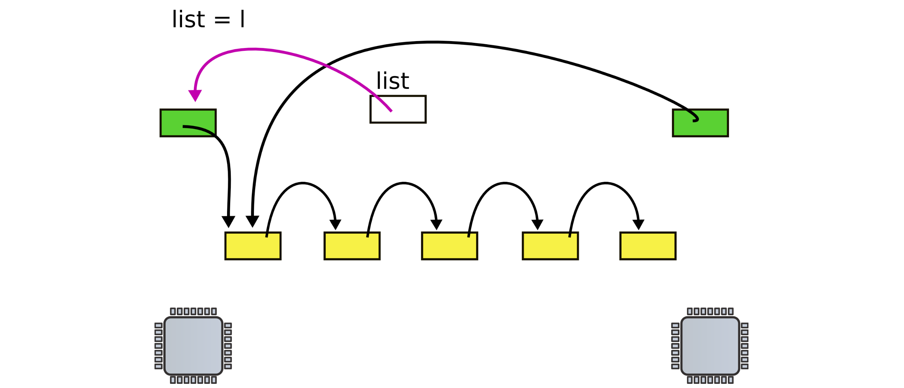
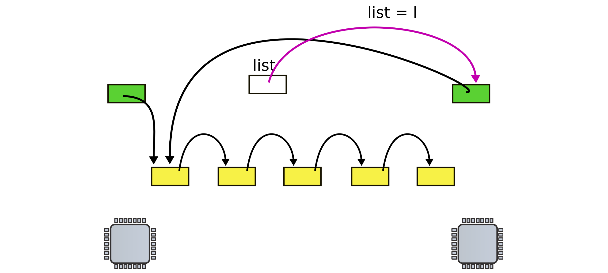
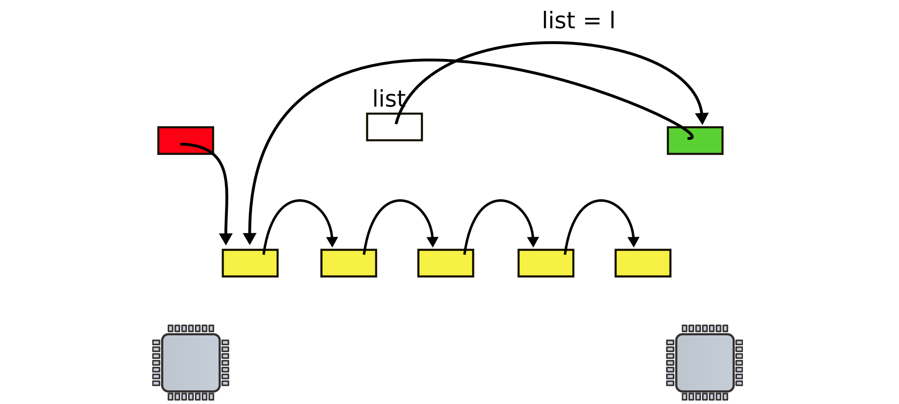

# Synchronization (part 1)

## Starting other CPUs

- Copy start code in a good location
    - `0x7000` (same as the one used by the boot loader)
- Pass start parameters on the stack
    - Allocate a new stack for each CPU
    - Send a magical interprocessor interrupt with the entry point `mpenter`

```C
void
startothers(void) {
    code = P2V(0x7000);
    memove(code, _binary_entryother_start, (unsigned int)_binary_entryother_size);
    for(c = cpus; c < cpus+ncpu; c++) {
        if(c == cpus+cpunum()) // We've already started
            continue
        ...
        stack = kalloc(); // Allocate a new kernel stack for each CPU
        *(void**)(code-4) = stack + KSTACKSIZE; // Set kstack pointer
        *(void**)(code-8) = mpenter; // Set address of mpenter
        *(int**)(code-12) = (void *) V2P(entrypgdir); // Set physical address of entry page directory

        lapistartap(c->apicid, V2P(code)); // Send magical interrupt to wake CPU
    }
}
```

### `entryother.S`

```asm
.code16
.globl start
start:
    cli             # Disable interrupts
    # Init segments to 0
    xorw %ax %ax
    movw %ax %ds
    movw %ax %es
    movw %ax %ss
    
    ldgt gdtdesc    # Load GDT
    
    # Switch to 32bit mode and long jump to start32
    movl %cr0, %eax
    orl $CR0_PE, %eax
    movl %eax, %cr0
    ljmpl $(SEG_KCODE<<3), $(start32)

.code32
start32:
    # Load 32bit segments
    movw $(SEG_KCODE<<3), %ax
    movw %ax, %ds
    movw %ax, %es
    movw %ax, %ss
    movw $0, %ax
    movw %ax, %fs
    movw %ax, %gs

    # Turn on page size extension for 4MB pages
    movl %cr4, %eax
    orl $(CR4_PSE), %eax
    movl %eax, %cr4
    # Use entrypgdir as our intitial page table
    movl (start-12), %eax
    movl %eax, %cr3
    # Turn on paging
    movl %cr0, %eax
    orl $(CR0_PE|CR0_PG|CR0_WP), %eax
    movl %eax, %cr0

    # Switch to stack allocated byt startothers()
    movl (start-4), %esp
    # Call mpenter()
    call *(start-8)
```

```C
static void
mpeneter(void) {
    switchkvm();
    seginit();
    lapicinit();
    mpmain();
}
```

```C
// Common CPU setup code
static void
mpmain(void) {
    cprintf("cpu%d: starting %d\n", cpuid(), cpuid());
    idtinit(); // load IDT register
    xchg(&(mycpu()->started), 1); // tell startothers() we're up and running
    scheduler(); // start running processes
}
```

### Init segments

```C
void
seginit(void) {
    struct cpu *c;

    // Map logical addresses to virtual addresses using identity map
    // Cannot share a CODE descriptor for both kernel and user
    // because it would have to have DPL_USER, but CPU forbids
    // an interrupt from CPL=0 to DPL=3
    c = &cpus[cpuid()];
    c->gdt[SEG_KCODE] = SEG(STA_X|STA_R, 0, 0xffffffff, 0);
    c->gdt[SEG_KDATA] = SEG(STA_W, 0, 0xffffffff, 0);
    c->gdt[SEG_UCODE] = SEG(STA_X|STA_R, 0, 0xffffffff, DPL_USER);
    c->gdt[SEG_UDATA] = SEG(STA_W, 0, 0xffffffff, DPL_USER);
    lgdt(c->gdt, sizeof(c->gdt));
}
```

## CPU representation

### Per-CPU variables

- Each CPU has a set of private variable
    - Current process running on that core
    - Kernel stack for interrupts
- All CPU cores are tracked in `struct cpu cpus[NCPU];`

### Per-CPU state

```C
// Per-CPU state
struct cpu {
    uchar apicid;                     // Local ACI ID
    struct context *scheduler;        // swtch() here to enter scheduler
    struct taskstate ts;              // Used by x86 to find stack for interrupt
    struct segdesc gdt[NSEGS];        // x86 global descriptor table
    volatile unsigned int started;    // Has the CPU started?
    int ncli;                         // Depth of pushcli nesting
    int intena;                       // Were interrupts enabled before pushcli?
    struct proc *proc;                // The process running on this cpu or null
};
```

### Identifying CPUs

```C
// Must be called with interrupts disabled
int
cpuid() {
    return mycpu()-cpus;
}
struct cpu* mycpu() {
    int apicid, i;

    if(readeflags()&FL_IF)
        panic("mycpu called with interrupts enabled\n");

    apicid = lapicid();
    // APIC IDs are not guaranteed to be contiguous. Maybe we should have
    // a reserse map, or reserve a register to store &cpus[i]
    for(i = 0; i < ncpu; ++i) {
        if (cpus[i].apicid == apicid)
            return &cpus[i];
    }
    panic("unknown apicid\n");
}
```

## Race conditions

### List implementation (no locks)

```C
struct list {
    int data;
    struct list *next;
};

struct list *list = 0;

void insert(int data) {
    struct list *l;

    l = malloc(sizeof *l);
    l->data = data;
    l->next = list;
    list = l;
}
```

- List is implemented as 
    - One data element
    - Pointer to the next element
- A global head will be maintained in `list`
- Insertion operation
    - Allocates new list element
    - Save data into that element
    - Insert into the list

> Let 2 CPUs allocate new data to the global list



> Both CPUs update the next pointers of their respective new elements



> Without loss of generality, the first CPU updates the head pointer



> Without loss of generality, the second CPU updates the head pointer



> The *first element* added in this situation is lost



### List implementation (with locks)

```C
struct list {
    int data;
    struct list *next;
};

struct list *list; = 0;
struct lock listlock;

void
insert(int data) {
    struct list *l;
    l = malloc(sizeof *l);
    acquire(&listlock);
    l->data = data;
    l->next = list;
    list = l;
    release(&listlock);
}
```

- The calls to `acquire` and `release` surround what we call the **critical section**
- Only 1 cpu can run in the critical section

## locks and `acquire`

### Spin lock

```C
void
acquire(struct spinlock *lk) {
    for(;;) {
        if(!lk->locked) {
            lk->locked = 1;
            break;
        }
    }
}
```

- Spin until lock is 0, then set it to 1
- But, 2 CPUs can reach the check *at the same time*
    - Both will see the lock as free
    - Both will "acquire" the lock
- The check and claiming of the lock needs to be **atomic**

### Compare and swap

- Need a way to swap a word in memory with a new value and return the old value

```C
void acquire(struct spinlock *lk) {
    ...
    // The xchg is atomic
    while(xchg(&lk->locked, 1) != 0)
        ;
    ...
}
```

- The `xchg` puts a 1 to try to acquire a lock and returns the locks acquired status
    - If `xchg` returns 1, the lock has previously been acquired, try again
    - If `xchg` returns 0, the lock has successfully been acquired, return

```C
static inline unsigned int
xchg(volatile unsigned int *addr, unsigned int newval) {
    unsigned int result;

    // The + in "+m" denotes a read-modify-write operand
    asm volatile("lock; xchgl %0, %1" :
                 "+m" (*addr), "=a" (result) :
                 "1" (newval) :
                 "cc");
    return result;    
}
```

- Almost there...
    - The C compiler can reorder moves, loads, or stores to speed things up
    - Need to tell it not to do that

```C
void
acquire(struct spinlock *lk) {
    ...
    // The xchg is atomic
    while(xchg(&lk->locked, 1) != 0)
        ;
    // Tell the C compiler and the processor to not move loads and stores
    // past this point, to ensure that the critical section's memory
    // references happen after the lock is acquired
    __sync_synchronize();
}
```