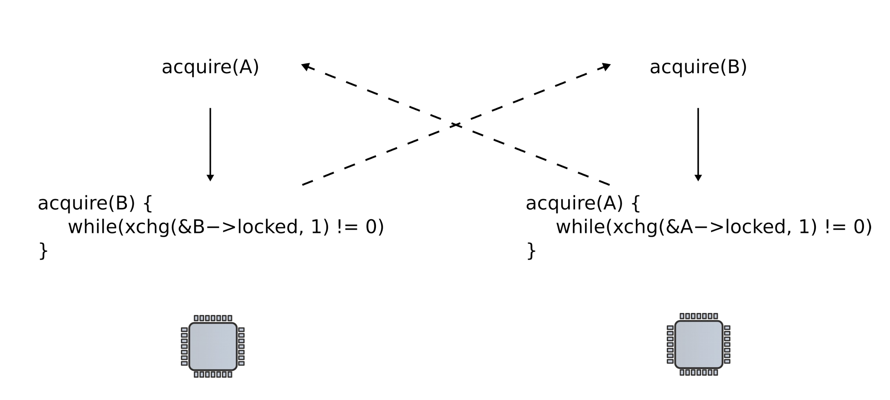
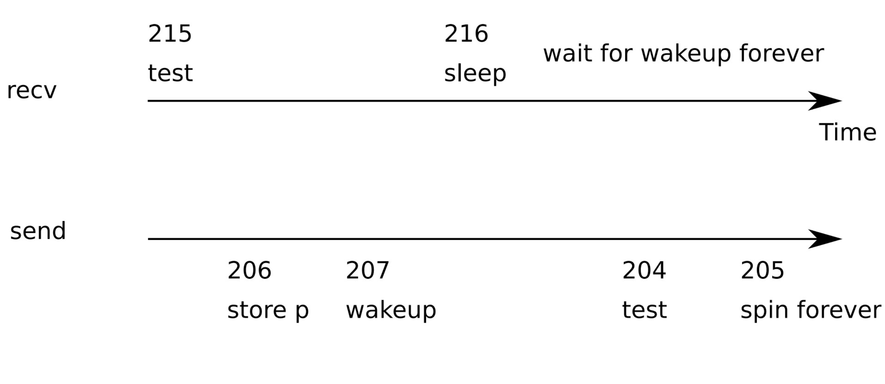

# Synchronization (part 2)

## Deadlocks



### Lock ordering

> Locks need to be acquired in the same order

### Locks and interrupts

> **NEVER** hold a lock with interrupts enabled

```C
void acquire(struct spinlock *lk) {
    pushcli(); // disable interrupsts to avoid deadlock
    if(holding(lk))
        panic("acquire")
    // The xchg is atomic
    while(xchg(&lk->locked, 1) != 0)
        ;

    __sync_synchronize();
}
```

- Simply disabling interrupts is not enough to prevent a deadlock
    - If 2 locks are acquired, interrupts should only be re-enabled *after* the second lock is released
- `pushcli()` uses a counter to determine when it is appropriate to re-enable interrupts

### `pushcli()` and `popcli()`

```C
void
pushcli(void) {
    int eflags;

    eflags = readeflags();
    cli();
    if(cpu->ncli == 0)
        cpu->intena = eflags & FL_IF;
    cpu->ncli += 1
}
```

```C
void
popcli(void) {
    if(readeflags()&FL_IF)
        panic("popcli - interruptable");
    if(--cpu->ncli < 0)
        panic("popcli");
    if(cpu->ncli == 0 && cpu->intena)
        sti();
} 
```

## Locks and interprocess communication

### Send and receive queue

- Allows one pointer to be shared between CPUs
- Works well, but expensive if communication is rare
- Receiver wastes CPU cycles

```C
struct q {
    void *ptr
};

void*
send(struct q *q, void *p) {
    while(q->ptr != 0)
        ;
    q->ptr = p;
}

void*
recv(struct q *q) {
    void *p;
    
    while((p = q->ptr) == 0)
        ;
    q->ptr = 0;
    return p;
}
```

### Sleep and wakeup

- `sleep(channel)`
    - Put the calling process to sleep
    - Release the CPU for other work
- `wakeup(channel)`
    - Wakes all processes sleeping on a given channel
    - Causes calls to `sleep()` to return

```C
struct q {
    void *ptr
};

void*
send(struct q *q, void *p) {
    while(q->ptr != 0)
        ;
    q->ptr = p;
    wakeup(q); /*wake recv*/
}

void*
recv(struct q *q) {
    void *p;
    
    while((p = q->ptr) == 0)
        sleep(q);
    q->ptr = 0;
    return p;
}
```

### Lost wakeup problem

- `recv()` gives up the CPU to other processes
- But calls to `wakeup` might be lost
    - Channel will spin forever
    - Awaiting channel will sleep forever



- Could be resolved by locking the queue

```C
struct q {
    void *ptr
};

void*
send(struct q *q, void *p) {
    acquire(&q->lock);
    while(q->ptr != 0)
        wakeup(q);
    q->ptr = p;
    release(&q->lock);
}

void*
recv(struct q *q) {
    void *p;

    acquire(&q->lock);
    while((p = q->ptr) == 0)
        sleep(q);
    q->ptr = 0;
    release(&q->lock);
    return p;
}
```

### Locks and sleeping

> A sleeping process holding a lock will **never** release it

```C
struct q {
    void *ptr
};

void*
send(struct q *q, void *p) {
    acquire(&q->lock);
    while(q->ptr != 0)
        wakeup(q);
    q->ptr = p;
    release(&q->lock);
}

void*
recv(struct q *q) {
    void *p;

    acquire(&q->lock);
    while((p = q->ptr) == 0)
        sleep(q, q->lock); // Pass the lock to sleep to release it
    q->ptr = 0;
    release(&q->lock);
    return p;
}
```

- `sleep` acquires a lock on `ptable.lock`
    - All process operations or protected by this lock
- Release `lk`
    - Safe since new `wakeup` starting cannot proceed
    - More wakeup must wait for `ptable.lock`, which `sleep` is holding

```C
void
sleep(void *chan, struct spinlock *lk) {
    ...
    if(lk != &ptable.lock) {
        acquire(&ptable.lock);
        release(lk);
    }

    // Go to sleep
    proc->chan = chan;
    proc->state = SLEEPING;
    sched();

    ...
    // Reacquire original lock
    if(lk != &ptable.lock) {
        release(&ptable.lock);
        acquire(lk);
    }
}
```

```C
void
wakeup1(void *chan) {
    struct proc *p;

    for(p = ptable.proc; p < &ptable.proc[NRPOC]; p++) {
        if(p->state == SLEEPING && p->chan == chan)
            p->state-> RUNNABLE;
    }
}


void
wakeup(void *chan) {
    acquire(&ptable.lock);
    wakeup1(chan);
    release(&ptable.lock);
}
```

## Pipes

### Pipe buffer

```C
#define PIPESIZE 512

struct pipe {
    struct spinlock lock;
    char data[PIPESIZE];
    unsigned int nread; // number of bytes read
    unsigned int nwrite; // number of bytes written
    int readopen; // read fd is still open
    int writeopen; // write fd is still open
};
```

- Buffer is full when `p->nwrite == p->nread + PIPESIZE`
- Buffer is empty when `p->nwrite == p->nread`

### `piperead()`

```C
int 
piperead(struct pipe *p, char *addr, int n) {
    int i;

    acquire(&p->lock);
    while(p->nread == p->nwrite && p->writeopen) { // If buffer is empty and write end still open
        if(proc->killed) {
            release(&p->lock);
            return -1;
        }
        sleep(&p->nread, &p->lock); // Go to sleep
    }
    for(i = 0; i < n; i++) {
        if(p->nread == p->nwrite)
            break;
        addr[i] = p->data[p->nread++ % PIPESIZE];
    }
    wakeup(&p->nwrite); // After reading some data, wakeup the writer
    release(&p->lock);
    return i;
}
```

### `pipewrite()`

```C
int
pipewrite(struct pipe *p, char *addr, int n) {
    int i;

    acquire(&p->lock);
    for(i = 0; i < n; i++) {
        while(p->nwrite == p->nread + PIPESIZE) { // If buffer is full
            if(p->readopen == 0 || proc->killed) {
                release(&p->lock);
                return -1; // Return error if read end is closed
            }
            wakeup(&p->nread); // Wakeup reader
            sleep(&p->nwrite, &p->lock); // Go to sleep
        }
        p->data[p->nwrite++ % PIPESIZE] = addr[i] // Write bytes to the pipe
    }
    wakeup(&p->nread); // Wakeup reader when done
    release(&p->lock);
    return n;
}
```