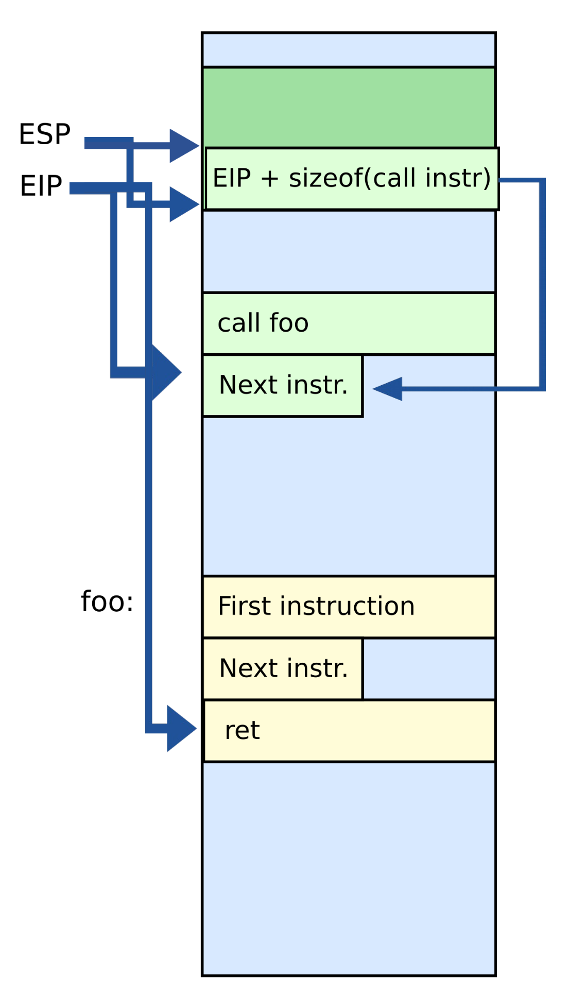
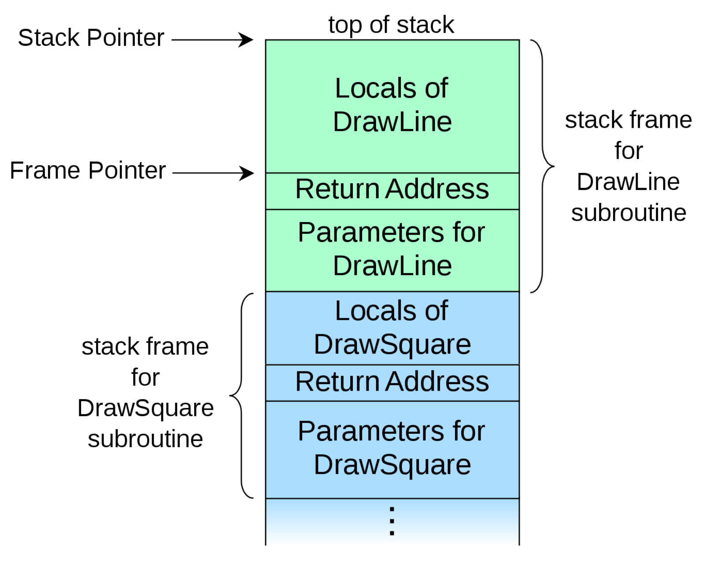
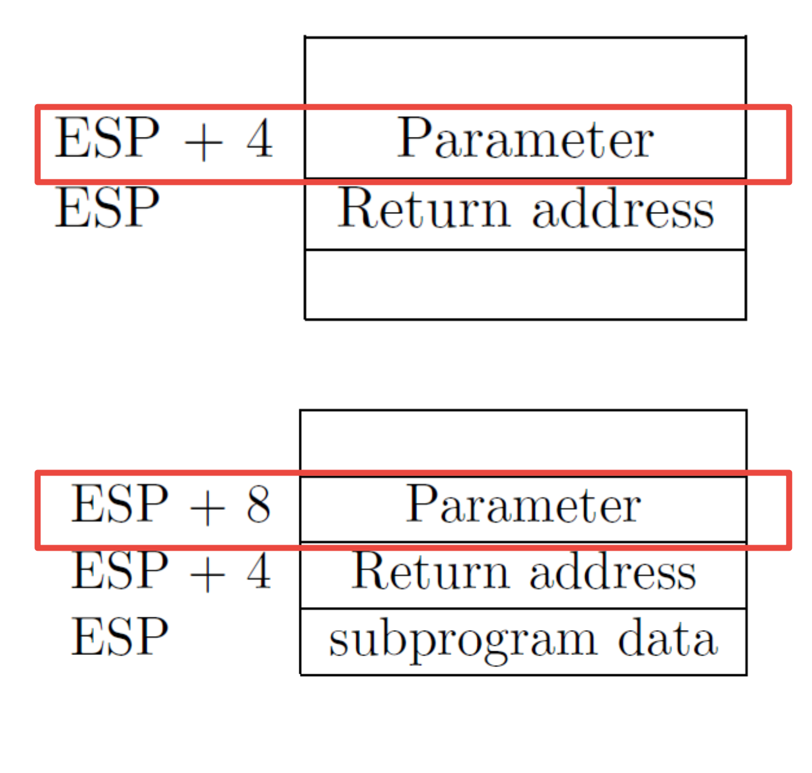

# Calling conventions

## Stack ... again

### Recap

- Just a region of memory
- Pointed to by the special register `ESP`
- You can get a new stack by changing `ESP`

### Invoking with stack

- Store the return address for the current procedure
- **Caller** pushes return address on the stack
- **Callee** pops it and jumps



## Calling conventions

> Goal: re-entrant programs

- How to pass argument?
	- On the stack?
	- In registers?
- How to return values?
	- On the stack?
	- In registers?

> Conventions differ from compiler, optimizations, etc.

### Stack frames

- Each function has a new frame
- Use the dedicated register `EBP` (points to the base of the frame)

```C
void DrawSquare(...) { // Invocation creates a new stack frame
	...
	DrawLine(x, y, z); // Invocation creates a new stack frame
}
```



### Prologue and epilogue

- Each function maintains the frame
	- A dedicated register `EBP` is used to keep the frame pointer
	- Each function uses prologue code and epilogue to maintain the frame

```asm
_my_function:
	push ebp        ; save original EBP value on the stack
	move ebp, esp   ; new EBP = ESP
	; function body
	pop ebp         ; restore original EBP value
	ret
```

### Allocating variables

#### Global variables

- Initialized -> `.data` section
- Uninitialized -> `.bss` section 

#### Dynamic variables

- Allocated on the heap
- Special area of memory provided by the OS from where functions like `malloc()` can allocate memory

#### Local variables

- Each function has private instances of local variables
- Functions can be called recursively
- Stored **on the stack**
	- Stored right after the save `EBP` value on the stack
	- Allocated by subtracting the number of bytes required from `ESP`

```asm
_my_function:
	push ebp         ; save original EBP value on stack
	mov ebp, esp     ; new EBP = ESP
	sub esp, <BYTES> ; the number of bytes needed by locals
	; function body
	mov esp, ebp     ; deallocate locals
	pop ebp          ; restore original EBP value
	ret
```

- With frames, local variables can be accessed by dereferencing `EBP`

```C
void my_function() {
	int a, b, c;
	a = 10;
	b = 5;
	c = 2
}
```

```asm
_my_function:
	push ebp               ; save the value of ebp
	mov ebp, esp           ; ebp = esp, set ebp to be top of the stack (esp)
	sub esp, 12            ; move esp down to allocate space for the local variables on the stack
	mov [ebp - 4], 10      ; location of variable a
	mov [ebp - 8], 5       ; location of b
	mov [ebp - 12], 2      ; location of c
```

### Passing arguments

- x86 32 bit
	- Pass arguments on the stack
	- Return value is in `EAX` and `EDX`
- x86 64 bit -- more registers
	- Pass first 6 arguments in registers
		1) `RDI`
		2) `RSI`
		3) `RDX`
		4) `RCX`
		5) `R8`
		6) `R9`
	- The rest on the stack
	- Return value is in `RAX` and `RDX`

```C
void my_function(int x, int y, int z) {
	...
}

my_function(2, 5, 10)
```

```asm
push 10
push 5
push 2
call _my_function
```

### Why stack frames?

- Not strictly required
- GCC compiler options `-fomit-frame-pointer` can disable them

> Don't keep the frame pointer in a register for functions that don't need one. This avoids the instructions to save, setup and restore frame pointers; it also makes an extra register available in many functions. **It also makes debugging impossible on some machines**

- Arguments are initially right after the return address. 
- As the function pushes more elements onto the stack, the relative distance changes



- Debugging becomes hard
	- As `ESP` changes, one has to manually keep track where local variables are relative to `ESP`
	- Compiler can do this easily and generate correct code
	- Harder for humans
- It becomes hard to unwind the stack in case of crash -> can't print out a **stack trace**
- It only takes a couple instructions to maintain the stack frame
	- x86 32 bit has 8 registers, leaving 6 for actual computation
	- Large functions will likely spill into the stack
	- x86 64 bit has 16 registers, so it isn't as bad
- That said, GCC sets `-fomit-frame-pointer` to "on" at *any* level of optimization

## Saving and restoring registers

- Processor doesn't save registers
- The following conventions are used
	- This agreement states what get saved by the caller and callee respectively
	- Registers `EAX`, `ECX`, and `EDX` are caller-saved
		- The function is free to use them
	- All other registers are callee-saved
		- The function must save the existing value before using
		- The function must restore the original value before returning