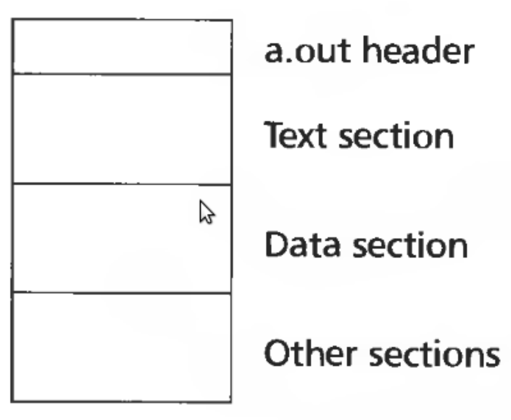
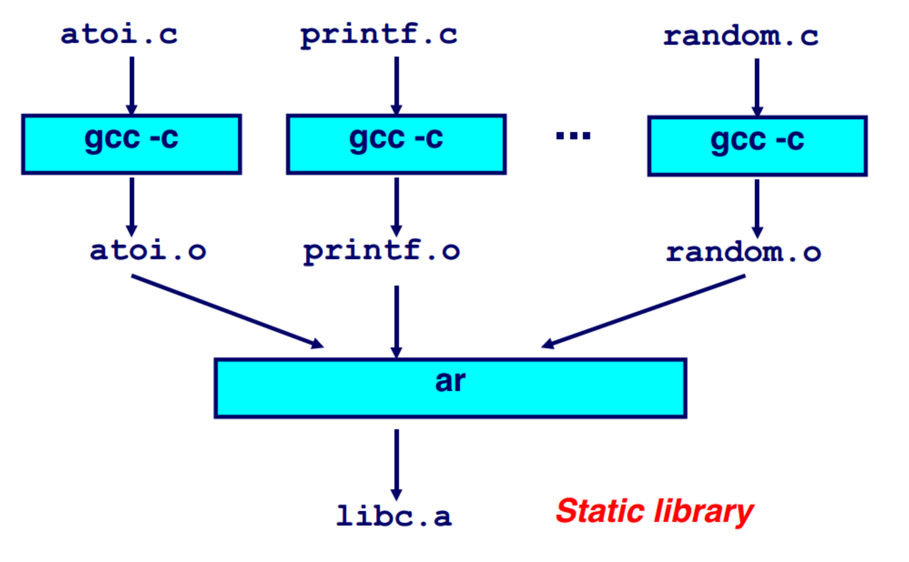

# Linking and loading (part 2)

## Object files

Conceptually, provides 5 kinds of information

- Header: code size, name of the source file, creation date
- Object code: binary instruction and data generated by the compiler
- Relocation information: list of places in the object code that need to be patched
- Symbols: globals symbols defined by this module
- Debugging information: source file and file number information, local symbols, data structure description

### Unix `a.out`

- Provides a small header
- `.text` section contains the executable code
- `.data` section contains initial values for static data



- `a.out` header

```C
int a_magic;  // magic number
int a_text;   // text segment size
int a_data;   // initialized data size
int a_bss;    // unitialized data size
int a_syms;   // symbol table size
int a_entry;  // entry point
int a_trsize; // text relocation size
int a_drsize; // data relocation size
```

### `a.out` loading

1) Read the header to get segment size
2) Check if there is a shareable code segment for this file
	1) If not, create one
	2) Map into the address space
	3) Read segment from a file into the address space
3) Create a private data segment
	- Large enough for `.data` and `.bss` sections
	- Read data segment, zero out the BSS segment
4) Create and map stack segment
	1) Place arguments from the command line on the stack
5) Jump to the entry point

## Executable and linkable format (ELF)

### Types of object files

- Relocatable object file (.o)
- Static libraries (.a)
- Shared libraries (.so)
- Executable files
- Unix has a general format capable to hold all of these files (ELF)

### ELF header

- Information
	- Magic number
	- Entry point
	- Pointers to two tables
		- Program header table
		- Section header table
- Reading
	1) `$ gcc -c -fno-pic -static -fno-builtin -ggdb -m32 -fno-omit-frame-pointer hello-int.c`
	2) `$ ld -m elf_i386 -N -e main -Ttext 0 -0 a.out hello-int.o`
	3) `$ readelf -a a.out`

```
ELF Header:
  Magic:   7f 45 4c 46 01 01 01 00 00 00 00 00 00 00 00 00
  Class:                             ELF32
  Data:                              2's complement, little endian
  Version:                           1 (current)
  OS/ABI:                            UNIX - System V
  ABI Version:                       0
  Type:                              EXEC (Executable file)
  Machine:                           Intel 80386
  Version:                           0x1
  Entry point address:               0x0
  Start of program headers:          52 (bytes into file)
  Start of section headers:          1240 (bytes into file)
  Flags:                             0x0
  Size of this header:               52 (bytes)
  Size of program headers:           32 (bytes)
  Number of program headers:         2
  Size of section headers:           40 (bytes)
  Number of section headers:         13
  Section header string table index: 12
```

### Program header table

- Used by the *loader*
- Take all "segments" marked as `LOAD` and load them into memory

```
Program Headers:
  Type           Offset   VirtAddr   PhysAddr   FileSiz MemSiz  Flg Align
  LOAD           0x000074 0x00000000 0x00000000 0x00064 0x00064 RWE 0x4
  GNU_STACK      0x000000 0x00000000 0x00000000 0x00000 0x00000 RW  0x10

 Section to Segment mapping:
  Segment Sections...
   00     .text .eh_frame .data
   01
```

### Section header table

- Used by the *linker*
- Merging (linking) code and data sections together
- `.text`: code of the program
- `.data`: initialized global variables
- `.rodata`: initialized read-only global variables
- `.bss`: uninitialized global variables

```
Section Headers:
  [Nr] Name              Type            Addr     Off    Size   ES Flg Lk Inf Al
  [ 0]                   NULL            00000000 000000 000000 00      0   0  0
  [ 1] .text             PROGBITS        00000000 000074 00001e 00 WAX  0   0  1
  [ 2] .eh_frame         PROGBITS        00000020 000094 000038 00   A  0   0  4
  [ 3] .data             PROGBITS        00000058 0000cc 00000c 00  WA  0   0  4
  [ 4] .comment          PROGBITS        00000000 0000d8 00002b 01  MS  0   0  1
  [ 5] .debug_aranges    PROGBITS        00000000 000103 000020 00      0   0  1
  [ 6] .debug_info       PROGBITS        00000000 000123 0000e9 00      0   0  1
  [ 7] .debug_abbrev     PROGBITS        00000000 00020c 00009a 00      0   0  1
  [ 8] .debug_line       PROGBITS        00000000 0002a6 00004f 00      0   0  1
  [ 9] .debug_str        PROGBITS        00000000 0002f5 00010e 01  MS  0   0  1
  [10] .debug_line_str   PROGBITS        00000000 000403 00001d 01  MS  0   0  1
  [11] .symtab           SYMTAB          00000000 000420 000070 10     12   3  4
  [12] .strtab           STRTAB          00000000 000490 000031 00      0   0  1
  [13] .shstrtab         STRTAB          00000000 0004c1 00008a 00      0   0  1
Key to Flags:
  W (write), A (alloc), X (execute), M (merge), S (strings), I (info),
  L (link order), O (extra OS processing required), G (group), T (TLS),
  C (compressed), x (unknown), o (OS specific), E (exclude),
  D (mbind), p (processor specific)
```

## Static libraries

- Conceptually just a collection of object files
- UNIX uses the archive format
	- Can support collections of any objects
	- Rarely used for anything instead of libraries

### Creating a static library



- Create a library: `ar rcs libclass.a class1.o class2.o class3.o`
- Linking: (linker can read archive files)
	- Through the C compiler: `gcc main.c libclass.a`
	- If library is on the standard library path: `gcc main.c -lclass`
	- During the linking process `ld ... main.o -lclass`
	- Same as: `gcc main.c class1.o class2.o class3.o`

### Searching libraries

- First linker path needs to resolve symbol names into function locations
- To improve the search, library formats add an index (maps names to member positions)

## Shared libraries

### Motivation

- A typical UNIX system can have thousands of programs
- Linking statically would mean we need 1000 copies of `printf` in memory
- How big if `printf`?
	- Handles conversion of multiple types to strings
	- Maybe 5 - 10Kb when compiled
	- Any program would be hauling that around with itself when loading
- Runtime considerations
	- 5 - 10Kb of memory multiplied by the number of running programs
	- If 250 programs are running, that can be anywhere from 1MB to 2.5MB
	- This was a huge amount for early UNIX systems
- Shared code
	- Single copy of library can be shared across all processes
	- *Really* useful for something like `libc`, which is linked to practically *every* process
	- Shared as read-only
	- Library may be loaded at different addresses per process, so it must be relocated for each process using it

### Size of a linked program

- Statically linked trivial example
	- `$ gcc -m32 -static hello-int.c -o test`
	- About 750Kb of space required
- Dynamically linked trivial example
	- `$ gcc -m32 hello-int.c -o test`
	- About 15Kb of space required