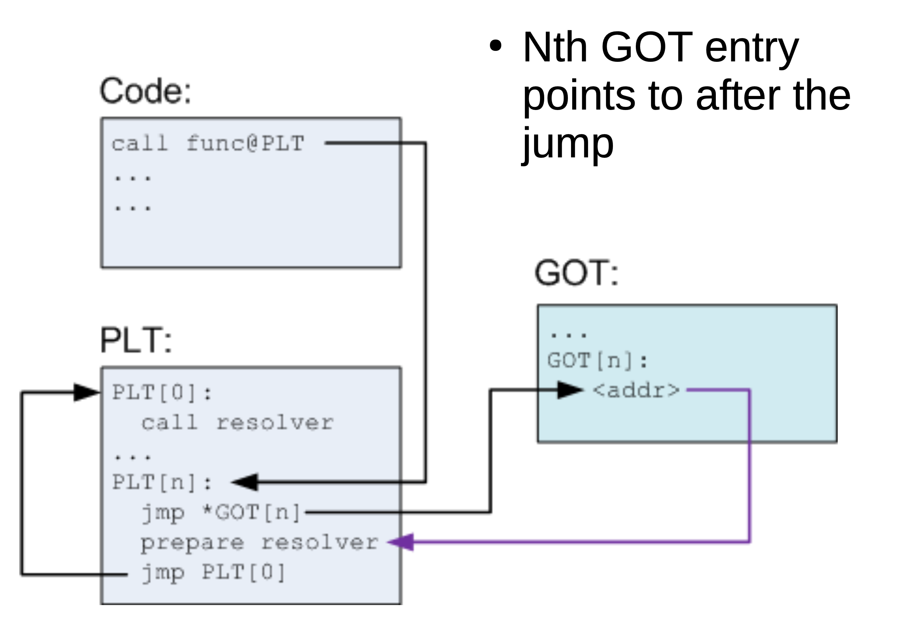

# Linking and loading (part 3)

## Position independent code

- Main idea
	- Generate code in such a way that it can work no matter where it is located in the address space
	- Share code across all address spaces
- Can stay untouched
	- Local jumps and relative calls
	- Stack data is relative to the stack
- Needs to change
	- Global variables
	- Imported functions

### How to build?

> Insight 1: code sections are followed by data sections

- Distance between code and data **remains constant even if code is relocated**
- Linker knows this distance
- Remains the same even if multiple code sections are merged together


> Insight 2: Avoid absolute addressing with these offsets

- Utilize a **g**lobal **o**ffset **t**able (GOT) to refer to variables
- Eliminates references with absolute addresses -> no need to relocate


- Global offset table
	- A table of addresses
	- Each entry contains the absolute address of a variable
	- Patched by the linker at relocation time

## Finding the position of code at runtime

### Where am I?

- x86 32 bit architecture requires absolute addresses for `mov` operations
- No instruction to learn the value of `EIP` (the instruction pointer)
- Simple trick
	- Call the next instruction
	- `call` pushes the address of the instruction to execute *next* after return
	- Called subroutine can use `popl` to fetch `EIP` into a register

```asm
		...
		call L2
		...       ; EIP is known here

L2: popl %ebx
```

### Finding a global variable

```C
int myglob = 42;

int ml_func(int a, int b) {
	return myglob + a + b;
}
```

```
00000000 <ml_func>:
   0:	55                   	push   %ebp
   1:	89 e5                	mov    %esp,%ebp
   3:	e8 fc ff ff ff       	call   4 <ml_func+0x4>
   8:	05 01 00 00 00       	add    $0x1,%eax            ; adding offset to GOT
   d:	8b 90 00 00 00 00    	mov    0x0(%eax),%edx       ; access address of myglob, save to EAX
  13:	8b 45 08             	mov    0x8(%ebp),%eax       ; load value of EAX to EBP
  16:	01 c2                	add    %eax,%edx
  18:	8b 45 0c             	mov    0xc(%ebp),%eax
  1b:	01 d0                	add    %edx,%eax
  1d:	5d                   	pop    %ebp
  1e:	c3                   	ret

Disassembly of section .text.__x86.get_pc_thunk.ax:

00000000 <__x86.get_pc_thunk.ax>:
   0:	8b 04 24             	mov    (%esp),%eax          ; using the simple trick to get EIP
   3:	c3                   	ret
```

### Resolving functions

- Can use the approach done above
- Not done in practice

#### Late binding

- When a shared library refers to some function, the real address of that function is not known until load time
- Resolving this address is known as binding

#### Lazy binding procedure

- In a large library, many routines may never by called
- Generally, the number of functions is much larger than the number of global variables
- Ok to bind all routines when program is statically linked
- With dynamic linking, the runtime overhead is too high, so we opt to link when a function is used

#### Procedure linkage table (PLT)

- Part of the executable text section
	- A set of entries
	- The first one is special, but the rest correspond to one external function
- PLT entries
	- A short chunk of executable code
	- Has a corresponding entry in the GOT
		- Contains the actual offset to the function
		- Only after it is resolved by the dynamic loader
	- A jump location which is specified in a corresponding GOT entry
	- Preparation of arguments for a resolver function
	- Call to the resolver routine, which resides in the first entry of the PLT

#### Before resolving



#### After resolving


```
00000477 <ml_func>:
 477:   55                     push   ebp
 478:   89 e5                  mov    ebp,esp
 47a:   53                     push   ebx
 47b:   83 ec 24               sub    esp,0x24       
 47e:   e8 e4 ff ff ff         call   467 <__i686.get_pc_thunk.bx>   ; Resolve address of GOT 
 483:   81 c3 71 1b 00 00      add    ebx,0x1b71                     ; Learn EIP, save offset in EBX
 489:   8b 45 08               mov    eax,DWORD PTR [ebp+0x8]
 48c:   89 04 24               mov    DWORD PTR [esp],eax            ; Push argument a on the stack
 48f:   e8 0c ff ff ff         call   3a0 <ml_util_func@plt>         ; Call PLT entry for ml_util_func
 ...


000003a0 <ml_util_func@plt>: 
3a0: ffa314000000    jmp    DWORD PTR [ebx+0x14]                     ; Jump to address specified in GOT
3a6: 6810000000      push   0x10                                     ; Prepare args for resolver
3ab: e9c0ffffff      jmp    370 <_init+0x30>                         ; Call resolver

; Next calls need not use the resolver, can go directly to function entry
```

## PIC considerations

- Processes can share code
- Each has a private GOT
- Linking time is faster since patching is done lazily

### Advantages

- Can share memory of common libraries
- Address space randomization

### Disadvantages

- Code gets slower
	- One register needed to track GOT
	- One more memory dereference to do
	- One more call to find GOT

## Loading and starting programs

### Statically linked program

#### Call to `exec`

- Kernel reads the program from disk
- Kernel can handle multiple executable formats
	- Tries all of them, one-by-one until it succeeds
- For now, we'll focus on ELF

### Work before `main()`


- Can see backtrace before `main` by setting a breakpoint on `__start` symbol
- Can see backtrace after `main` by setting `backtract past-main` to "on"

### Initializers and finalizers

- C++ needs a segment for invoking constructors for static variables
	- List of pointers to startup routines
	- Startup code in every module is put into an anonymous startup routine
	- Put into a segment called `.init`
- Problem
	- Order matters
	- Ideally *you* should track dependencies
	- Simple hack: system libraries go first, then use constructors

```C
#include <stdio.h>

void __attribute__ ((constructor)) a_constructor() {
	printf("%s\n", __FUNCTION__);
}

int main() {
	printf("%s\n", __FUNCTION__);
}
```

```
$ ./hello
a_constructor
maine
$
```

### Dynamically linked program

#### Loading a dynamically linked ELF

- Map ELF sections to memory
- Interpreter section typically `ld.so`
- Map `ld.so` into memory
	- Start `ld.so` instead of your program
	- Linker initializes itself
- Finds the names of shared libraries required by the program

#### Starting dynamically linked programs

- Kernel checks if `PT_INTERP` is present in the ELF file
- Reads the filename of the interpreter
- Reads the interpreter and loads it in program's memory (its an ELF itself)
- Sets to start program at the entry point of the interpreter

#### Finding libraries in the file system

- `DP_PATH` symbol: can be linked into a file by a normal linker at link time
- `LD_LIBRARY_PATH` environment variable
- Library cache file
	- `/etc/ld.so.conf`
	- The most normal way to resolve library paths
- Default library path: `/usr/lib`

#### Loading more libraries

- When the library is found it is loaded into memory
- Linker adds its symbol table to the linked list of symbol tables
- Recursively searches if the library depends on other libraries (loads them if needed)

#### Shared library initialization

- Remember position independent code needs relocation in the data segment and GOT
- `ld.so` linker performs this relocation