# Address translation (part 1)

## Relocation

- Relocate a program to work at different addresses
- Similar idea to relocation from linking and loading

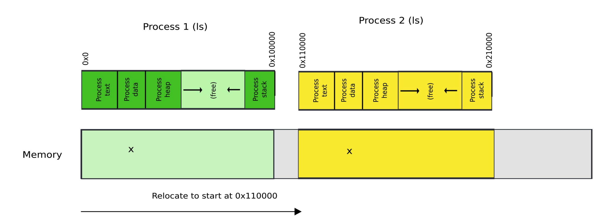

- Processes are laid out in separate sections of physical memory
- Each process has its own dedicated space in memory

### Implementing

- Software enforcement
	- Google NaCL (Chrome sandbox)
	- WASM (web assembly, another sandboxing standard)
- Hardware enforcement
	- Must have support included in hardware

### Issues

- Process can still read and write to another process's memory space
- Process could potentially write to the kernel's memory space
- Relocation does **not** provide isolation between processes

## Segmentation

- We cannot truly have a private address space for each process, but we can provide the illusion of one
	- Multiple programs should be given identical copies of an address space
	- This simplifies software architecture by derestricting the memory layout of other programs
- The hardware should add a *base value* to every address used in a program

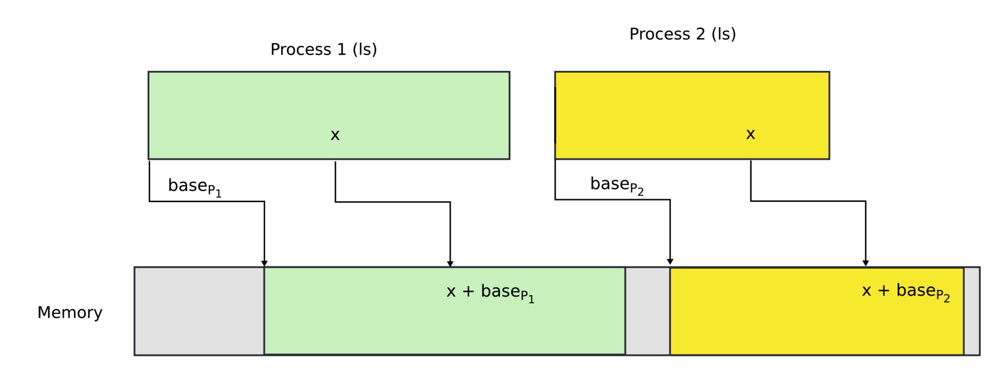

### Base addresses

- Where do these base addresses come from?
- Hardware can maintain a table of base addresses (one base for each process)
- Dedicate a register to keep an index into that table

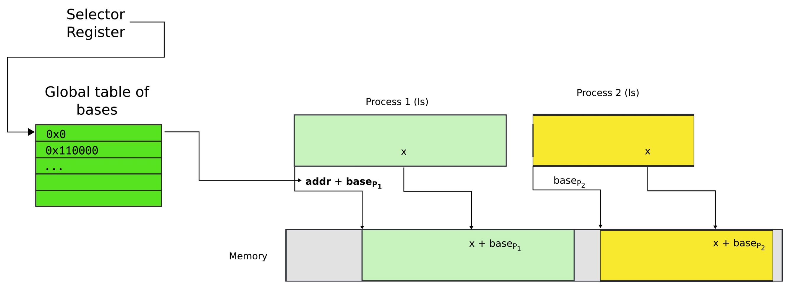

### Segmented addresses

- Addresses now consist of two parts
	1) Segment selector
	2) Address offset
- Intel calls this the "logical address
- A **g**lobal **d**escriptor **t**able (GDT) maintains an array of segment descriptors
	- Each descriptor contains and base address and a limit address for the segment
	- Also contains some access control flags
	- Location of GDT in physical memory is pointed by the GDT register
- Translating to a physical address
	- Say a program uses the address `0x300010`
	- That program has the segment selector `0x1`
	- Obtain the base address of the segment by indexing the GDT with the program's segment selector (`0x110000`)
	- Add the program address (offset) to the retrieved base address: `0x410010 = 0x300010 + 0x110000`

### Segmenting with multiple processes

- Each process has a private GDT
- OS will switch between GDT

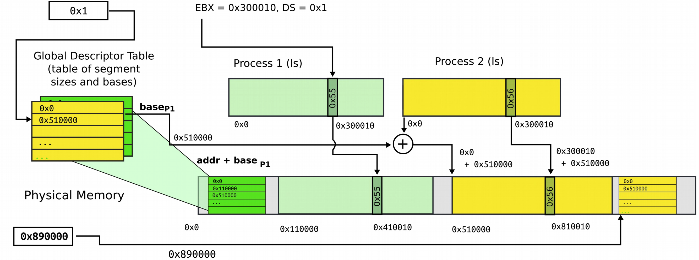

- Requires a new addressing mode: logical addressing
	- All addresses are logical addresses
	- Each consisting of a segment selector and an offset
	- Segment selector is simply an index into an array (the process's descriptor table)
- Segment descriptors consist of
	- A base address
	- A limiting address (size of segment given by `limit - base`)
	- Access rights for the segment
		- Executable, readable, writable
		- Privilege level (0 -3)

### Programming with segmentation

- Segments are associated with 1 of 3 types of storage
	- Code
	- Data
	- Stack
- A program can have up to 6 total segments
- Segments are identified by registers: `cs, ds, ss, es, fs, gs`
- All memory accesses are prefixed with desired segment
	- `move eax, ds:0x80` (load offset `0x80` from data into `EAX`)
	- `jmp cs:0xab8` (jump execution to code offset `0xab8`)
	- `mov ss:0x40, ecx` (move `ECX` to stack offset `0x40`)
- This can be quite cumbersome
	- Ideally, code, data and stack segments from the instruction type
		- Control flow instructions use code segment
		- Stack management uses stack segment
		- Mode loads/stores use data segment
	- Extra segments must be specified explicitly
- Code segment
	- `CS` register maintains a pointer to the code segment
	- `EIP` is an offset inside the segment stored in `CS` register
	- Can only be changed
		- Procedure calls
		- Interrupt handling
		- Task switching
- Data segment
	- Can use `dx, es, fs, gs` segment registers
	- Means that up to 4 data segments can be used at the same time
- Stack segment
	- Can be loaded explicitly
	- OS can set up multiple stacks
	- Of course, only one is accessible at a time

### Improvements over relocation

- Gives the illusion of a private address space
- Identical copies of an address space in multiple programs (`fork()` can be implemented)
- Isolation: processes cannot access memory outside of their segments

### Issues

- What if a process needs more memory?
	- A call to `malloc()` might take memory that causes one process's address space to leak into another
	- This breaks isolation principles that we've previously established

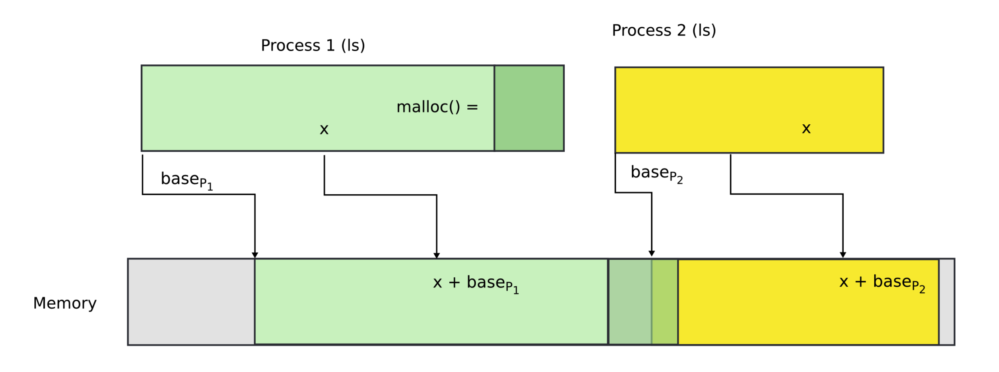

- Possible solutions
	- Move process by copying its memory over to segments that are out of the way
	- Swap the overlapping segment to disk
- Where segments fall short
	- Relocating or swapping the entire process takes time
	- Memory gets fragmented
		- There might be no space for the swapped out process to come in
		- May need to swap out more processes which will only exacerbate the problem

## Paging

### Motivation

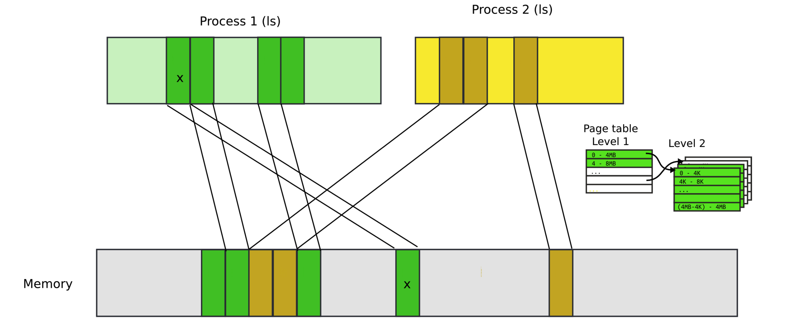

- Break up memory into 4096 byte chunks called pages
	- Modern hardware support different page sizes up to 1GB
- Independently control mapping for each page of linear address space
- Compared to segmentation, this provides many more degrees of freedom

### Translation mechanisms

#### Translation array

- Addresses now structured at the bit level
	- First 20 bits in the page number
	- Remaining 12 are access control bits

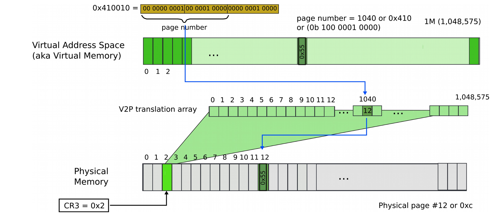

- Issues with this approach
	- 4 bytes are required to relocate each page
	- If we require 1 million entries, then the translation array would require 4Mb

#### Array with size

- The size controls how many entries are required
- Virtual-to-physical array may spread across multiple physical pages

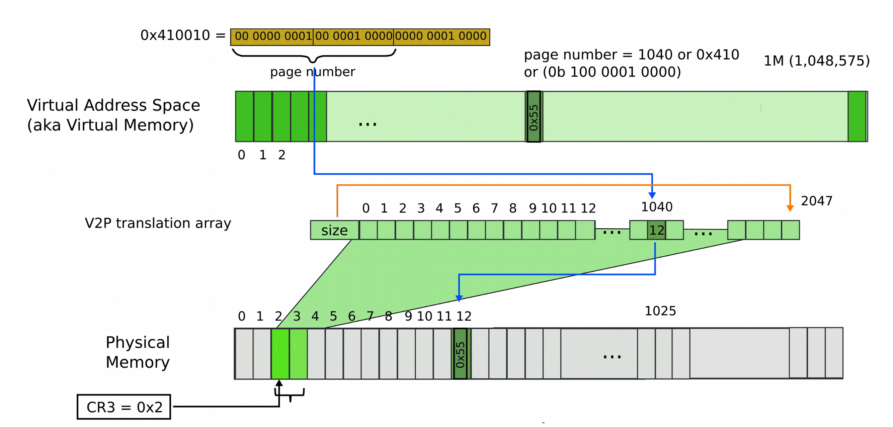

- The array size may still get excessively large

#### Array with chunks

- Maintain a table of array regions
- Regions point to virtual-to-physical translation arrays that lie on physical pages.

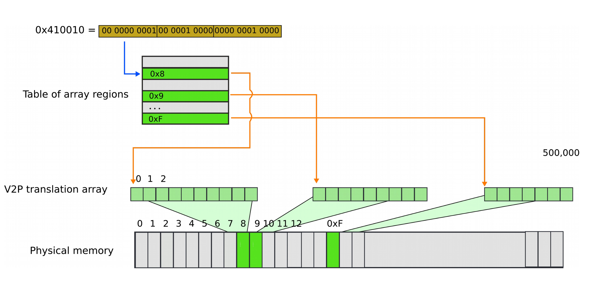

#### Page table

- Maintain a page table directory
- Each table entry points to a virtual-to-physical array that lies in physical pages

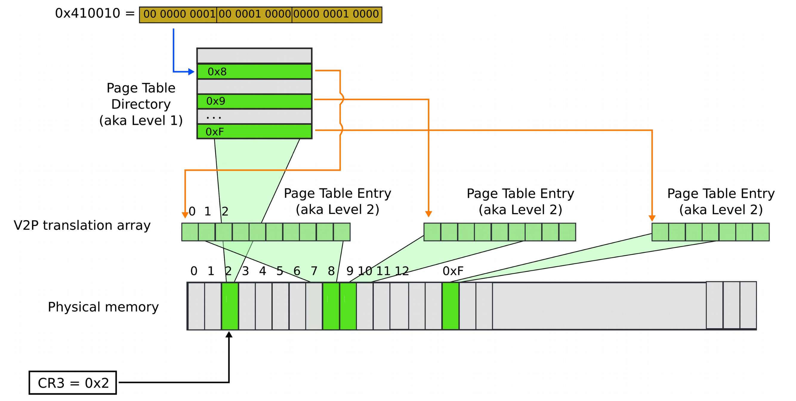

- A page table entry can point to a second page table (process specific)
- The inner page table entries point to the processes address space

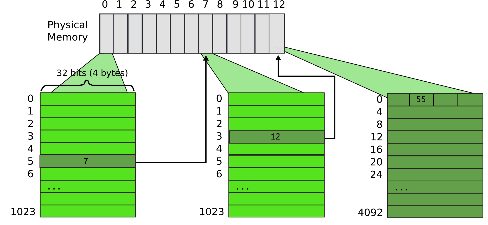