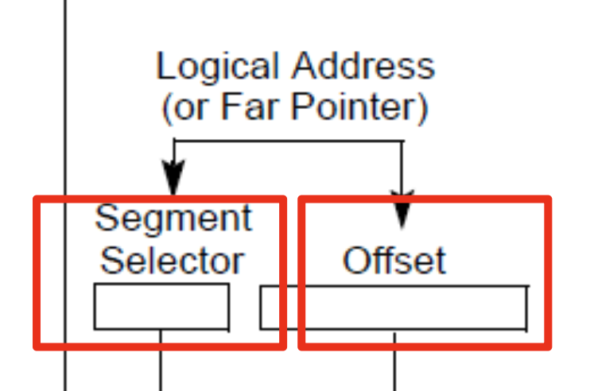

# Address translation (part 2)

## Page translation

- Linear address is split into 3 parts
	- The directory bits
	- The page table bits
	- The offset into a page
- The page directory is stored `CR3` register

### Page directory entry

- First 20 bits represent the address of the page table the entry refers to
- Last 8 bits are access control bits
- Remaining bits are ignored
- Pages are 4KB each, meaning 1MB is needed to cover 4GB of physical memory
- Pages start at 4KB (page aligned boundary)

### Page table entry

- First 20 bits represent the address of the 4KB page frame
- Last 9 bits are access control bits
- Remaining bits are ignored

### Benefits of page tables

- Page tables represent sparse address space more efficiently
	- An entire array has to be allocated upfront
	- But if the address space uses a handful of pages
	- Only page table (level 1 and 2) needed to be allocated to describe translation
- On a dense address space this benefit goes away
- In terms of isolation
	- Each process has its own page table
	- OS switches between them
	- This makes it impossible for processes to access each other's memory
	- This also means the kernel's address space is protected from a rogue process

### Improvements over segmentation

- Allows emulation of large virtual address space on a smaller physical memory
- Program can access all pages in its address space
- OS will move other pages to disk (and can do so without problems or making an existing problem worse)
- Regions of memory can be shared across multiple programs
	- Shared libraries
	- Inter-process communication

## Complete address translation

- A modern OS will use a combination of segmentation and paging to gain the benefits of both

1) Take the given logical address (from a program) and split it into its segment selector and offset

2) Use the segment selector of the logical address to look up the segment descriptor in the GDT
3) Use the base address of the segment and add the offset portion of the logical address to compute the linear address

4) Use the directory portion (first 10 bits) of the linear address to obtain the location of the process page table
5) Use the table portion (next 10 bits) and the (first 20 bits) of the page directory entry to compute the physical address of the page

6) Use the remaining bits of the linear address of the offset into the page discovered from the PDE and PTE

## Page translation for 32 bit x86

## Page translation for 64 bit x86

