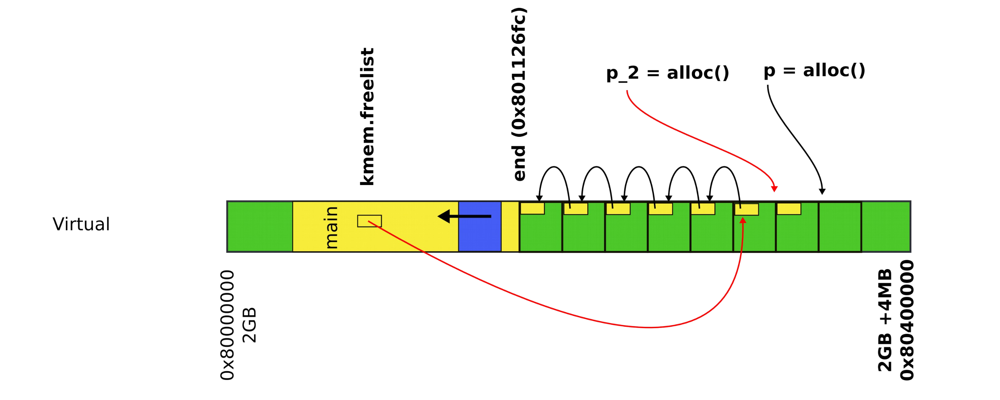
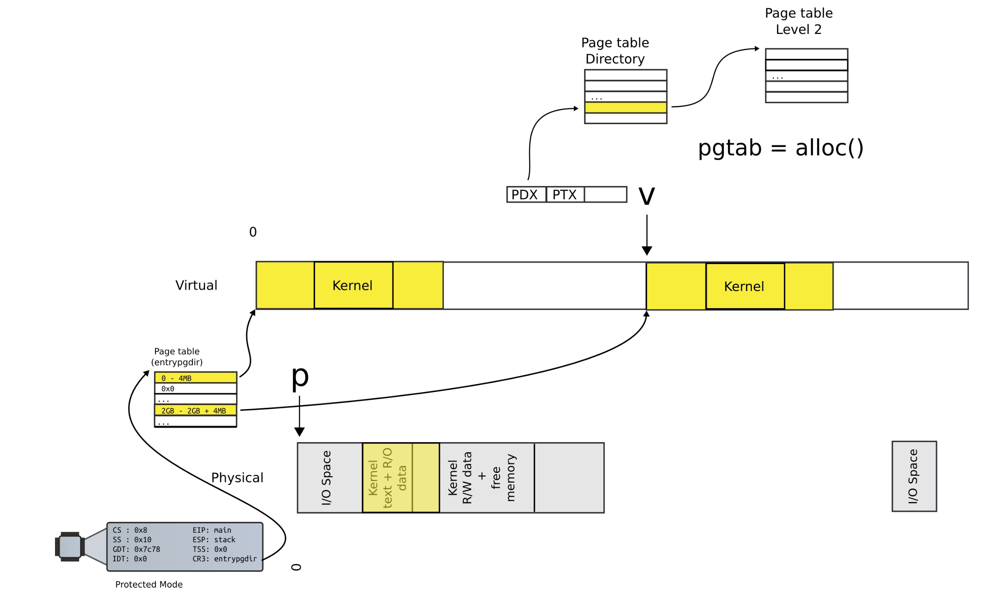

# Kernel memory allocator

## System after boot


```C
// Bootstrap processor starts running C code here.
// Allocate a real stack and switch to it, first
// doint some setup required for memory allocator to work.
int
main(void) {
    knit1(end, P2V(4*1024*1024)); // phys page allocator
    kvmalloc(); // kernal page table
    mpinit(); // detect other processors
    lapicinit(); // interrupt controller
    seginit(); // segment descriptors
    cprintf("\ncpu%d: starting xv6\n\n", cpunum());
}
```

### Running multiple processes

- Each process is a collection of resource
    - Memory (text, stack, heap)
    - In-kernel state: open file descriptors, network sockets (connections)
- Processes are isolated from each other
    - Processes don't trust each other (individual users, some privileged)
    - Can't interfere with other processes
    - Can't change kernel (to affect other processes)
- Each process maps the kernel
    - Not strictly required
    - Convenient for system calls
    - No need to change the page table when process enters the kernel with a system call
    - **Things are much faster!**


### Process view of the kernel


### Memory after boot


- Create the kernel memory allocator
- Allocate memory for page tables

## Kernel memory allocator: `kinit1`

- Kernel needs normal 2 level, 4KB page tables
    - Currently has one statically allocated page table with two entries
    - Is a page table for 4MB pages
- 4KB page table is a better choice
    - xv6 processes are small
    - Wasting 4MB on a program that fits into 1KB is absurd
- Memory is needed to create page tables
    - Implement `alloc()` and `free()`
    - Can allocate page tables, stacks, and data structures, etc.

### Page allocator


```C
struct run {
    struct run *next;
}
```





#### `kalloc()`

```C
char*
kalloc(void) {
    struct run *r;
    ...
    r = kmem.freelist;
    if (r)
        kmem.freelist = r->next;
    ...
    return (char*)r;
}
```

#### `kfree()`

```C
void
kfree(char *v) {
    struct run *r;
    ...
    r = (struct run*)v;
    r->next = kmem.freelist;
    kmem.freelist = r;
}
```

### Kernel memory freelist

- Where can we get memory to keep the list itself?
    - Notice, the list is allocated within the pages
    - It has to write each page though to update the "next" pointer
- There is a bit of free memory in the 4MB page we've mapped
    - Donate this free memory to the allocator
    - Take memory from the end of the kernel binary to the end of the 4MB page
    - `end` is the first address after kernel loaded from the ELF file

```C
void
kinit1(void *vstart, void *vend) {
    ...
    freerange(vstart, vend)
}
```

- Frees range of memory from `vstart` to `vend`, giving it to the allocator

```C
void
freerange(void *vstart, void *vend) {
    char *p;
    p = (char*)PGROUNDUP((unsigned int)vstart);
    for(; p + PGSIZE <= (char*)vend; p += PGSIZE) {
        kfree(p);
    }
}
```

- Internally frees the pages from `vstart` to `vend`
- `kfree()` adds them to the allocator list

## Kernel page table: `kvmalloc`

```C
void
kvmalloc(void) {
    kpgdir = setupkvm();
    switchkvm();
}
```

- Map a region of virtual memory into page tables
    - Start from 2GBs
    - Iterate memory page by page
    - Allocate page table directory and page tables as we go
    - Fill in table entries with proper physical addresses
- This creates the kernel memory allocator: can now allocate space for page table directory and page tables





### `setupkvm()`

```C
pde_t*
setupkvm(void) {
    pde_t *pgdir;
    struct kmap *k;

    if ((pgdir = (pde_t*)kalloc()) == 0)
        return 0;
    memset(pgdir, 0, PGSIZE);
    ...
    for (k = kmap; k < &kmap[NELEM(kmap)]; k++) {
        if (mappages(pgdir, k->virt, k->phys_end - k->phys_start, (unsigned int)k->phys_start, k->perm) < 0) 
            return;
    }
    return pgdir;
}
```

#### Kernel map

```C
static struct kmap {
    void *virt;
    unsigned int phys_start;
    unsigned int phys_end;
    int perm;
} kmap[] = {
    { (void*)KERNBASE, 0, EXTMEM< PTE_W}, // I/O space
    { (void*)KERNLINK, V2P(KERNLINK), V2P(data), 0}, // text+rodata
    { (void*)data, V2P(data), PHYSTOP, PTE_W}, // kern data+memory
    { (void*)DEVSPICE, DEVSPACE, 0, PTE_W}, // more devices
};
```

#### `mappages()`

```C
int
mappages(pde_t *pdgir, void *va, unsigned int size, unsigned int pa, int perm) {
    char *a, *last;
    pte_t *pte;

    a = (char*)PGROUNDDOWN((unsigned int)va);
    last = (char*)PGROUNDDOWN(((unsigned int)va) + size - 1);
    for(;;) {
        if((pte = walkpgdir(pgdir, a, 1)) == 0)
            return -1;
        if (*pte & PTE_P)
            panic("remap");
        *pte = pa | perm | PTE_P;
        if (a == last)
            break;
        a += PGSIZE;
        pa += PGSIZE;
    }
    return 0;
}
```

- Get the start (`a`) and end (`last`) pages for the virtual address range we are mapping
- Then work in a loop mapping every page one-by-one
    1) Lookup the page table directory entry (`pte`) corresponding to the virtual address (`a`) we're mapping
    2) Update the page directory entry entry (`*pte`) with the physical address (`pa`)

##### `walkpgdir()`

```C
pde_t*
walkpgdir(pde_t *pgdir, const void *va, int alloc) {
    pde_t *pde;
    pte_t *pgtab;

    pde = &pgdir[PDX(va)];
    if (*pde & PTE_P) {
        pgtab = (pte_t*)P2V(PTE_ADDR(*pde));
    } else {
        if (!alloc || (pgtab = (pte_t*)kalloc()) == 0)
            return 0;
        // Make sure all thos PTE_P bits are zero
        memset(pgtab, 0, PGSIZE);
        ...
        *pde = V2P(pgtab) | PTE_P | PTE_W | PTE_U;
    }
    return &pgtab[PTX(va)];
}
```

- Locate the page table directory entry for this virtual address
- Locate the page directory entry (`*pde`)

```C
// +--------10------+-------10-------+---------12--------+
// | Page Directory |    Page Table  | Offset with Page  |
// |    Index       |     Index      |                   |
// +----------------+----------------+-------------------+
// \--- PDX(va) ---/ \--- PTX(va) --/

// page directory index
#define PDX(va) (((unsigned int)(va) >> PDXSHIFT) & 0x3FF)

// page table index
#define PTX(va) (((unsigned int)(va) >> PTXSHIFT) & 0x3FF)

#define PTXSHIFT 12 // offset of PTX in a linear address
#define PDXSHIFT 22 // offset of PDX in a linear address
```

- Getting a level 2 page
    - Convert from 20 bites of physical page number to physical address of the page: `PTE_ADDR(*pde)`
    - Convert from physical address of that page to virtual address: `P2V(...)`
        - Can't access physical addresses directly
        - Can only access virtual addresses
- Return the PTE entry if it exists
- Or allocate it and initialize it with zeros

```C
#define KERBASE 0x80000000 // First kernel virtual address
#define V2P(a) (((unsigned int)(a)) - KERNBASE)
#define P2V(a) (((void *) (a)) + KERNBASE)
```

#### Back to `mappages`

- Present pages during mapping causes a panic
- Otherwise update the page table entry
    - `*pte` points to the physical address of the page
    - Move on to the next page

### `switchkvm`

```C
void
switchkvm(void) {
    lcr3(v2p(kpgdir));
}
```

- Kernel has a memory allocator
- Kernel has its own address space mapped with 4KB page tables
- Kernel is ready to create processes